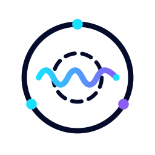

<p align="center">
  
</p>

<h1 align="center">@llmrtc/llmrtc</h1>

<p align="center">
  A TypeScript SDK for building real-time voice and vision AI applications.<br>
  Combines LLM, Speech-to-Text, Text-to-Speech, and vision capabilities over WebRTC for low-latency conversational AI.
</p>

<p align="center">
  <a href="https://www.llmrtc.org">Documentation</a> •
  <a href="https://www.llmrtc.org/getting-started/overview">Getting Started</a> •
  <a href="https://www.llmrtc.org/recipes/minimal-voice-assistant">Examples</a>
</p>

---

## Features

- **Real-time Voice Conversations** - WebRTC-based audio streaming with server-side VAD (Voice Activity Detection)
- **Multi-Provider Support** - OpenAI, Anthropic Claude, Google Gemini, AWS Bedrock, OpenRouter, and local models
- **Tool Calling** - Provider-agnostic tool definitions with JSON Schema, works across all LLM providers
- **Playbooks** - Multi-stage conversation flows with automatic transitions, per-stage tools, and two-phase turn execution
- **Vision/Multimodal** - Camera and screen capture with automatic frame extraction
- **Streaming Responses** - Stream LLM and TTS responses for minimal latency
- **Barge-in Support** - Interrupt AI responses mid-speech
- **Automatic Reconnection** - Built-in connection state management with exponential backoff
- **Session Persistence** - Maintain conversation history across reconnections

## Architecture

```
┌─────────────────┐         WebRTC          ┌─────────────────┐
│                 │◄──────────────────────► │                 │
│   Web Client    │      Audio/Data         │    Backend      │
│                 │                         │                 │
└─────────────────┘                         └────────┬────────┘
                                                     │
                                            ┌────────▼────────┐
                                            │   Orchestrator  │
                                            └────────┬────────┘
                                                     │
                      ┌──────────────┬───────────────┼───────────────┬──────────────┐
                      ▼              ▼               ▼               ▼              ▼
               ┌──────────┐  ┌──────────┐    ┌──────────┐    ┌──────────┐   ┌──────────┐
               │   LLM    │  │   STT    │    │   TTS    │    │  Vision  │   │   VAD    │
               │ Provider │  │ Provider │    │ Provider │    │ Provider │   │ (Silero) │
               └──────────┘  └──────────┘    └──────────┘    └──────────┘   └──────────┘
```

## Packages

| Package | Description |
|---------|-------------|
| `@llmrtc/llmrtc-core` | Core types, interfaces, and orchestrator |
| `@llmrtc/llmrtc-web-client` | Browser client with WebRTC support |
| `@llmrtc/llmrtc-backend` | Node.js backend with signaling server |

### LLM Providers

| Package | Provider | Features |
|---------|----------|----------|
| `@llmrtc/llmrtc-provider-openai` | OpenAI | GPT-5.2 / GPT-5.1, Whisper STT, TTS |
| `@llmrtc/llmrtc-provider-anthropic` | Anthropic | Claude 4.5 (Sonnet/Haiku/Opus), vision |
| `@llmrtc/llmrtc-provider-google` | Google | Gemini 2.5 Flash/Pro, multimodal |
| `@llmrtc/llmrtc-provider-bedrock` | AWS Bedrock | Claude, Nova, Llama via AWS |
| `@llmrtc/llmrtc-provider-openrouter` | OpenRouter | Multi-model gateway |
| `@llmrtc/llmrtc-provider-lmstudio` | LMStudio | Local model inference |
| `@llmrtc/llmrtc-provider-local` | Local | Ollama, Faster Whisper, Piper TTS |

### TTS Providers

| Package | Provider | Features |
|---------|----------|----------|
| `@llmrtc/llmrtc-provider-openai` | OpenAI | tts-1, tts-1-hd, streaming |
| `@llmrtc/llmrtc-provider-elevenlabs` | ElevenLabs | High-quality voices, streaming |
| `@llmrtc/llmrtc-provider-local` | Piper | Offline TTS |

---

## Requirements

### Node.js & TypeScript

- **Node.js 20+** - The SDK uses ESM modules, modern JavaScript features, and native bindings that assume Node 20 or newer.
- **TypeScript 5.6+** - For type definitions and compilation (if using TypeScript).

```bash
node --version  # Should be v20.x or higher
```

### Browser (Web Client)

The web client requires a browser with WebRTC support: **Chrome**, **Firefox**, **Safari**, or **Edge**.

### Native WebRTC Module (Backend)

The backend package (`@llmrtc/llmrtc-backend`) uses `@roamhq/wrtc` for server-side WebRTC. This is a native module that may require C/C++ build tools on platforms without prebuilt binaries.

### FFmpeg (Streaming TTS)

Streaming TTS (`streamingTTS: true`) requires **FFmpeg** in your `$PATH`. Non-streaming TTS works without FFmpeg.

### Platform-Specific Setup

| Platform | Commands |
|----------|----------|
| **macOS** | `brew install ffmpeg`<br>`xcode-select --install` (if `@roamhq/wrtc` build fails) |
| **Ubuntu/Debian** | `sudo apt-get install ffmpeg build-essential` |
| **Windows** | Install [FFmpeg](https://ffmpeg.org/download.html) and add to PATH<br>Install [Visual Studio Build Tools](https://visualstudio.microsoft.com/visual-cpp-build-tools/) for native modules |

### Verify Installation

After installing, verify dependencies are working:

```bash
# Check Node version
node --version

# Verify backend package loads (native deps compiled correctly)
node -e "import('@llmrtc/llmrtc-backend').then(() => console.log('backend ok'))"

# Verify FFmpeg (required for streaming TTS)
ffmpeg -version
```

---

## TURN Server Configuration

For reliable WebRTC connections behind NAT/firewalls, configure a TURN server. Without TURN, users behind symmetric NAT or strict corporate firewalls may fail to connect.

### Metered TURN (Recommended)

For production deployments, you need a TURN server to ensure reliable WebRTC connections behind NAT/firewalls.

The [OpenRelay Project](https://www.metered.ca/tools/openrelay/) by Metered provides a free global TURN server network with **20GB of monthly TURN usage at no cost** — sufficient for most use cases.

1. Sign up at [metered.ca/tools/openrelay](https://www.metered.ca/tools/openrelay/)
2. Create a TURN credential to get your API key
3. Configure via environment variables or code

**Environment Variables (CLI Mode):**

```bash
METERED_APP_NAME=your-app-name    # Your Metered app name
METERED_API_KEY=your-api-key       # API key from credential creation
METERED_REGION=us_east             # Optional: us_east, europe, asia, etc.
```

**Library Mode:**

```typescript
const server = new LLMRTCServer({
  providers: { llm, stt, tts },
  metered: {
    appName: 'your-app-name',
    apiKey: 'your-api-key',
    region: 'us_east'  // Optional
  }
});
```

The server fetches TURN credentials from Metered's API and sends them to clients in the WebSocket `ready` message.

### Custom ICE Servers

Override with your own STUN/TURN servers:

**Environment Variables (CLI Mode):**

```bash
# JSON array of RTCIceServer objects
ICE_SERVERS='[{"urls":"stun:stun.example.com:3478"},{"urls":"turn:turn.example.com:3478","username":"user","credential":"pass"}]'
```

**Library Mode:**

```typescript
// Backend
const server = new LLMRTCServer({
  providers: { llm, stt, tts },
  iceServers: [
    { urls: 'stun:stun.example.com:3478' },
    { urls: 'turn:turn.example.com:3478', username: 'user', credential: 'pass' }
  ]
});

// Frontend (optional - overrides server-provided servers)
const client = new LLMRTCWebClient({
  signallingUrl: 'ws://localhost:8787',
  iceServers: [{ urls: 'stun:stun.l.google.com:19302' }]
});
```

### ICE Server Priority

| Priority | Backend | Frontend |
|----------|---------|----------|
| 1 (highest) | `iceServers` config | `iceServers` config |
| 2 | `metered` config → fetch from API | Server-provided in `ready` message |
| 3 (default) | `stun:stun.metered.ca:80` | `stun:stun.metered.ca:80` |

---

## Quick Start

### Installation

```bash
# Backend (includes all providers - no separate provider installs needed)
npm install @llmrtc/llmrtc-backend

# Web client for browser apps
npm install @llmrtc/llmrtc-web-client

# Or install individual packages if needed
npm install @llmrtc/llmrtc-core
npm install @llmrtc/llmrtc-provider-openai @llmrtc/llmrtc-provider-elevenlabs
```

### Backend Setup

**Option 1: Library Mode (Recommended)**

```typescript
// All providers are re-exported from @llmrtc/llmrtc-backend
import {
  LLMRTCServer,
  OpenAILLMProvider,
  OpenAIWhisperProvider,
  ElevenLabsTTSProvider
} from '@llmrtc/llmrtc-backend';

const server = new LLMRTCServer({
  providers: {
    llm: new OpenAILLMProvider({ apiKey: process.env.OPENAI_API_KEY! }),
    stt: new OpenAIWhisperProvider({ apiKey: process.env.OPENAI_API_KEY! }),
    tts: new ElevenLabsTTSProvider({ apiKey: process.env.ELEVENLABS_API_KEY! })
  },
  port: 8787,
  systemPrompt: 'You are a helpful voice assistant.'
});

await server.start();
```

**Option 2: CLI Mode**

```bash
# Create .env file
echo "OPENAI_API_KEY=sk-..." > .env
echo "ELEVENLABS_API_KEY=xi-..." >> .env

# Run the server
npx llmrtc-backend
```

**Using the Orchestrator Directly (Advanced)**

```typescript
import { ConversationOrchestrator } from '@llmrtc/llmrtc-core';
import { OpenAILLMProvider, OpenAIWhisperProvider } from '@llmrtc/llmrtc-provider-openai';
import { ElevenLabsTTSProvider } from '@llmrtc/llmrtc-provider-elevenlabs';

const orchestrator = new ConversationOrchestrator({
  systemPrompt: 'You are a helpful voice assistant.',
  historyLimit: 8,
  providers: {
    llm: new OpenAILLMProvider({ apiKey: process.env.OPENAI_API_KEY! }),
    stt: new OpenAIWhisperProvider({ apiKey: process.env.OPENAI_API_KEY! }),
    tts: new ElevenLabsTTSProvider({ apiKey: process.env.ELEVENLABS_API_KEY! })
  }
});

// Process a turn (audio -> transcript -> response -> speech)
for await (const item of orchestrator.runTurnStream(audioBuffer)) {
  if ('isFinal' in item) console.log('Transcript:', item.text);
  if ('done' in item) console.log('LLM chunk:', item.content);
  if ('audio' in item) console.log('TTS audio:', item.audio.length, 'bytes');
}
```

### Frontend Setup

```typescript
import { LLMRTCWebClient } from '@llmrtc/llmrtc-web-client';

const client = new LLMRTCWebClient({
  signallingUrl: 'ws://localhost:8787',
  iceServers: []
});

// Event handlers
client.on('transcript', (text) => console.log('You said:', text));
client.on('llmChunk', (text) => console.log('AI:', text));
client.on('ttsTrack', (stream) => {
  // Play TTS audio through WebRTC MediaStreamTrack
  const audio = new Audio();
  audio.srcObject = stream;
  audio.play();
});
client.on('stateChange', (state) => console.log('Connection:', state));

// Connect
await client.start();

// Share microphone
const stream = await navigator.mediaDevices.getUserMedia({ audio: true });
await client.shareAudio(stream);

// Optional: Share camera for vision
const videoStream = await navigator.mediaDevices.getUserMedia({ video: true });
client.shareVideo(videoStream);
```

---

## API Reference

### Core Types

#### LLMProvider

```typescript
interface LLMProvider {
  name: string;
  init?(): Promise<void>;
  complete(request: LLMRequest): Promise<LLMResult>;
  stream?(request: LLMRequest): AsyncIterable<LLMChunk>;
}

interface LLMRequest {
  messages: Message[];
  config?: SessionConfig;
  stream?: boolean;
  tools?: ToolDefinition[];      // Available tools for the LLM
  toolChoice?: ToolChoice;       // How the LLM should use tools
}

interface LLMResult {
  fullText: string;
  raw?: unknown;
  toolCalls?: ToolCallRequest[]; // Tools the LLM wants to call
  stopReason?: StopReason;       // Why the LLM stopped
}

interface Message {
  role: 'system' | 'user' | 'assistant' | 'tool';
  content: string;
  attachments?: VisionAttachment[];
  toolCallId?: string;  // For tool role messages
  toolName?: string;    // For tool role messages
}

// Tool-related types
interface ToolDefinition {
  name: string;
  description: string;
  parameters: ToolParameterSchema; // JSON Schema
  executionPolicy?: 'sequential' | 'parallel';
}

interface ToolCallRequest {
  callId: string;
  name: string;
  arguments: Record<string, unknown>;
}

type ToolChoice = 'auto' | 'none' | 'required' | { name: string };
type StopReason = 'end_turn' | 'tool_use' | 'max_tokens' | 'stop_sequence';
```

#### STTProvider

```typescript
interface STTProvider {
  name: string;
  init?(): Promise<void>;
  transcribe(audio: Buffer, config?: STTConfig): Promise<STTResult>;
  transcribeStream?(audio: AsyncIterable<Buffer>, config?: STTConfig): AsyncIterable<STTResult>;
}
```

#### TTSProvider

```typescript
interface TTSProvider {
  name: string;
  init?(): Promise<void>;
  speak(text: string, config?: TTSConfig): Promise<TTSResult>;
  speakStream?(text: string, config?: TTSConfig): AsyncIterable<Buffer>;
}

interface TTSConfig {
  voice?: string;
  format?: 'mp3' | 'ogg' | 'wav' | 'pcm';
  model?: string;
}
```

### ConversationOrchestrator

The orchestrator manages the conversation flow: audio → STT → LLM → TTS.

```typescript
const orchestrator = new ConversationOrchestrator({
  systemPrompt: 'You are a helpful assistant.',
  historyLimit: 8,  // Number of messages to keep in context
  temperature: 0.7,
  topP: 0.9,
  maxTokens: 1024,
  providers: {
    llm: llmProvider,
    stt: sttProvider,
    tts: ttsProvider,
    vision?: visionProvider
  }
});

// Non-streaming
const result = await orchestrator.runTurn(audioBuffer, attachments);

// Streaming (recommended)
for await (const item of orchestrator.runTurnStream(audioBuffer, attachments)) {
  // Handle STTResult, LLMChunk, LLMResult, TTSResult
}
```

### LLMRTCWebClient

Browser client for WebRTC-based communication.

```typescript
const client = new LLMRTCWebClient({
  signallingUrl: 'ws://localhost:8787',
  iceServers: [{ urls: 'stun:stun.l.google.com:19302' }],
  reconnection: {
    enabled: true,
    maxRetries: 5,
    baseDelayMs: 1000,
    maxDelayMs: 30000,
    jitterFactor: 0.3
  }
});

// Connection lifecycle
await client.start();
client.close();

// State
client.state; // 'disconnected' | 'connecting' | 'connected' | 'reconnecting' | 'failed' | 'closed'
client.currentSessionId;

// Audio
const audioCtrl = await client.shareAudio(micStream);
await audioCtrl.stop();

// Video/Screen capture for vision
const videoCtrl = client.shareVideo(cameraStream, 1000); // 1 frame/sec
const screenCtrl = client.shareScreen(screenStream, 1200);
videoCtrl.stop();

// Events
client.on('transcript', (text) => {});
client.on('llm', (fullText) => {});
client.on('llmChunk', (chunk) => {});
client.on('tts', (audio, format) => {});
client.on('ttsTrack', (mediaStream) => {});
client.on('ttsStart', () => {});
client.on('ttsComplete', () => {});
client.on('ttsCancelled', () => {}); // Barge-in occurred
client.on('speechStart', () => {});
client.on('speechEnd', () => {});
client.on('error', (error) => {});
client.on('stateChange', (state) => {});
client.on('reconnecting', (attempt, maxAttempts) => {});
```

---

## Provider Configuration

### OpenAI

```typescript
import {
  OpenAILLMProvider,
  OpenAIWhisperProvider,
  OpenAITTSProvider
} from '@llmrtc/llmrtc-provider-openai';

// LLM
const llm = new OpenAILLMProvider({
  apiKey: 'sk-...',
  model: 'gpt-5.2', // or 'gpt-5.1', 'gpt-5-mini' (lower cost)
  baseURL: 'https://api.openai.com/v1' // optional
});

// STT
const stt = new OpenAIWhisperProvider({
  apiKey: 'sk-...',
  model: 'whisper-1',
  language: 'en' // optional
});

// TTS
const tts = new OpenAITTSProvider({
  apiKey: 'sk-...',
  model: 'tts-1', // or 'tts-1-hd', 'gpt-4o-mini-tts'
  voice: 'nova', // alloy, echo, fable, onyx, nova, shimmer
  speed: 1.0 // 0.25 to 4.0
});

// Streaming TTS
for await (const chunk of tts.speakStream('Hello world')) {
  // Process audio chunks as they arrive
}
```

### Anthropic Claude

```typescript
import { AnthropicLLMProvider } from '@llmrtc/llmrtc-provider-anthropic';

const llm = new AnthropicLLMProvider({
  apiKey: 'sk-ant-...',
  model: 'claude-sonnet-4-5', // or claude-opus-4-5, claude-haiku-4-5
  maxTokens: 4096
});

// Supports vision via message attachments
const result = await llm.complete({
  messages: [{
    role: 'user',
    content: 'What is in this image?',
    attachments: [{
      data: 'data:image/jpeg;base64,...',
      mimeType: 'image/jpeg'
    }]
  }]
});
```

### Google Gemini

```typescript
import { GeminiLLMProvider } from '@llmrtc/llmrtc-provider-google';

const llm = new GeminiLLMProvider({
  apiKey: 'AIza...',
  model: 'gemini-2.5-flash' // or 'gemini-2.5-pro'
});

// Streaming
for await (const chunk of llm.stream({ messages })) {
  console.log(chunk.content);
}
```

### AWS Bedrock

```typescript
import { BedrockLLMProvider } from '@llmrtc/llmrtc-provider-bedrock';

const llm = new BedrockLLMProvider({
  region: 'us-east-1',
  // Uses AWS credential chain by default (env vars, ~/.aws/credentials, IAM role)
  credentials: {
    accessKeyId: '...',
    secretAccessKey: '...'
  },
  model: 'anthropic.claude-sonnet-4-20250514-v1:0'
  // Also supports: amazon.nova-*, meta.llama3-*, mistral.*
});
```

### OpenRouter

```typescript
import { OpenRouterLLMProvider } from '@llmrtc/llmrtc-provider-openrouter';

const llm = new OpenRouterLLMProvider({
  apiKey: 'sk-or-...',
  model: 'anthropic/claude-sonnet-4.5', // provider/model format
  siteUrl: 'https://myapp.com', // optional, for rankings
  siteName: 'My App'
});
```

### LMStudio (Local)

```typescript
import { LMStudioLLMProvider } from '@llmrtc/llmrtc-provider-lmstudio';

const llm = new LMStudioLLMProvider({
  baseUrl: 'http://localhost:1234/v1',
  model: 'llama-3.2-3b' // Model loaded in LMStudio
});
```

### ElevenLabs

```typescript
import { ElevenLabsTTSProvider } from '@llmrtc/llmrtc-provider-elevenlabs';

const tts = new ElevenLabsTTSProvider({
  apiKey: 'xi-...',
  voiceId: '21m00Tcm4TlvDq8ikWAM', // Rachel
  modelId: 'eleven_flash_v2_5', // Low latency
  // or 'eleven_multilingual_v2' for quality
  format: 'mp3'
});

// Streaming TTS for real-time playback
for await (const chunk of tts.speakStream('Hello world')) {
  // chunks arrive as audio is generated
}
```

### Local Providers (Ollama, Faster Whisper, Piper)

```typescript
import {
  OllamaLLMProvider,
  FasterWhisperProvider,
  PiperTTSProvider,
  LlavaVisionProvider
} from '@llmrtc/llmrtc-provider-local';

// Ollama LLM
const llm = new OllamaLLMProvider({
  model: 'llama3.2',
  baseUrl: 'http://localhost:11434'
});

// Faster Whisper STT
const stt = new FasterWhisperProvider({
  baseUrl: 'http://localhost:8000'
});

// Piper TTS
const tts = new PiperTTSProvider({
  baseUrl: 'http://localhost:5000'
});

// LLaVA Vision
const vision = new LlavaVisionProvider({
  model: 'llava:7b'
});
```

---

## Backend Server

The backend package can be used in two ways:
1. **CLI Mode** - Run directly with `npx llmrtc-backend` using environment variables
2. **Library Mode** - Import and configure programmatically with `LLMRTCServer`

### CLI Usage

```bash
# Install
npm install @llmrtc/llmrtc-backend

# Configure with .env file
echo "OPENAI_API_KEY=sk-..." > .env
echo "ELEVENLABS_API_KEY=xi-..." >> .env

# Run
npx llmrtc-backend
```

### Library Usage

```typescript
// All providers are re-exported from @llmrtc/llmrtc-backend
import {
  LLMRTCServer,
  OpenAILLMProvider,
  OpenAIWhisperProvider,
  ElevenLabsTTSProvider
} from '@llmrtc/llmrtc-backend';

const server = new LLMRTCServer({
  providers: {
    llm: new OpenAILLMProvider({ apiKey: 'sk-...' }),
    stt: new OpenAIWhisperProvider({ apiKey: 'sk-...' }),
    tts: new ElevenLabsTTSProvider({ apiKey: '...' })
  },
  port: 3000,
  systemPrompt: 'You are a helpful assistant.'
});

await server.start();
console.log('Server running on port 3000');

// Graceful shutdown
process.on('SIGTERM', () => server.stop());
```

### Library Usage with Events

```typescript
import {
  LLMRTCServer,
  AnthropicLLMProvider,
  FasterWhisperProvider,
  OpenAITTSProvider
} from '@llmrtc/llmrtc-backend';

	const server = new LLMRTCServer({
	  providers: {
	    llm: new AnthropicLLMProvider({
	      apiKey: process.env.ANTHROPIC_API_KEY!,
	      model: 'claude-sonnet-4-5'
	    }),
	    stt: new FasterWhisperProvider({
	      baseUrl: 'http://localhost:9000'
	    }),
    tts: new OpenAITTSProvider({
      apiKey: process.env.OPENAI_API_KEY!,
      voice: 'nova'
    })
  },
  streamingTTS: true
});

// Listen to events
server.on('listening', ({ host, port }) => console.log(`Listening on ${host}:${port}`));
server.on('connection', ({ id }) => console.log(`Client connected: ${id}`));
server.on('disconnect', ({ id }) => console.log(`Client disconnected: ${id}`));
server.on('error', (err) => console.error('Server error:', err));

// Add custom routes to the internal Express app
const app = server.getApp();
app?.get('/api/status', (req, res) => res.json({ status: 'ok' }));

await server.start();
```

### LLMRTCServer Config Options

| Option | Type | Default | Description |
|--------|------|---------|-------------|
| `providers` | `ConversationProviders` | *required* | Pre-built provider instances (llm, stt, tts, vision?) |
| `port` | `number` | `8787` | Server port |
| `host` | `string` | `'127.0.0.1'` | Server host |
| `systemPrompt` | `string` | `'You are a helpful...'` | System prompt for the AI |
| `historyLimit` | `number` | `8` | Number of messages to keep in context |
| `streamingTTS` | `boolean` | `true` | Enable streaming TTS for lower latency |
| `heartbeatTimeout` | `number` | `45000` | Connection heartbeat timeout (ms) |
| `cors` | `CorsOptions` | `undefined` | CORS configuration |

### Environment Variables (CLI Mode)

```bash
# Provider selection (optional - auto-detects based on available API keys)
LLM_PROVIDER=openai        # openai, anthropic, google, bedrock, openrouter, lmstudio, ollama
TTS_PROVIDER=elevenlabs    # elevenlabs, openai, piper
STT_PROVIDER=openai        # openai, faster-whisper

# API Keys (set the ones for your chosen providers)
OPENAI_API_KEY=sk-...
ELEVENLABS_API_KEY=xi-...
ANTHROPIC_API_KEY=sk-ant-...
GOOGLE_API_KEY=AIza...
OPENROUTER_API_KEY=sk-or-...
AWS_ACCESS_KEY_ID=AKIA...
AWS_SECRET_ACCESS_KEY=...
AWS_REGION=us-east-1

# Model overrides (optional)
OPENAI_MODEL=gpt-5.2
ANTHROPIC_MODEL=claude-sonnet-4-5
GOOGLE_MODEL=gemini-2.5-flash
BEDROCK_MODEL=anthropic.claude-sonnet-4-20250514-v1:0
OPENROUTER_MODEL=anthropic/claude-sonnet-4.5
OPENAI_TTS_VOICE=nova

# Server config
PORT=8787
HOST=127.0.0.1
SYSTEM_PROMPT=You are a helpful assistant.
STREAMING_TTS=true

# Local providers
LOCAL_ONLY=true                           # Use local providers only
OLLAMA_BASE_URL=http://localhost:11434
LMSTUDIO_BASE_URL=http://localhost:1234/v1
FASTER_WHISPER_URL=http://localhost:8000
PIPER_URL=http://localhost:5000
```

**Auto-detection:** If `LLM_PROVIDER` is not set, the backend auto-detects based on available API keys:
Anthropic → Google → Bedrock → OpenRouter → OpenAI (default)

### Running the Backend

```bash
# Development (monorepo)
npm run dev:backend

# Production CLI
npm run build
npx llmrtc-backend

# Or direct execution
node packages/backend/dist/cli.js
```

---

## Advanced Usage

### Dynamic Provider Selection

The built-in backend (`packages/backend`) automatically selects providers based on environment variables. Set `LLM_PROVIDER`, `TTS_PROVIDER`, or `STT_PROVIDER` to choose explicitly, or just set the API keys and let auto-detection pick the right provider.

For custom backends, you can implement provider selection like this:

```typescript
function createLLMProvider(): LLMProvider {
  switch (process.env.LLM_PROVIDER) {
    case 'openai':
      return new OpenAILLMProvider({ apiKey: process.env.OPENAI_API_KEY });
    case 'anthropic':
      return new AnthropicLLMProvider({ apiKey: process.env.ANTHROPIC_API_KEY });
    case 'gemini':
      return new GeminiLLMProvider({ apiKey: process.env.GOOGLE_API_KEY });
    case 'bedrock':
      return new BedrockLLMProvider({ region: process.env.AWS_REGION });
    case 'openrouter':
      return new OpenRouterLLMProvider({
        apiKey: process.env.OPENROUTER_API_KEY,
        model: process.env.OPENROUTER_MODEL
      });
    case 'lmstudio':
      return new LMStudioLLMProvider({ baseUrl: process.env.LMSTUDIO_BASE_URL });
    default:
      return new OllamaLLMProvider({ model: process.env.OLLAMA_MODEL });
  }
}
```

### Handling Barge-in (User Interruption)

```typescript
// Frontend
client.on('speechStart', () => {
  // User started speaking - TTS will be cancelled server-side
  console.log('User interrupting...');
});

client.on('ttsCancelled', () => {
  // TTS was cancelled due to user speech
  stopCurrentAudioPlayback();
});

// Backend handles barge-in automatically via VAD
```

### Vision with Multiple Sources

```typescript
// Capture camera frames
const cameraStream = await navigator.mediaDevices.getUserMedia({ video: true });
const cameraCtrl = client.shareVideo(cameraStream, 1000); // 1 FPS

// Capture screen
const screenStream = await navigator.mediaDevices.getDisplayMedia({ video: true });
const screenCtrl = client.shareScreen(screenStream, 1200); // 0.83 FPS

// Frames are automatically sent with speech segments
client.on('speechEnd', () => {
  // Attachments are gathered and sent automatically
});
```

### Connection State Handling

```typescript
client.on('stateChange', (state) => {
  switch (state) {
    case 'connecting':
      showSpinner();
      break;
    case 'connected':
      hideSpinner();
      enableMicrophone();
      break;
    case 'reconnecting':
      showReconnectingBanner();
      break;
    case 'failed':
      showErrorMessage('Connection failed');
      break;
    case 'closed':
      cleanup();
      break;
  }
});

client.on('reconnecting', (attempt, maxAttempts) => {
  updateBanner(`Reconnecting... (${attempt}/${maxAttempts})`);
});
```

### Hooks and Observability

The SDK provides a comprehensive hooks system for observability, metrics, and extensibility:

```typescript
import {
  LLMRTCServer,
  createLoggingHooks,
  ConsoleMetrics,
  InMemoryMetrics
} from '@llmrtc/llmrtc-backend';

const server = new LLMRTCServer({
  providers: { llm, stt, tts },

  // Pre-built structured logging
  hooks: {
    ...createLoggingHooks({ level: 'info' }),

    // Custom guardrail - check LLM output
    async onLLMEnd(ctx, result, timing) {
      if (result.fullText.includes('inappropriate')) {
        throw new Error('Content policy violation');
      }
      console.log(`Turn ${ctx.turnId}: LLM took ${timing.durationMs}ms`);
    },

    // Track errors
    onError(error, context) {
      reportToSentry(error, {
        component: context.component,
        sessionId: context.sessionId,
        errorCode: context.code
      });
    }
  },

  // Metrics reporting (use ConsoleMetrics for debugging)
  metrics: new ConsoleMetrics(),

  // Custom sentence chunking for streaming TTS
  sentenceChunker: (text) => text.split(/(?<=[.!?。！？])\s*/)
});
```

**Available Hooks:**

| Hook | Description |
|------|-------------|
| `onConnection` | WebSocket connection established |
| `onDisconnect` | Connection closed (includes session duration) |
| `onSpeechStart` | VAD detected user started speaking |
| `onSpeechEnd` | VAD detected user stopped speaking |
| `onTurnStart` | Conversation turn started |
| `onSTTStart/End/Error` | Speech-to-text lifecycle |
| `onLLMStart/Chunk/End/Error` | LLM inference lifecycle |
| `onTTSStart/Chunk/End/Error` | Text-to-speech lifecycle |
| `onTurnEnd` | Turn completed (includes total timing) |
| `onError` | Any error with context |

**Metrics Adapters:**

```typescript
// For production: implement MetricsAdapter
class PrometheusMetrics implements MetricsAdapter {
  increment(name, value, tags) { /* push to prometheus */ }
  timing(name, durationMs, tags) { /* record histogram */ }
  gauge(name, value, tags) { /* set gauge */ }
}

// Standard metric names (all prefixed with llmrtc.):
// - stt.duration_ms, llm.ttft_ms, llm.duration_ms
// - tts.duration_ms, turn.duration_ms, session.duration_ms
// - errors (counter), connections.active (gauge)
```

---

## Tool Calling

The SDK provides a provider-agnostic tool calling system that works across all LLM providers. Define tools once and use them with OpenAI, Anthropic, Google Gemini, AWS Bedrock, OpenRouter, LMStudio, and Ollama.

### Defining Tools

```typescript
import { ToolRegistry, defineTool, ToolDefinition } from '@llmrtc/llmrtc-core';

// Define a tool with JSON Schema parameters
const getWeatherTool = defineTool(
  {
    name: 'get_weather',
    description: 'Get the current weather for a city',
    parameters: {
      type: 'object',
      properties: {
        city: {
          type: 'string',
          description: 'The city name'
        },
        units: {
          type: 'string',
          enum: ['celsius', 'fahrenheit'],
          description: 'Temperature units'
        }
      },
      required: ['city']
    }
  },
  // Async handler function
  async (params: { city: string; units?: string }) => {
    const response = await fetch(`https://api.weather.com/${params.city}`);
    return await response.json();
  }
);

// Create a registry and register tools
const registry = new ToolRegistry();
registry.register(getWeatherTool);

// Get definitions for LLM requests
const definitions = registry.getDefinitions();
```

### Using Tools with LLM Providers

```typescript
import { OpenAILLMProvider } from '@llmrtc/llmrtc-provider-openai';

const llm = new OpenAILLMProvider({ apiKey: 'sk-...' });

// Make an LLM request with tools
const result = await llm.complete({
  messages: [
    { role: 'user', content: 'What is the weather in Tokyo?' }
  ],
  tools: registry.getDefinitions(),
  toolChoice: 'auto' // 'auto' | 'none' | 'required' | { name: 'tool_name' }
});

// Check if the LLM wants to call tools
if (result.stopReason === 'tool_use' && result.toolCalls) {
  for (const call of result.toolCalls) {
    console.log(`Tool: ${call.name}, Args: ${JSON.stringify(call.arguments)}`);
  }
}
```

### Tool Executor

The `ToolExecutor` handles execution of tool calls with support for parallel execution, timeouts, and abort signals:

```typescript
import { ToolExecutor } from '@llmrtc/llmrtc-core';

const executor = new ToolExecutor(registry, {
  timeout: 30000,           // Per-tool timeout (ms)
  maxConcurrency: 5,        // Max parallel executions
  defaultPolicy: 'parallel', // 'parallel' | 'sequential'
  validateArguments: true   // Opt-in: validate args against JSON Schema before execution
});

// Execute tool calls from LLM response
const results = await executor.execute(result.toolCalls, {
  sessionId: 'session-123',
  turnId: 'turn-456'
});

// Results include success status, duration, and result data
for (const toolResult of results) {
  console.log(`${toolResult.toolName}: ${toolResult.success ? 'OK' : toolResult.error}`);
}
```

### Complete Tool Loop Example

```typescript
import { ToolRegistry, ToolExecutor, defineTool } from '@llmrtc/llmrtc-core';
import { OpenAILLMProvider } from '@llmrtc/llmrtc-provider-openai';

// Setup
const registry = new ToolRegistry();
registry.register(defineTool(
  { name: 'calculate', description: 'Do math', parameters: { type: 'object', properties: { expression: { type: 'string' } }, required: ['expression'] } },
  async ({ expression }) => eval(expression) // Note: use a proper math library in production
));

const llm = new OpenAILLMProvider({ apiKey: 'sk-...' });
const executor = new ToolExecutor(registry);

// Conversation with tool loop
const messages = [{ role: 'user', content: 'What is 42 * 17?' }];

let response = await llm.complete({
  messages,
  tools: registry.getDefinitions(),
  toolChoice: 'auto'
});

// Tool loop - keep calling tools until LLM gives final answer
while (response.stopReason === 'tool_use' && response.toolCalls?.length) {
  // Execute tools
  const results = await executor.execute(response.toolCalls, { sessionId: 'demo' });

  // Add assistant message with tool calls
  messages.push({ role: 'assistant', content: response.fullText || '' });

  // Add tool results
  for (const result of results) {
    messages.push({
      role: 'tool',
      content: JSON.stringify(result.result),
      toolCallId: result.callId,
      toolName: result.toolName
    });
  }

  // Call LLM again
  response = await llm.complete({ messages, tools: registry.getDefinitions() });
}

console.log('Final answer:', response.fullText);
```

### Provider Support

Tool calling is supported across all LLM providers with automatic format conversion:

| Provider | Tool Calling | Streaming Tools |
|----------|-------------|-----------------|
| OpenAI | ✅ | ✅ |
| Anthropic | ✅ | ✅ |
| Google Gemini | ✅ | ✅ |
| AWS Bedrock | ✅ | ✅ |
| OpenRouter | ✅ | ✅ |
| LMStudio | ✅ | ✅ |
| Ollama | ✅ | ✅ |

---

## Playbooks

Playbooks define multi-stage conversation flows with automatic transitions between stages. Each stage can have its own system prompt, tools, and LLM configuration.

### Core Concepts

- **Stage**: A conversation state with its own system prompt and available tools
- **Transition**: A rule that triggers movement from one stage to another
- **Two-Phase Turn**: Phase 1 (tool loop) → Phase 2 (final response)
- **PlaybookOrchestrator**: Manages playbook execution and turn handling

### Defining a Playbook

```typescript
import { Playbook, Stage, Transition } from '@llmrtc/llmrtc-core';

const playbook: Playbook = {
  id: 'customer-support',
  name: 'Customer Support Assistant',

  stages: [
    {
      id: 'greeting',
      name: 'Greeting',
      systemPrompt: 'Greet the customer and understand their issue.',
      maxTurns: 3 // Auto-transition after 3 turns
    },
    {
      id: 'troubleshooting',
      name: 'Troubleshooting',
      systemPrompt: 'Help the customer resolve their technical issue.',
      tools: [diagnosticTool.definition, lookupTool.definition],
      toolChoice: 'auto',
      twoPhaseExecution: true // Enable tool loop + final response
    },
    {
      id: 'resolution',
      name: 'Resolution',
      systemPrompt: 'Confirm the issue is resolved and close the ticket.',
      llmConfig: { temperature: 0.3 } // More deterministic for closing
    }
  ],

  transitions: [
    // Keyword-based: greeting → troubleshooting
    {
      id: 'start-troubleshooting',
      from: 'greeting',
      condition: { type: 'keyword', keywords: ['help', 'problem', 'issue', 'broken'] },
      action: { targetStage: 'troubleshooting' }
    },
    // Tool call trigger: troubleshooting → resolution
    {
      id: 'issue-resolved',
      from: 'troubleshooting',
      condition: { type: 'tool_call', toolName: 'mark_resolved' },
      action: { targetStage: 'resolution' }
    },
    // LLM decision: allow LLM to request transition
    {
      id: 'llm-transition',
      from: '*', // From any stage
      condition: { type: 'llm_decision' },
      action: { targetStage: 'resolution' }
    },
    // Max turns fallback
    {
      id: 'greeting-timeout',
      from: 'greeting',
      condition: { type: 'max_turns', count: 3 },
      action: { targetStage: 'troubleshooting' },
      priority: -1 // Lower priority than keyword match
    }
  ],

  initialStage: 'greeting',
  globalSystemPrompt: 'You are a helpful customer support agent.',
  defaultLLMConfig: { temperature: 0.7, maxTokens: 500 }
};
```

### Transition Conditions

| Type | Description | Example |
|------|-------------|---------|
| `keyword` | Match keywords in assistant response | `{ type: 'keyword', keywords: ['done', 'goodbye'] }` |
| `tool_call` | Triggered when specific tool is called | `{ type: 'tool_call', toolName: 'submit_form' }` |
| `llm_decision` | LLM calls `playbook_transition` tool | `{ type: 'llm_decision' }` |
| `max_turns` | Exceeded turn count in stage | `{ type: 'max_turns', count: 5 }` |
| `timeout` | Time spent in stage exceeds limit | `{ type: 'timeout', durationMs: 60000 }` |
| `intent` | Intent detection (via context) | `{ type: 'intent', intent: 'book_appointment', confidence: 0.8 }` |
| `custom` | Custom evaluation function | `{ type: 'custom', evaluate: (ctx) => ctx.turnCount > 2 }` |

### Using PlaybookOrchestrator

```typescript
import {
  PlaybookOrchestrator,
  ToolRegistry
} from '@llmrtc/llmrtc-core';
import { OpenAILLMProvider } from '@llmrtc/llmrtc-provider-openai';

// Setup
const llm = new OpenAILLMProvider({ apiKey: 'sk-...' });
const registry = new ToolRegistry();
// Register your tools...

const orchestrator = new PlaybookOrchestrator(llm, playbook, registry, {
  maxToolCallsPerTurn: 10,
  phase1TimeoutMs: 30000,
  llmRetries: 3,      // Retry LLM calls with exponential backoff
  historyLimit: 50,   // Max messages to keep in conversation history
  debug: true
});

// Execute a turn
const result = await orchestrator.executeTurn('Hi, my internet is not working');

console.log('Response:', result.response);
console.log('Current stage:', orchestrator.getEngine().getCurrentStage().name);
console.log('Tool calls made:', result.toolCalls.length);
console.log('Transitioned:', result.transitioned);

// Streaming turn execution
for await (const event of orchestrator.streamTurn('Can you run a diagnostic?')) {
  if (event.type === 'tool_call') {
    console.log('Calling tool:', event.data.name);
  } else if (event.type === 'content') {
    process.stdout.write(event.data); // Stream response
  } else if (event.type === 'done') {
    console.log('\nTurn complete');
  }
}
```

### PlaybookOrchestrator Options

| Option | Type | Default | Description |
|--------|------|---------|-------------|
| `maxToolCallsPerTurn` | `number` | `10` | Maximum tool calls allowed per turn before forcing final response |
| `phase1TimeoutMs` | `number` | `60000` | Timeout for Phase 1 (tool loop) in milliseconds |
| `llmRetries` | `number` | `3` | Number of LLM retry attempts with exponential backoff (1s, 2s, 4s delays) |
| `historyLimit` | `number` | `50` | Maximum messages to keep in conversation history. Oldest messages are trimmed when exceeded |
| `debug` | `boolean` | `false` | Enable debug logging |
| `logger` | `Logger` | `console` | Custom logger implementation |
| `abortSignal` | `AbortSignal` | `undefined` | Signal to abort ongoing operations |

### Two-Phase Turn Execution

When `twoPhaseExecution: true` (default), each turn executes in two phases:

1. **Phase 1 (Tool Loop)**: LLM can call tools repeatedly until it decides to respond
2. **Phase 2 (Final Response)**: Generate the user-facing response

```
User Input
    │
    ▼
┌─────────────────────────────────────────────┐
│ Phase 1: Tool Loop                          │
│                                             │
│   LLM Request ──► Tool Call? ──► Execute   │
│        ▲              │              │      │
│        └──────────────┴──────────────┘      │
│                       │ No                  │
│                       ▼                     │
└─────────────────────────────────────────────┘
                        │
                        ▼
┌─────────────────────────────────────────────┐
│ Phase 2: Final Response                     │
│                                             │
│   Generate user-facing response             │
└─────────────────────────────────────────────┘
                        │
                        ▼
              Response to User
```

### PlaybookEngine API

The `PlaybookEngine` manages playbook state and transitions:

```typescript
import { PlaybookEngine } from '@llmrtc/llmrtc-core';

const engine = new PlaybookEngine(playbook);

// State management
engine.getCurrentStage();           // Get current stage
engine.getState();                  // Get full state (turnCount, history, etc.)
engine.updateContext({ key: val }); // Update conversation context
engine.setSessionMetadata({ ... }); // Set session metadata

// Transition evaluation
const result = await engine.evaluateTransitions(
  'Thanks, that fixed it!',  // Last assistant message
  [{ name: 'mark_resolved', arguments: {} }] // Tool calls
);

if (result.shouldTransition) {
  await engine.executeTransition(result.transition);
}

// Event handling
engine.on(event => {
  switch (event.type) {
    case 'stage_enter': console.log('Entered:', event.stage.name); break;
    case 'stage_exit': console.log('Exited:', event.stage.name); break;
    case 'transition': console.log('Transitioned via:', event.transition.id); break;
  }
});

// Helpers
engine.getEffectiveSystemPrompt(); // Combined global + stage prompt
engine.getAvailableTools();        // Combined global + stage tools
engine.getEffectiveLLMConfig();    // Merged LLM config
```

### Stage Lifecycle Hooks

```typescript
const stage: Stage = {
  id: 'checkout',
  name: 'Checkout',
  systemPrompt: 'Process the customer order.',

  // Called when entering this stage
  async onEnter(ctx) {
    console.log('Entering checkout from:', ctx.otherStage?.name);
    // Initialize checkout state
    await initializeCart(ctx.sessionMetadata.userId);
  },

  // Called when leaving this stage
  async onExit(ctx) {
    console.log('Leaving checkout, going to:', ctx.otherStage?.name);
    // Save cart state
    await saveCart(ctx.conversationContext.cartId);
  }
};
```

### Built-in playbook_transition Tool

When stages have `llm_decision` transitions, the `playbook_transition` tool is automatically available:

```typescript
// The LLM can call this tool to request a stage transition:
{
  name: 'playbook_transition',
  arguments: {
    targetStage: 'resolution',
    reason: 'Customer confirmed the issue is resolved',
    data: { satisfactionScore: 5 } // Optional data passed to new stage
  }
}
```

### Simple Playbook Helper

For single-stage use cases:

```typescript
import { createSimplePlaybook } from '@llmrtc/llmrtc-core';

const playbook = createSimplePlaybook(
  'assistant',
  'You are a helpful assistant.',
  [weatherTool.definition, searchTool.definition]
);
```

### Playbook Validation

```typescript
import { validatePlaybook } from '@llmrtc/llmrtc-core';

const result = validatePlaybook(playbook);
if (!result.valid) {
  console.error('Playbook errors:', result.errors);
}
// Checks: duplicate IDs, invalid stage references, missing initial stage
```

### Hooks for Playbooks

```typescript
import { PlaybookHooks, PlaybookContext } from '@llmrtc/llmrtc-core';

const hooks: PlaybookHooks = {
  onStageEnter(ctx: PlaybookContext, stage, previousStage) {
    analytics.track('stage_entered', { stage: stage.id });
  },

  onStageExit(ctx, stage, nextStage, timing) {
    metrics.timing('stage_duration', timing.durationMs, { stage: stage.id });
  },

  onTransition(ctx, transition, from, to) {
    console.log(`${from.name} → ${to.name} via ${transition.id}`);
  },

  onPlaybookTurnEnd(ctx, response, toolCallCount) {
    console.log(`Turn complete: ${toolCallCount} tool calls`);
  },

  onPlaybookComplete(ctx, finalStage, totalTurns) {
    console.log(`Playbook finished in ${totalTurns} turns`);
  }
};
```

### Metrics for Tools and Playbooks

```typescript
import { MetricNames, ConsoleMetrics } from '@llmrtc/llmrtc-core';

// Tool metrics
MetricNames.TOOL_DURATION      // 'llmrtc.tool.duration_ms'
MetricNames.TOOL_CALLS         // 'llmrtc.tool.calls'
MetricNames.TOOL_ERRORS        // 'llmrtc.tool.errors'

// Playbook metrics
MetricNames.STAGE_DURATION     // 'llmrtc.playbook.stage.duration_ms'
MetricNames.STAGE_TRANSITIONS  // 'llmrtc.playbook.transitions'
MetricNames.STAGE_TURNS        // 'llmrtc.playbook.stage.turns'
MetricNames.CURRENT_STAGE      // 'llmrtc.playbook.stage.current'
MetricNames.PLAYBOOK_COMPLETIONS // 'llmrtc.playbook.completions'
```

---

## Development

### Project Structure

```
packages/
├── core/                 # Types, interfaces, orchestrator
├── backend/              # Node.js server, WebRTC, VAD
├── web-client/           # Browser client
└── providers/
    ├── openai/           # OpenAI LLM, Whisper, TTS
    ├── anthropic/        # Claude
    ├── google/           # Gemini
    ├── bedrock/          # AWS Bedrock
    ├── openrouter/       # OpenRouter gateway
    ├── lmstudio/         # LMStudio local
    ├── elevenlabs/       # ElevenLabs TTS
    └── local/            # Ollama, Faster Whisper, Piper
```

### Building

```bash
npm install
npm run build
```

### Running Examples

```bash
# Start backend (development mode)
npm run dev:backend

# Start frontend (Vite demo)
npm run dev

# Or use CLI after building
npm run build
npx llmrtc-backend
```

### Scripts

| Script | Description |
|--------|-------------|
| `npm run build` | Build all packages |
| `npm run typecheck` | TypeScript type checking |
| `npm run dev` | Start Vite demo |
| `npm run dev:backend` | Start backend in dev mode |
| `npm run lint` | Run ESLint |
| `npm run format` | Check Prettier formatting |
| `npm test` | Run tests |

---

## Troubleshooting

### WebRTC Connection Issues

- **ICE gathering fails**: Ensure STUN/TURN servers are configured correctly
- **Connection timeout**: Check firewall settings, try with TURN relay
- **No audio**: Verify microphone permissions, check browser console

### Provider Errors

- **API key invalid**: Check environment variables are set correctly
- **Rate limits**: Implement retry logic or upgrade API tier
- **Model not found**: Verify model name matches provider's current offerings

### Backend Issues

- **wrtc module errors**: The native WebRTC module requires compatible binaries. Falls back to WebSocket-only if unavailable.
- **Missing audio**: Check TTS provider configuration and API keys
- **VAD not triggering**: Adjust microphone input level, check audio track is active

---

## License

Licensed under the **Apache License, Version 2.0**. See [`LICENSE`](LICENSE).

## Notice

See [`NOTICE`](NOTICE) for required attribution notices.

## Trademarks

“Metered”, “LLMRTC”, and related marks are trademarks of Next Path Software Consulting Inc., dba Metered.
The Apache 2.0 license does **not** grant rights to use trademarks. See [`TRADEMARKS.md`](TRADEMARKS.md).

## Contact

- Email: contact@llmrtc.org
- Issues: https://github.com/llmrtc/llmrtc/issues
