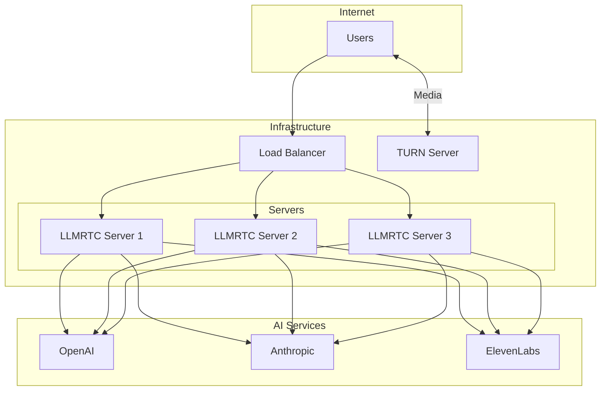
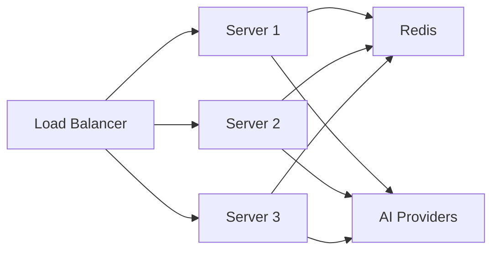

Guide for deploying LLMRTC backend in production environments.

---

## Architecture Overview

A production deployment typically includes:



---

## Prerequisites

### System Requirements

| Component | Minimum | Recommended |
|-----------|---------|-------------|
| CPU | 2 cores | 4+ cores |
| Memory | 2 GB | 4+ GB |
| Storage | 10 GB | 20+ GB SSD |
| Node.js | 20.x | 20.x LTS |
| FFmpeg | Required for streaming TTS | Latest stable |

### Network Requirements

| Port | Protocol | Purpose |
|------|----------|---------|
| 443 | TCP | HTTPS/WSS |
| 8787 | TCP | Backend (internal) |
| 3478 | UDP/TCP | TURN server |
| 10000-20000 | UDP | WebRTC media (if direct) |

---

## Docker Deployment

### Dockerfile

```dockerfile
FROM node:20-slim

# Install FFmpeg for streaming TTS
RUN apt-get update && \
    apt-get install -y --no-install-recommends ffmpeg && \
    rm -rf /var/lib/apt/lists/*

WORKDIR /app

# Install dependencies
COPY package*.json ./
RUN npm ci --only=production

# Copy application
COPY . .

# Non-root user
RUN useradd -r llmrtc && chown -R llmrtc:llmrtc /app
USER llmrtc

EXPOSE 8787

CMD ["npx", "llmrtc-backend"]
```

### Docker Compose

```yaml
version: '3.8'

services:
  llmrtc:
    build: .
    ports:
      - "8787:8787"
    environment:
      - OPENAI_API_KEY=${OPENAI_API_KEY}
      - ANTHROPIC_API_KEY=${ANTHROPIC_API_KEY}
      - ELEVENLABS_API_KEY=${ELEVENLABS_API_KEY}
      - PORT=8787
      - HOST=0.0.0.0
    restart: unless-stopped
    healthcheck:
      test: ["CMD", "curl", "-f", "http://localhost:8787/health"]
      interval: 30s
      timeout: 10s
      retries: 3

  nginx:
    image: nginx:alpine
    ports:
      - "443:443"
    volumes:
      - ./nginx.conf:/etc/nginx/nginx.conf:ro
      - ./certs:/etc/nginx/certs:ro
    depends_on:
      - llmrtc
    restart: unless-stopped
```

---

## Process Managers

### PM2

```javascript
// ecosystem.config.js
module.exports = {
  apps: [{
    name: 'llmrtc',
    script: 'npx',
    args: 'llmrtc-backend',
    instances: 'max',  // Or specific number
    exec_mode: 'cluster',
    env: {
      NODE_ENV: 'production',
      PORT: 8787
    },
    env_file: '.env',
    max_memory_restart: '1G',
    error_file: '/var/log/llmrtc/error.log',
    out_file: '/var/log/llmrtc/out.log',
    merge_logs: true,
    time: true
  }]
};
```

```bash
# Start
pm2 start ecosystem.config.js

# Monitor
pm2 monit

# Logs
pm2 logs llmrtc

# Restart on file changes (dev)
pm2 start ecosystem.config.js --watch
```

### systemd

```ini
# /etc/systemd/system/llmrtc.service
[Unit]
Description=LLMRTC Voice AI Server
After=network.target

[Service]
Type=simple
User=llmrtc
Group=llmrtc
WorkingDirectory=/opt/llmrtc
EnvironmentFile=/opt/llmrtc/.env
ExecStart=/usr/bin/npx llmrtc-backend
Restart=always
RestartSec=10
StandardOutput=append:/var/log/llmrtc/output.log
StandardError=append:/var/log/llmrtc/error.log

# Security
NoNewPrivileges=true
PrivateTmp=true
ProtectSystem=strict
ReadWritePaths=/var/log/llmrtc

[Install]
WantedBy=multi-user.target
```

```bash
# Enable and start
systemctl enable llmrtc
systemctl start llmrtc

# Status
systemctl status llmrtc

# Logs
journalctl -u llmrtc -f
```

---

## Reverse Proxy

### NGINX

```nginx
# /etc/nginx/sites-available/llmrtc
upstream llmrtc_backend {
    server 127.0.0.1:8787;
    keepalive 32;
}

server {
    listen 80;
    server_name voice.example.com;
    return 301 https://$server_name$request_uri;
}

server {
    listen 443 ssl http2;
    server_name voice.example.com;

    # SSL
    ssl_certificate /etc/letsencrypt/live/voice.example.com/fullchain.pem;
    ssl_certificate_key /etc/letsencrypt/live/voice.example.com/privkey.pem;
    ssl_protocols TLSv1.2 TLSv1.3;
    ssl_ciphers ECDHE-ECDSA-AES128-GCM-SHA256:ECDHE-RSA-AES128-GCM-SHA256;
    ssl_prefer_server_ciphers off;

    # WebSocket
    location / {
        proxy_pass http://llmrtc_backend;
        proxy_http_version 1.1;
        proxy_set_header Upgrade $http_upgrade;
        proxy_set_header Connection "upgrade";
        proxy_set_header Host $host;
        proxy_set_header X-Real-IP $remote_addr;
        proxy_set_header X-Forwarded-For $proxy_add_x_forwarded_for;
        proxy_set_header X-Forwarded-Proto $scheme;

        # Timeouts for long-lived connections
        proxy_read_timeout 86400;
        proxy_send_timeout 86400;
        proxy_connect_timeout 60;

        # Buffer settings
        proxy_buffering off;
        proxy_buffer_size 4k;
    }

    # Health check
    location /health {
        proxy_pass http://llmrtc_backend/health;
        proxy_read_timeout 5s;
    }
}
```

### Caddy

```caddyfile
voice.example.com {
    reverse_proxy localhost:8787 {
        header_up X-Real-IP {remote_host}
        header_up X-Forwarded-For {remote_host}

        # WebSocket support
        header_up Connection {http.request.header.Connection}
        header_up Upgrade {http.request.header.Upgrade}

        # Timeouts
        transport http {
            read_timeout 0
            write_timeout 0
        }
    }

    log {
        output file /var/log/caddy/llmrtc.log
    }
}
```

---

## Load Balancing

### Sticky Sessions

WebSocket connections need sticky sessions:

```nginx
upstream llmrtc_backend {
    ip_hash;  # Sticky sessions by IP
    server 127.0.0.1:8787;
    server 127.0.0.2:8787;
    server 127.0.0.3:8787;
}
```

### Health Checks

```nginx
upstream llmrtc_backend {
    server 127.0.0.1:8787 max_fails=3 fail_timeout=30s;
    server 127.0.0.2:8787 max_fails=3 fail_timeout=30s;
}
```

---

## TURN Server

### Metered.ca Integration

```bash
# Environment variables
METERED_APP_NAME=your-app
METERED_API_KEY=your-api-key
METERED_REGION=global  # or specific region
```

### Self-Hosted coturn

```bash
# /etc/turnserver.conf
listening-port=3478
tls-listening-port=5349
fingerprint
lt-cred-mech
use-auth-secret
static-auth-secret=your-secret-here
realm=voice.example.com
cert=/etc/letsencrypt/live/voice.example.com/fullchain.pem
pkey=/etc/letsencrypt/live/voice.example.com/privkey.pem
log-file=/var/log/turnserver/turn.log
```

Pass to LLMRTC:

```typescript
const server = new LLMRTCServer({
  iceServers: [
    { urls: 'stun:turn.example.com:3478' },
    {
      urls: 'turn:turn.example.com:3478',
      username: generateUsername(),
      credential: generateCredential()
    }
  ]
});
```

---

## Monitoring

### Health Endpoint

```bash
# Basic health check
curl https://voice.example.com/health
# {"ok":true}
```

### Prometheus Metrics

```typescript
import { Registry, collectDefaultMetrics } from 'prom-client';

const register = new Registry();
collectDefaultMetrics({ register });

// Expose metrics endpoint
app.get('/metrics', async (c) => {
  const metrics = await register.metrics();
  return c.text(metrics, 200, {
    'Content-Type': register.contentType
  });
});
```

### Log Aggregation

```bash
# Ship logs to centralized logging
journalctl -u llmrtc -f | fluent-bit -c /etc/fluent-bit/llmrtc.conf
```

---

## Scaling

### Horizontal Scaling



For session persistence across instances, use Redis:

```typescript
import Redis from 'ioredis';

const redis = new Redis(process.env.REDIS_URL);

// Store session state
server.on('connection', async ({ id }) => {
  await redis.hset(`session:${id}`, 'server', process.env.INSTANCE_ID);
});
```

### Vertical Scaling

| Concurrent Users | Recommended Specs |
|-----------------|-------------------|
| 10-50 | 2 CPU, 4GB RAM |
| 50-200 | 4 CPU, 8GB RAM |
| 200-500 | 8 CPU, 16GB RAM |
| 500+ | Multiple instances |

---

## Kubernetes

```yaml
# deployment.yaml
apiVersion: apps/v1
kind: Deployment
metadata:
  name: llmrtc
spec:
  replicas: 3
  selector:
    matchLabels:
      app: llmrtc
  template:
    metadata:
      labels:
        app: llmrtc
    spec:
      containers:
      - name: llmrtc
        image: your-registry/llmrtc:latest
        ports:
        - containerPort: 8787
        envFrom:
        - secretRef:
            name: llmrtc-secrets
        resources:
          requests:
            memory: "1Gi"
            cpu: "500m"
          limits:
            memory: "2Gi"
            cpu: "1000m"
        livenessProbe:
          httpGet:
            path: /health
            port: 8787
          initialDelaySeconds: 30
          periodSeconds: 10
        readinessProbe:
          httpGet:
            path: /health
            port: 8787
          initialDelaySeconds: 5
          periodSeconds: 5
---
apiVersion: v1
kind: Service
metadata:
  name: llmrtc
spec:
  selector:
    app: llmrtc
  ports:
  - port: 8787
    targetPort: 8787
  sessionAffinity: ClientIP  # Sticky sessions
```

---

## Related Documentation

- [CLI Mode](cli) - Environment variable configuration
- [Library Mode](library) - Programmatic configuration
- [Networking & TURN](networking-and-turn) - WebRTC connectivity
- [Security](security) - Production security
- [Operations: Monitoring](../operations/monitoring) - Observability
