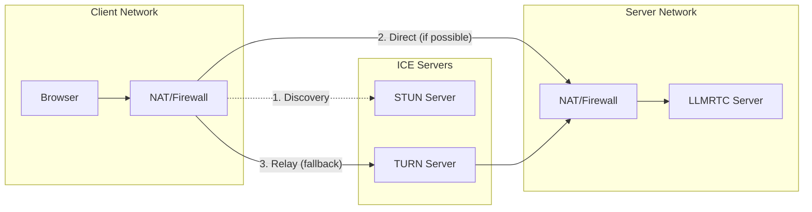

WebRTC enables low-latency audio/video streaming, but establishing peer connections through NAT and firewalls requires ICE (Interactive Connectivity Establishment) servers.

## Why TURN Matters

Most users are behind NAT (Network Address Translation) which prevents direct peer-to-peer connections. ICE servers help establish connections:

- **STUN servers** help discover your public IP address. They work for ~80% of connections.
- **TURN servers** relay traffic when direct connections fail. Essential for corporate firewalls and symmetric NAT.

**Without TURN, expect 10-20% of users to fail to connect** - especially on corporate networks, mobile data, and restrictive ISPs.



## How ICE Servers Are Delivered

LLMRTC handles ICE server distribution automatically:

1. Server resolves ICE servers at startup (from config, Metered API, or defaults)
2. When a client connects via WebSocket, the server sends a `ready` message containing the ICE servers
3. Client uses these servers to establish the WebRTC connection

```typescript
// Server sends this to client on WebSocket connect
{
  "type": "ready",
  "id": "session-uuid",
  "protocolVersion": 1,
  "iceServers": [
    { "urls": "stun:stun.metered.ca:80" },
    { "urls": "turn:global.relay.metered.ca:80", "username": "...", "credential": "..." },
    { "urls": "turn:global.relay.metered.ca:443?transport=tcp", "username": "...", "credential": "..." }
  ]
}
```

## Configuration Options

### Option 1: Metered TURN (Recommended)

[Metered TURN](https://www.metered.ca/tools/openrelay/) provides a global TURN network with automatic credential management.

**Environment Variables (CLI mode):**
```bash
METERED_APP_NAME=your-app      # From Metered dashboard (e.g., 'myapp' for myapp.metered.live)
METERED_API_KEY=your-key       # API key for fetching credentials
METERED_REGION=us_east         # Optional: us_east, europe, asia, etc.
```

**Library Mode:**
```typescript
import { LLMRTCServer } from '@metered/llmrtc-backend';

const server = new LLMRTCServer({
  providers: { llm, stt, tts },
  metered: {
    appName: 'your-app',    // Required
    apiKey: 'your-key',     // Required
    region: 'us_east'       // Optional: prefer specific region
  }
});
```

The server fetches fresh TURN credentials from Metered's API and includes them in every `ready` message. Credentials are cached and refreshed automatically.

### Option 2: Custom ICE Servers

Provide your own STUN/TURN servers.

**Environment Variables (CLI mode):**
```bash
ICE_SERVERS='[{"urls":"stun:stun.example.com:3478"},{"urls":"turn:turn.example.com:3478","username":"user","credential":"pass"}]'
```

**Library Mode:**
```typescript
const server = new LLMRTCServer({
  providers: { llm, stt, tts },
  iceServers: [
    { urls: 'stun:stun.example.com:3478' },
    {
      urls: 'turn:turn.example.com:3478',
      username: 'user',
      credential: 'pass'
    },
    {
      urls: 'turn:turn.example.com:443?transport=tcp',  // TCP fallback
      username: 'user',
      credential: 'pass'
    }
  ]
});
```

### Option 3: Client-Side Override

Clients can override server-provided ICE servers:

```typescript
const client = new LLMRTCWebClient({
  signallingUrl: 'ws://localhost:8787',
  iceServers: [
    { urls: 'stun:stun.l.google.com:19302' }
  ]
});
```

### Option 4: Default (STUN Only)

If no ICE configuration is provided, LLMRTC uses Metered's free STUN server:

```
stun:stun.metered.ca:80
```

**Warning:** STUN-only mode will fail for ~15-20% of users behind strict NAT. Use TURN in production.

## Resolution Priority

ICE servers are resolved in this order (first match wins):

| Priority | Source | When Used |
|----------|--------|-----------|
| 1 | Client `iceServers` config | Client explicitly overrides |
| 2 | Server `iceServers` config | Custom ICE servers configured |
| 3 | Metered API | `metered` config provided |
| 4 | Default STUN | No configuration (fallback) |

## Firewall Requirements

For WebRTC to work, ensure these ports are accessible:

| Port | Protocol | Purpose |
|------|----------|---------|
| 3478 | UDP/TCP | Standard STUN/TURN |
| 5349 | TCP/TLS | TURN over TLS |
| 443 | TCP | TURN over TCP (firewall bypass) |
| 49152-65535 | UDP | WebRTC media (dynamic range) |

**Tip:** Always provide a TCP/TLS TURN fallback (`turn:...?transport=tcp`) for corporate networks that block UDP.

## Debugging Connection Issues

### Check ICE Server Delivery

In browser devtools, look for the `ready` message in WebSocket traffic:

```javascript
// Console: verify ICE servers received
client.on('stateChange', (state) => {
  console.log('Connection state:', state);
});
```

### Common Issues

| Symptom | Likely Cause | Fix |
|---------|-------------|-----|
| Stuck in "connecting" | No TURN server, strict NAT | Add TURN servers |
| Works locally, fails remotely | Missing TURN | Add Metered or custom TURN |
| Works on WiFi, fails on mobile | Carrier-grade NAT | Ensure TCP TURN fallback |
| Intermittent disconnects | TURN credential expiry | Use Metered (auto-refresh) |

### Test Your Configuration

```bash
# Check if TURN server is reachable
curl -v telnet://turn.example.com:3478

# Test with Trickle ICE tool
# https://webrtc.github.io/samples/src/content/peerconnection/trickle-ice/
```

## Production Recommendations

1. **Always use TURN** - Don't rely on STUN alone
2. **Provide TCP fallback** - Some networks block UDP entirely
3. **Use geographic distribution** - Place TURN servers near users
4. **Monitor connection rates** - Track ICE connection success/failure
5. **Consider Metered** - Handles credentials, regions, and scaling automatically

## Related

- [Protocol Message Types](../protocol/message-types) - Details on `ready` message format
- [Web Client Connection](../web-client/connection-lifecycle) - Client-side connection handling
- [Troubleshooting](../operations/troubleshooting) - Common WebRTC issues
