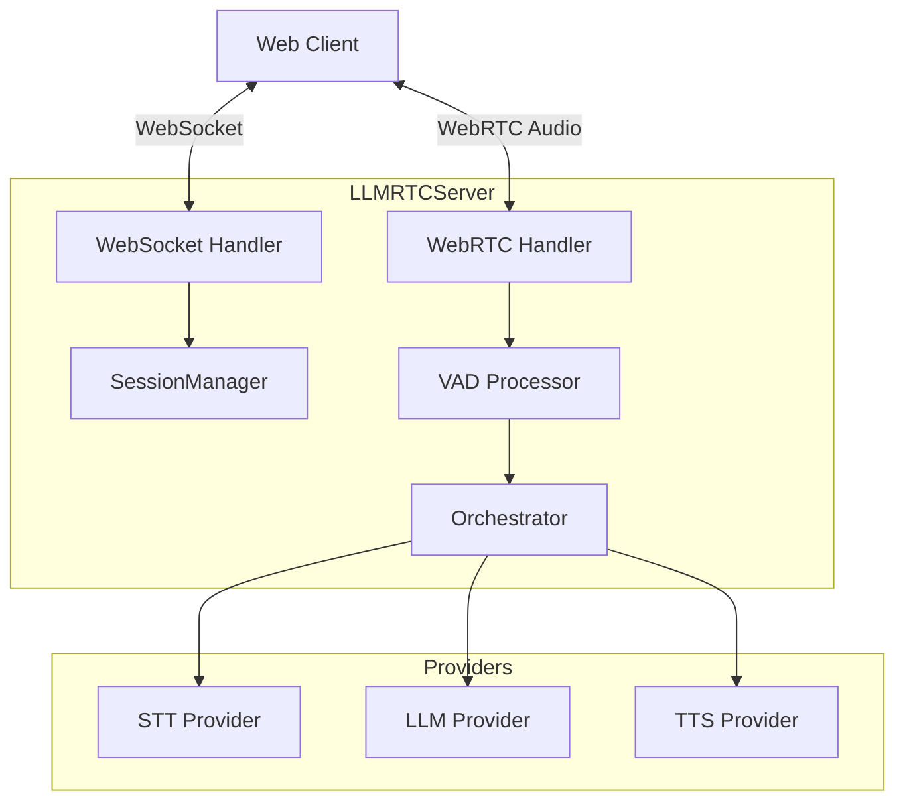
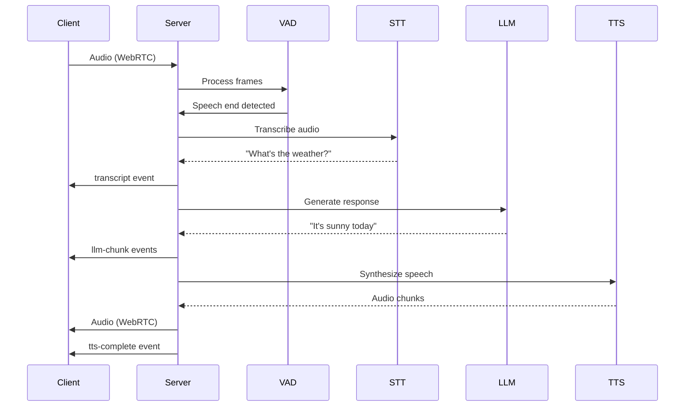

The **backend package** (`@llmrtc/llmrtc-backend`) is a Node.js server that handles WebRTC signaling, audio processing, provider orchestration, and session management for real-time voice AI applications.

---

## Architecture

The backend coordinates all server-side components:



---

## Core Capabilities

### Signaling & Transport
- WebSocket server for signaling and control messages
- WebRTC for low-latency bidirectional audio
- Automatic ICE candidate handling and TURN support
- Connection state management and health monitoring

### Audio Processing
- Server-side VAD (Silero v5) for speech detection
- Barge-in support (interrupt TTS when user speaks)
- Audio format conversion and resampling
- PCM to Opus encoding for WebRTC transport

### Session Management
- Unique session IDs for each connection
- Conversation history persistence
- Automatic reconnection support
- Configurable session TTL

### Provider Orchestration
- Pluggable providers for STT, LLM, and TTS
- Auto-detection based on environment variables
- Streaming support for low latency
- Two-phase execution for playbooks

---

## Usage Modes

The backend can be used two ways:

### CLI Mode

Run the server directly from the command line:

```bash
npx llmrtc-backend
```

Configuration via environment variables. Ideal for:
- Quick prototyping
- Simple deployments
- Docker containers

See [CLI Mode](cli) for details.

### Library Mode

Embed the server in your Node.js application:

```typescript
import { LLMRTCServer } from '@llmrtc/llmrtc-backend';

const server = new LLMRTCServer({
  providers: { llm, stt, tts },
  systemPrompt: 'You are a helpful assistant.',
  port: 8787
});

await server.start();
```

Ideal for:
- Custom authentication
- Integration with existing apps
- Advanced routing and middleware

See [Library Mode](library) for details.

---

## Request Flow

A typical voice interaction flows through the backend:



---

## Server Events

The server emits Node.js EventEmitter events for connection lifecycle:

| Event | Payload | Description |
|-------|---------|-------------|
| `listening` | `{ host: string, port: number }` | Server started |
| `connection` | `{ id: string }` | New client connected |
| `disconnect` | `{ id: string }` | Client disconnected |
| `error` | `Error` | Error occurred |

```typescript
server.on('listening', ({ host, port }) => {
  console.log(`Server running at ${host}:${port}`);
});

server.on('connection', ({ id }) => {
  console.log(`Client connected: ${id}`);
});

server.on('disconnect', ({ id }) => {
  console.log(`Client disconnected: ${id}`);
});

server.on('error', (error) => {
  console.error('Server error:', error);
});
```

---

## Server Hooks

For speech and processing events, use **hooks** (not EventEmitter events). Hooks are passed via the `hooks` configuration option:

```typescript
const server = new LLMRTCServer({
  providers: { llm, stt, tts },
  hooks: {
    onConnection: (sessionId, connectionId) => {
      console.log(`Session ${sessionId} connected`);
    },
    onDisconnect: (sessionId, timing) => {
      console.log(`Session ${sessionId} ended after ${timing.durationMs}ms`);
    },
    onSpeechStart: (sessionId, timestamp) => {
      console.log(`User started speaking in ${sessionId}`);
    },
    onSpeechEnd: (sessionId, timestamp, audioDurationMs) => {
      console.log(`User spoke for ${audioDurationMs}ms`);
    },
    onError: (error, context) => {
      console.error(`Error in ${context}:`, error);
    }
  }
});
```

| Hook | Description |
|------|-------------|
| `onConnection` | Session established (after WebRTC setup) |
| `onDisconnect` | Session ended, includes timing data |
| `onSpeechStart` | User started speaking (VAD triggered) |
| `onSpeechEnd` | User stopped speaking, includes audio duration |
| `onError` | Error occurred, includes context |

See [Observability & Hooks](observability-and-hooks) for the complete hooks reference.

---

## Endpoints

The backend exposes HTTP endpoints:

| Endpoint | Method | Description |
|----------|--------|-------------|
| `/health` | GET | Health check, returns `{ ok: true }` |
| `/` | WebSocket | Signaling endpoint for clients |

For custom endpoints, use library mode and access `server.getApp()`.

---

## Dependencies

The backend requires:

| Dependency | Purpose | Required |
|------------|---------|----------|
| Node.js 20+ | Runtime | Yes |
| FFmpeg | Streaming TTS audio processing | For streaming TTS |
| Provider API keys | STT/LLM/TTS services | Yes (unless local) |

---

## Related Documentation

- [CLI Mode](cli) - Command-line usage
- [Library Mode](library) - Programmatic API
- [Configuration](configuration) - All configuration options
- [Environment Variables](environment-variables) - Environment setup
- [Networking & TURN](networking-and-turn) - WebRTC connectivity
- [Voice Playbook Mode](voice-playbook) - Multi-stage conversations
- [Security](security) - Authentication and API keys
- [Deployment](deployment) - Production deployment
