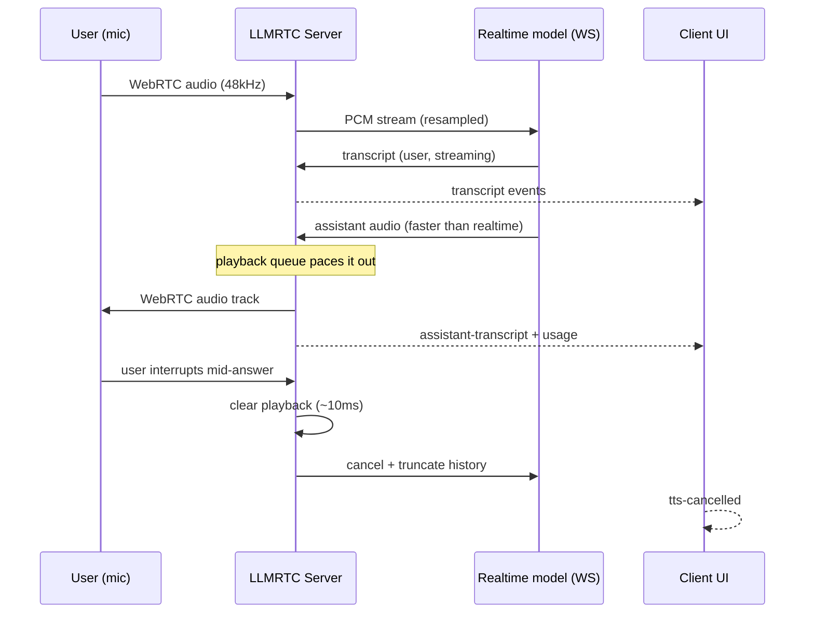

# Realtime Speech-to-Speech Relay

**Experimental.** Instead of the STT → LLM → TTS pipeline, a session in
**realtime relay mode** connects directly to a native speech-to-speech
model (OpenAI `gpt-realtime-2.1` family) over the provider's WebSocket.
The model hears the user's actual voice and answers with generated
speech in ~300–500ms, handles interruptions natively, and preserves
prosody — while LLMRTC keeps providing the WebRTC transport, tool
registry, playbooks, client protocol, and metrics.

Design details live in
[RFC 0001](https://github.com/llmrtc/llmrtc/blob/main/rfcs/0001-realtime-speech-to-speech.md).

## When to use which mode

| | Pipeline (default) | Realtime relay |
|---|---|---|
| Latency | ~800–1500ms | ~300–500ms |
| LLM choice | Any provider (Claude, GLM, local…) | The realtime model |
| Cost | Text-token pricing | Audio-token pricing (~10x) |
| Transcripts | Always | Optional (billed separately) |

## Providers

| Provider | Model | Status |
|---|---|---|
| `OpenAIRealtimeSpeechProvider` | `gpt-realtime-2.1` (default), `-mini` | Live-verified |
| `GeminiLiveSpeechProvider` | `gemini-3.1-flash-live-preview` | Experimental (Gemini Live is a Google preview API); conformance-tested against the documented wire format |

Gemini notes: ~10-minute socket lifetimes are handled inside the adapter
with session resumption and bounded input buffering, so reconnects don't
clip user speech; barge-in is provider-driven; stage instruction updates
use a system text turn, tool-set changes a resumption reconnect.

## Setup (library mode)

```typescript
import { LLMRTCServer, OpenAIRealtimeSpeechProvider } from '@llmrtc/llmrtc-backend';

const server = new LLMRTCServer({
  realtimeSpeech: {
    provider: new OpenAIRealtimeSpeechProvider({ apiKey: process.env.OPENAI_API_KEY! }),
    voice: 'marin',
    budget: { maxSessionMs: 30 * 60 * 1000 }  // default: 120 minutes
  },
  systemPrompt: 'You are a concise voice assistant.',
  toolRegistry  // optional: tools work natively in relay mode
});

await server.start();
```

`providers` becomes optional when `realtimeSpeech` is set. Relay mode
requires the WebRTC audio track (no base64-audio fallback), and
`streamingSTT`/`streamingTTS` are ignored.

## How it flows



## What clients receive

The existing protocol carries relay sessions — old clients keep
working. New additive events on the web client:

```typescript
client.on('transcript', (text, isFinal) => {
  // User speech: partials carry the accumulated text so far, so
  // replace the preview in place
  userLine.textContent = text;
});
client.on('assistantTranscript', (text, isFinal) => {
  assistantLine.textContent = text;      // what the assistant is saying
  if (isFinal) commitToHistory('assistant', text);
});
client.on('usage', (u) => {
  // Per-response spend telemetry (audio tokens are the cost driver)
  totalTokens += u.inputTokens + u.outputTokens;
});
client.on('modeChanged', (mode) => {
  // Advisory: the provider failed mid-session; after auto-reconnect,
  // check ready.mode - it is authoritative
  banner.show(`Voice quality changed: running in ${mode} mode`);
});
client.on('ttsCancelled', () => assistantLine.classList.add('interrupted'));
```

`ready.mode` reports `'realtime'` or `'pipeline'`. Everything else —
connecting, mic capture, playing the audio track — is identical to
pipeline mode, so an existing app switches modes with a server-side
config change only.

## Complete example: a voice agent with tools

The same `ToolRegistry` definitions drive the realtime model's native
function calling — no changes to tool code:

```typescript
import {
  LLMRTCServer,
  OpenAIRealtimeSpeechProvider,
  ToolRegistry,
  defineTool
} from '@llmrtc/llmrtc-backend';

const toolRegistry = new ToolRegistry();
toolRegistry.register(defineTool(
  {
    name: 'check_order_status',
    description: 'Look up the status of an order by its number',
    parameters: {
      type: 'object',
      properties: { orderNumber: { type: 'string' } },
      required: ['orderNumber']
    }
  },
  async ({ orderNumber }) => {
    const order = await db.orders.find(orderNumber);
    return { status: order.status, eta: order.eta };
  }
));

const server = new LLMRTCServer({
  realtimeSpeech: {
    provider: new OpenAIRealtimeSpeechProvider({
      apiKey: process.env.OPENAI_API_KEY!,
      model: 'gpt-realtime-2.1'        // or 'gpt-realtime-2.1-mini' (~1/3 cost)
    }),
    voice: 'marin',
    turnDetection: { type: 'semantic', eagerness: 'auto' },
    maxOutputTokens: 800,
    budget: { maxSessionMs: 30 * 60 * 1000, onExceeded: 'end-session' }
  },
  systemPrompt:
    'You are a friendly order-support voice agent. Use check_order_status ' +
    'when the caller mentions an order. Keep answers to one or two sentences.',
  toolRegistry
});

await server.start();
```

The model hears "where's my order twelve-forty-five?", calls
`check_order_status({ orderNumber: '1245' })` through your handler, and
speaks the result — the client sees the same `tool-call-start` /
`tool-call-end` events as in pipeline mode.

### Gemini variant

```typescript
import { GeminiLiveSpeechProvider } from '@llmrtc/llmrtc-backend';

const server = new LLMRTCServer({
  realtimeSpeech: {
    provider: new GeminiLiveSpeechProvider({ apiKey: process.env.GOOGLE_API_KEY! }),
    voice: 'Kore'
  },
  systemPrompt: 'You are a concise voice assistant.'
});
```

### Configuration reference

| Option | Default | Description |
|---|---|---|
| `provider` | — | `OpenAIRealtimeSpeechProvider` or `GeminiLiveSpeechProvider` |
| `voice` | provider default | Provider voice id (`marin`, `cedar`… / `Kore`…) |
| `instructions` | server `systemPrompt` | System prompt for the realtime model |
| `inputTranscription` | `true` | User transcripts (billed separately) |
| `transcriptionModel` | `gpt-4o-mini-transcribe` | OpenAI transcript model (Gemini transcribes natively) |
| `turnDetection` | `server_vad` | `{type: 'server_vad', silenceDurationMs?}` or `{type: 'semantic', eagerness?}` |
| `maxOutputTokens` | provider default | Per-response cap — the primary runaway-cost bound |
| `contextManagement` | truncate @ 0.8 | Provider-side context cost lever |
| `budget.maxSessionMs` | 120 minutes | Wall-clock cap (`0` disables) |
| `budget.maxTokens` | unset | Cumulative token cap |
| `budget.onExceeded` | `end-session` | Or `warn` |
| `clientReconnectGraceMs` | 30000 | Reconnect-adoption window (`0` disables) |

## Playbooks

With a `playbook` configured, stage transitions reconfigure the live
session's instructions and tools, and `stage-change` events reach the
client as in pipeline mode. Relay-mode playbooks support
`llm_decision` transitions; `clearHistory` and per-stage `llmConfig`
are not applied (a startup warning lists anything unsupported).

## Interruptions, budgets, renewal

- **Barge-in**: reaction is bounded by design — server-side playback
  clears within ~10ms of the interruption signal regardless of how much
  of the answer was already generated (end-to-end adds network and
  client playout latency), and the provider's history is truncated to
  what the user actually heard.
- **Budgets**: `budget.maxSessionMs` (default 120 minutes) and
  `budget.maxTokens` end or warn on runaway sessions
  (`BUDGET_EXCEEDED`).
- **60-minute cap**: OpenAI realtime sessions expire after an hour; the
  relay renews automatically by seeding a fresh session from the
  conversation transcripts.
- **Reconnects**: a dropped client has 30 seconds
  (`clientReconnectGraceMs`) to reconnect to the same live conversation
  before the provider session closes.

## Fallback behavior

With pipeline `providers` configured alongside `realtimeSpeech`, a
session whose provider connection fails at setup starts in pipeline
mode instead (`ready.mode: 'pipeline'`). A mid-session provider failure
sends `mode-changed {mode: 'pipeline'}` (advisory) and ends the
connection; the client's auto-reconnect lands on the fallback **if the
provider is still unreachable** — otherwise the session resumes in
realtime mode. `ready.mode` is authoritative. Without pipeline
providers, failures surface as `REALTIME_ERROR`.

## Scale notes

Each relay session holds one provider WebSocket, streams ~43–64KB/s of
base64 audio upstream continuously (16kHz Gemini / 24kHz OpenAI), and
runs a 100Hz playback pacer. Provider-side, audio tokens-per-minute
limits — not concurrent-session caps — are the binding constraint. New
sessions scale any-node; reconnect recovery (the grace window, session
history) is node-local, so keep load-balancer affinity at least as long
as `clientReconnectGraceMs` if seamless reconnects matter.

## Cost warning

Realtime audio pricing is roughly an order of magnitude above an
equivalent pipeline: at `gpt-realtime-2.1` rates, a 10-minute
conversation runs ~$0.50–0.90 (cache-warm). `gpt-realtime-2.1-mini`
costs ~1/3 of that. Input transcription (on by default) bills
separately at the transcription model's rate. Set budgets in
production.
