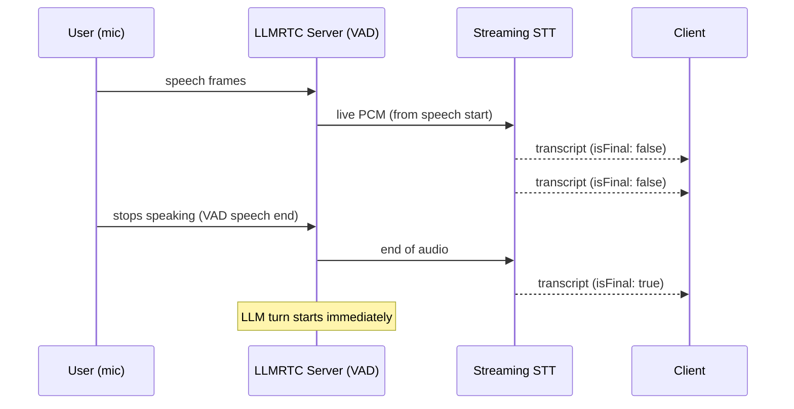

# Streaming Speech-to-Text

By default the pipeline transcribes each utterance **after** the user
stops speaking: server-side VAD buffers the speech, then sends the whole
segment to the STT provider. With **streaming STT**, audio flows to the
provider live *while the user is talking* — interim transcripts appear in
the client within a couple hundred milliseconds, and the final transcript
(and therefore the LLM turn) starts earlier because most of the audio was
already processed before the user finished.



## Enable it

Streaming STT is **opt-in** and requires an STT provider that implements
`transcribeStream`. Two are included:

| Provider | Model | Notes |
|----------|-------|-------|
| `ElevenLabsScribeProvider` | Scribe v2 Realtime | Sub-150ms partials; batch requests use Scribe v2 |
| `OpenAIRealtimeSTTProvider` | `gpt-realtime-whisper` | Native streaming over the Realtime API; audio-duration pricing |

### Library mode

```typescript
import {
  LLMRTCServer,
  ElevenLabsScribeProvider,
  AnthropicLLMProvider,
  OpenAITTSProvider
} from '@llmrtc/llmrtc-backend';

const server = new LLMRTCServer({
  providers: {
    llm: new AnthropicLLMProvider({ apiKey: process.env.ANTHROPIC_API_KEY! }),
    stt: new ElevenLabsScribeProvider({ apiKey: process.env.ELEVENLABS_API_KEY! }),
    tts: new OpenAITTSProvider({ apiKey: process.env.OPENAI_API_KEY! })
  },
  streamingSTT: true,   // stream mic audio to STT during speech
  streamingTTS: true
});

await server.start();
```

Or with OpenAI's realtime transcription:

```typescript
import { OpenAIRealtimeSTTProvider } from '@llmrtc/llmrtc-backend';

const stt = new OpenAIRealtimeSTTProvider({
  apiKey: process.env.OPENAI_API_KEY!,
  model: 'gpt-realtime-whisper',   // default
  delay: 'low'                     // optional latency/accuracy knob
});
```

### CLI mode

```bash
STREAMING_STT=true
STT_PROVIDER=elevenlabs-scribe    # or: openai-realtime
ELEVENLABS_API_KEY=xi-...         # for elevenlabs-scribe
```

If `streamingSTT` is enabled but the configured STT provider has no
`transcribeStream`, the server falls back to the buffered pipeline —
nothing breaks.

## Interim transcripts in the client

No client changes are required. The web client has always emitted the
`transcript` event with an `isFinal` flag; buffered STT only ever
produced finals, streaming STT now delivers partials too:

```typescript
client.on('transcript', (text, isFinal) => {
  if (isFinal) {
    commitMessage(text);      // the final utterance
  } else {
    showLivePreview(text);    // updates while the user speaks
  }
});
```

Partial transcripts carry the **accumulated text so far** (not deltas),
so each event can directly replace the previous preview.

Most providers emit exactly one final per utterance. If a provider emits
several final segments, each is relayed to the client individually while
the LLM receives them joined in order as a single turn.

## How it works

1. Server-side VAD (Silero) detects speech start. A short pre-speech
   buffer (~300ms) is flushed first so the first word isn't clipped.
2. Mic frames are resampled to the provider's preferred rate
   (`streamingInputSampleRate`: 16kHz for Scribe, 24kHz for OpenAI
   Realtime) and streamed over the provider's WebSocket.
3. Each provider partial is relayed to the client as a
   `transcript` message with `isFinal: false`.
4. At VAD speech end the audio stream is closed; the provider commits
   and returns the final transcript, which drives the normal LLM → TTS
   turn. Barge-in and turn cancellation behave exactly as in buffered
   mode.

## Custom streaming providers

Implement `transcribeStream` (and optionally declare the input rate) on
any `STTProvider`:

```typescript
import type { STTProvider, STTResult } from '@llmrtc/llmrtc-core';

class MyStreamingSTT implements STTProvider {
  name = 'my-stt';
  streamingInputSampleRate = 16000; // 16-bit mono PCM frames

  async transcribe(audio: Buffer): Promise<STTResult> { /* batch */ }

  async *transcribeStream(audio: AsyncIterable<Buffer>): AsyncIterable<STTResult> {
    // send frames to your engine as they arrive...
    yield { text: 'partial text', isFinal: false };
    // ...and finish with a final result
    yield { text: 'full utterance', isFinal: true };
  }
}
```

Yield partials with the accumulated text and exactly one final per
utterance (multiple finals are concatenated in order).
