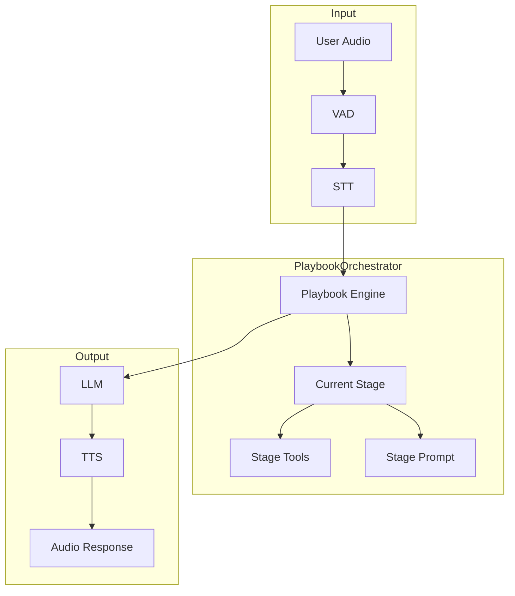
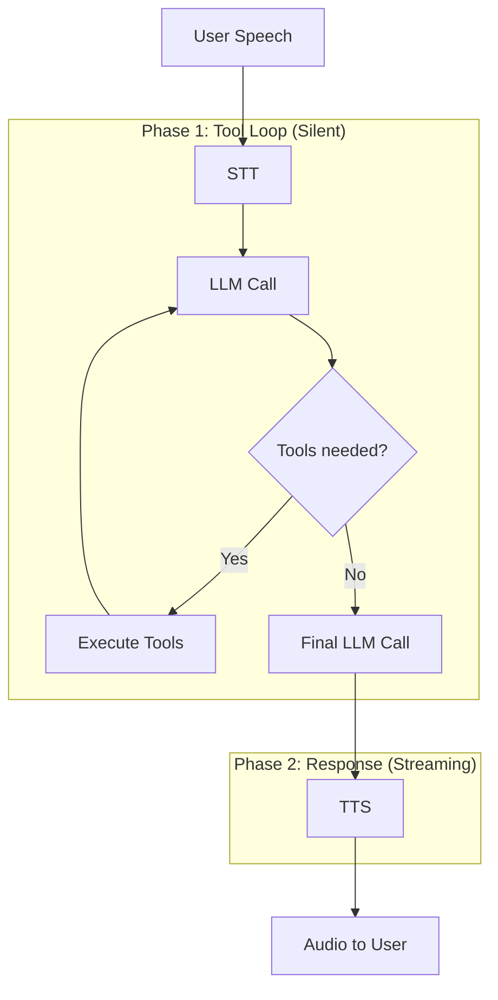

Voice Playbook mode combines the speech pipeline (VAD → STT → LLM → TTS) with multi-stage playbook logic. Use this for complex voice workflows with tools, stages, and transitions.

---

## Architecture



The PlaybookOrchestrator manages:
- Stage state and transitions
- Per-stage tools and prompts
- Two-phase execution
- History management

---

## Basic Setup

```typescript
import {
  LLMRTCServer,
  ToolRegistry,
  defineTool
} from '@metered/llmrtc-backend';
import type { Playbook } from '@metered/llmrtc-core';

// Define tools
const tools = new ToolRegistry();

tools.register(defineTool({
  name: 'check_balance',
  description: 'Check account balance',
  parameters: {
    type: 'object',
    properties: {
      accountId: { type: 'string' }
    },
    required: ['accountId']
  },
  execute: async ({ accountId }) => {
    // Implementation
    return { balance: 1500.00 };
  }
}));

// Define playbook
const playbook: Playbook = {
  name: 'support-bot',
  initialStage: 'greeting',
  stages: {
    greeting: {
      prompt: 'Greet the customer and ask how you can help.',
      transitions: [
        { to: 'billing', when: 'user mentions billing or payment' },
        { to: 'technical', when: 'user mentions technical issue' }
      ]
    },
    billing: {
      prompt: 'Help with billing inquiries. Use check_balance for account info.',
      tools: ['check_balance'],
      transitions: [
        { to: 'farewell', when: 'issue resolved' }
      ]
    },
    technical: {
      prompt: 'Help with technical issues.',
      transitions: [
        { to: 'farewell', when: 'issue resolved' }
      ]
    },
    farewell: {
      prompt: 'Thank the customer and end the conversation.'
    }
  }
};

// Create server with playbook
const server = new LLMRTCServer({
  providers: { llm, stt, tts },
  playbook,
  toolRegistry: tools,
  playbookOptions: {
    maxToolCallsPerTurn: 10,
    phase1TimeoutMs: 60000,
    debug: false
  }
});

await server.start();
```

---

## Playbook Options

```typescript
interface PlaybookOptions {
  // Tool execution
  maxToolCallsPerTurn?: number;  // Default: 10
  phase1TimeoutMs?: number;      // Default: 60000 (60s)

  // History
  historyLimit?: number;         // Default: 50

  // LLM behavior
  llmRetries?: number;           // Default: 3

  // Two-phase execution
  twoPhaseExecution?: boolean;   // Default: true

  // Debugging
  debug?: boolean;               // Default: false
}
```

---

## Two-Phase Execution

Voice playbooks use two-phase execution by default:



**Phase 1**: The LLM calls tools silently. The user doesn't hear intermediate results.

**Phase 2**: After tools complete, the LLM generates a spoken response that summarizes results.

This produces natural, concise responses even for complex tool workflows.

### Disabling Two-Phase

```typescript
const server = new LLMRTCServer({
  playbook,
  toolRegistry: tools,
  playbookOptions: {
    twoPhaseExecution: false  // Stream everything including tool reasoning
  }
});
```

---

## Stage Transitions

Transitions can be triggered in multiple ways:

### LLM-Decided Transitions

The LLM decides to transition based on conversation context:

```typescript
stages: {
  greeting: {
    prompt: 'Greet the user. When they explain their issue, move to the appropriate stage.',
    transitions: [
      { to: 'billing', when: 'user mentions billing, payment, or account' },
      { to: 'technical', when: 'user mentions bugs, errors, or technical problems' }
    ]
  }
}
```

### Tool-Triggered Transitions

Tools can return a `__transition` property:

```typescript
const checkEligibility = defineTool({
  name: 'check_eligibility',
  // ...
  execute: async (args) => {
    const eligible = await checkUserEligibility(args.userId);
    return {
      eligible,
      __transition: eligible ? 'offer' : 'rejection'
    };
  }
});
```

### Programmatic Transitions

Use hooks to force transitions:

```typescript
const server = new LLMRTCServer({
  playbook,
  hooks: {
    onStageChange: (from, to, reason) => {
      console.log(`Transition: ${from} → ${to} (${reason})`);
    }
  }
});
```

---

## Client Events

The client receives events for UI updates:

### Stage Change

```typescript
client.on('stageChange', ({ from, to, reason }) => {
  console.log(`Stage: ${from} → ${to}`);
  updateStageIndicator(to);
});
```

### Tool Events

```typescript
client.on('toolCallStart', ({ name, arguments: args }) => {
  showToolIndicator(name);
});

client.on('toolCallEnd', ({ name, result }) => {
  hideToolIndicator(name);
});
```

---

## History Management

Each stage can control history:

```typescript
stages: {
  triage: {
    prompt: '...',
    historyStrategy: 'full'  // Carry all history
  },
  resolution: {
    prompt: '...',
    historyStrategy: 'summary'  // Summarize then reset
  },
  farewell: {
    prompt: '...',
    historyStrategy: 'reset'  // Start fresh
  }
}
```

| Strategy | Behavior |
|----------|----------|
| `full` | Keep complete history (default) |
| `reset` | Clear history on stage entry |
| `summary` | LLM summarizes, then reset |
| `lastN` | Keep only last N messages |

---

## Error Handling

Playbooks handle errors gracefully:

### Tool Errors

```typescript
const riskyTool = defineTool({
  name: 'risky_operation',
  execute: async (args) => {
    try {
      return await performOperation(args);
    } catch (error) {
      // Return error info instead of throwing
      return {
        success: false,
        error: error.message
      };
    }
  }
});
```

### LLM Retries

The orchestrator retries on transient errors:

```typescript
playbookOptions: {
  llmRetries: 3  // Retry up to 3 times with exponential backoff
}
```

Retryable errors: 429 (rate limit), 5xx, timeouts
Non-retryable: 4xx client errors (except 429)

---

## Observability

Track playbook execution with hooks:

```typescript
const server = new LLMRTCServer({
  playbook,
  hooks: {
    onStageChange: (from, to, reason) => {
      metrics.increment('stage_transitions', { from, to });
    },
    onToolStart: (ctx, request) => {
      console.log(`Tool: ${request.name}`);
    },
    onToolEnd: (ctx, result, timing) => {
      metrics.timing('tool_duration', timing.totalMs, {
        tool: result.name
      });
    }
  }
});
```

---

## Related Documentation

- [Concepts: Playbooks](../concepts/playbooks) - Playbook concepts
- [Playbooks: Overview](../playbooks/overview) - Detailed playbook guide
- [Playbooks: Defining Playbooks](../playbooks/defining-playbooks) - Configuration reference
- [Core SDK: Tools](../core-sdk/tools) - Tool system details
- [Observability & Hooks](observability-and-hooks) - Monitoring hooks
