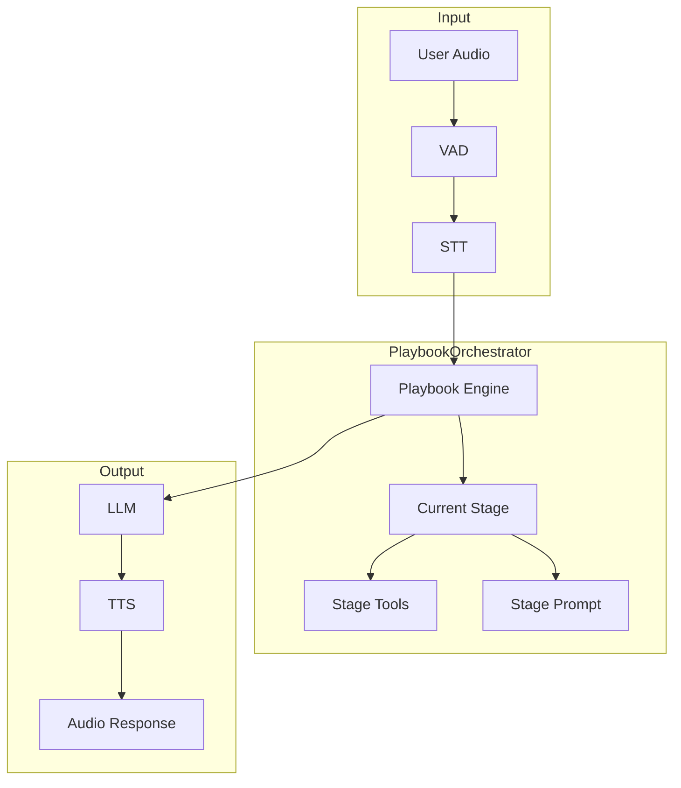
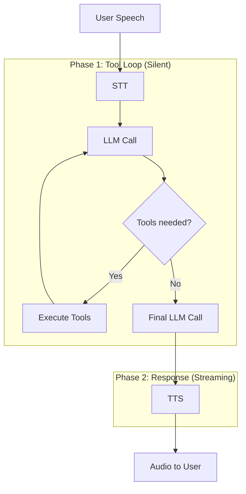

Voice Playbook mode combines the speech pipeline (VAD → STT → LLM → TTS) with multi-stage playbook logic. Use this for complex voice workflows with tools, stages, and transitions.

---

## Architecture



The PlaybookOrchestrator manages:
- Stage state and transitions
- Per-stage tools and prompts
- Two-phase execution
- History management

---

## Basic Setup

```typescript
import {
  LLMRTCServer,
  ToolRegistry,
  defineTool
} from '@llmrtc/llmrtc-backend';
import type { Playbook } from '@llmrtc/llmrtc-core';

// Define tools
const tools = new ToolRegistry();

tools.register(defineTool({
  name: 'check_balance',
  description: 'Check account balance',
  parameters: {
    type: 'object',
    properties: {
      accountId: { type: 'string' }
    },
    required: ['accountId']
  }
}, async ({ accountId }) => {
  // Implementation
  return { balance: 1500.00 };
}));

// Define playbook
const playbook: Playbook = {
  id: 'support-bot',
  initialStage: 'greeting',
  stages: [
    {
      id: 'greeting',
      name: 'Greeting',
      systemPrompt: 'Greet the customer and ask how you can help.'
    },
    {
      id: 'billing',
      name: 'Billing Support',
      systemPrompt: 'Help with billing inquiries. Use check_balance for account info.',
      tools: [tools.getTool('check_balance').definition]
    },
    {
      id: 'technical',
      name: 'Technical Support',
      systemPrompt: 'Help with technical issues.'
    },
    {
      id: 'farewell',
      name: 'Farewell',
      systemPrompt: 'Thank the customer and end the conversation.'
    }
  ],
  transitions: [
    { id: 't1', from: 'greeting', condition: { type: 'keyword', keywords: ['billing', 'payment', 'invoice'] }, action: { targetStage: 'billing' } },
    { id: 't2', from: 'greeting', condition: { type: 'keyword', keywords: ['technical', 'bug', 'error'] }, action: { targetStage: 'technical' } },
    { id: 't3', from: 'billing', condition: { type: 'llm_decision' }, action: { targetStage: 'farewell' } },
    { id: 't4', from: 'technical', condition: { type: 'llm_decision' }, action: { targetStage: 'farewell' } }
  ]
};

// Create server with playbook
const server = new LLMRTCServer({
  providers: { llm, stt, tts },
  playbook,
  toolRegistry: tools,
  playbookOptions: {
    maxToolCallsPerTurn: 10,
    phase1TimeoutMs: 60000,
    debug: false
  }
});

await server.start();
```

---

## Playbook Options (Server Level)

At the `LLMRTCServer` level, the following playbook options are supported:

```typescript
interface ServerPlaybookOptions {
  // Tool execution
  maxToolCallsPerTurn?: number;  // Default: 10
  phase1TimeoutMs?: number;      // Default: 60000 (60s)

  // Debugging
  debug?: boolean;               // Default: false
}
```

:::note Core SDK Options
Additional options like `historyLimit` and `llmRetries` are available when using `PlaybookOrchestrator` directly via the core SDK. See [Core SDK Playbooks](../core-sdk/playbooks) for details.
:::

---

## Two-Phase Execution

Voice playbooks use two-phase execution by default:



**Phase 1**: The LLM calls tools silently. The user doesn't hear intermediate results.

**Phase 2**: After tools complete, the LLM generates a spoken response that summarizes results.

This produces natural, concise responses even for complex tool workflows.

### Disabling Two-Phase

To disable two-phase execution, set `twoPhaseExecution: false` on individual stages:

```typescript
stages: [
  {
    id: 'simple-response',
    name: 'Simple Response',
    systemPrompt: '...',
    twoPhaseExecution: false  // Stream everything including tool reasoning
  }
]
```

---

## Stage Transitions

Transitions can be triggered in multiple ways:

### LLM-Decided Transitions

The LLM decides to transition based on conversation context:

```typescript
// Stages array
stages: [
  {
    id: 'greeting',
    name: 'Greeting',
    systemPrompt: 'Greet the user. When they explain their issue, use the playbook_transition tool to move to the appropriate stage.'
  }
],
// Use llm_decision condition type - the LLM calls playbook_transition tool
transitions: [
  { id: 't1', from: 'greeting', condition: { type: 'llm_decision' }, action: { targetStage: 'billing' } },
  { id: 't2', from: 'greeting', condition: { type: 'llm_decision' }, action: { targetStage: 'technical' } }
]
```

### Tool-Triggered Transitions

Tools can return a `__transition` property:

```typescript
const checkEligibility = defineTool({
  name: 'check_eligibility',
  description: 'Check user eligibility',
  parameters: {
    type: 'object',
    properties: { userId: { type: 'string' } },
    required: ['userId']
  }
}, async (args) => {
  const eligible = await checkUserEligibility(args.userId);
  return {
    eligible,
    __transition: eligible ? 'offer' : 'rejection'
  };
});
```

### Programmatic Transitions

Use hooks to force transitions:

```typescript
const server = new LLMRTCServer({
  playbook,
  hooks: {
    onStageEnter: (ctx, stageName) => {
      console.log(`Entered stage: ${stageName}`);
    },
    onStageExit: (ctx, stageName) => {
      console.log(`Exited stage: ${stageName}`);
    }
  }
});
```

---

## Client Events

The client receives events for UI updates:

### Stage Change

```typescript
client.on('stageChange', ({ from, to, reason }) => {
  console.log(`Stage: ${from} → ${to}`);
  updateStageIndicator(to);
});
```

### Tool Events

```typescript
client.on('toolCallStart', ({ name, callId, arguments: args }) => {
  showToolIndicator(name);
});

client.on('toolCallEnd', ({ callId, result, error, durationMs }) => {
  hideToolIndicator();
});
```

---

## History Management

History is managed at the orchestrator level. When using `PlaybookOrchestrator` directly (core SDK), you can configure `historyLimit` in the options. The orchestrator automatically trims older messages when the limit is exceeded.

:::note
At the `LLMRTCServer` level, history management uses default settings. For custom history limits, use the core SDK directly.
:::

---

## Error Handling

Playbooks handle errors gracefully:

### Tool Errors

```typescript
const riskyTool = defineTool({
  name: 'risky_operation',
  description: 'Perform a risky operation',
  parameters: { type: 'object', properties: {} }
}, async (args) => {
  try {
    return await performOperation(args);
  } catch (error) {
    // Return error info instead of throwing
    return {
      success: false,
      error: error.message
    };
  }
});
```

### LLM Retries

The `PlaybookOrchestrator` includes built-in retry logic for transient errors:
- Retryable errors: 429 (rate limit), 5xx, timeouts
- Non-retryable: 4xx client errors (except 429)

When using the core SDK directly, configure retries via `llmRetries` option.

---

## Observability

Track playbook execution with hooks:

```typescript
const server = new LLMRTCServer({
  playbook,
  hooks: {
    onToolStart: (ctx, request) => {
      console.log(`Tool: ${request.name}`);
    },
    onToolEnd: (ctx, result, timing) => {
      metrics.timing('tool_duration', timing.durationMs, {
        tool: result.toolName
      });
    }
  }
});
```

:::note Playbook Hooks
Playbook-specific hooks (`onStageEnter`, `onStageExit`, `onTransition`) are available when using `PlaybookOrchestrator` directly. See [Hooks & Metrics](../core-sdk/hooks-and-metrics) for the complete hook reference.
:::

---

## Related Documentation

- [Concepts: Playbooks](../concepts/playbooks) - Playbook concepts
- [Playbooks: Overview](../playbooks/overview) - Detailed playbook guide
- [Playbooks: Defining Playbooks](../playbooks/defining-playbooks) - Configuration reference
- [Core SDK: Tools](../core-sdk/tools) - Tool system details
- [Observability & Hooks](observability-and-hooks) - Monitoring hooks
