LLMRTC is a modular SDK for building real-time voice and text AI applications. This page explains the overall architecture and how components interact.

---

## Package Structure

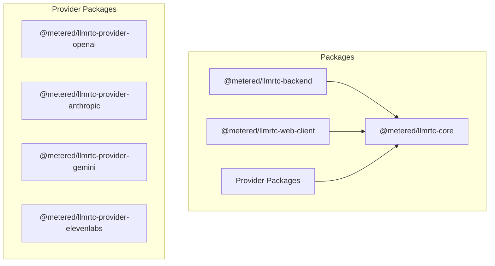

| Package | Purpose |
|---------|---------|
| `@metered/llmrtc-core` | Types, orchestrators, tools, protocol, hooks |
| `@metered/llmrtc-backend` | Server, WebRTC, VAD, session management |
| `@metered/llmrtc-web-client` | Browser client, audio capture, events |
| `@metered/llmrtc-provider-*` | LLM, STT, TTS provider implementations |

---

## High-Level Data Flow

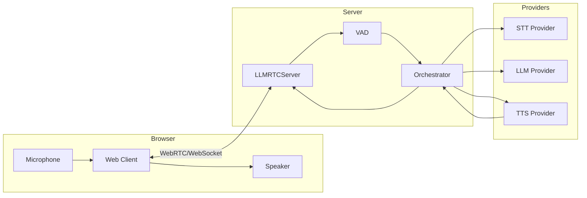

**Flow:**
1. User speaks into microphone
2. Audio streams to server via WebRTC
3. VAD detects speech boundaries
4. STT transcribes audio to text
5. LLM generates response
6. TTS synthesizes speech
7. Audio streams back to browser via WebRTC

---

## Conversation Turn Sequence

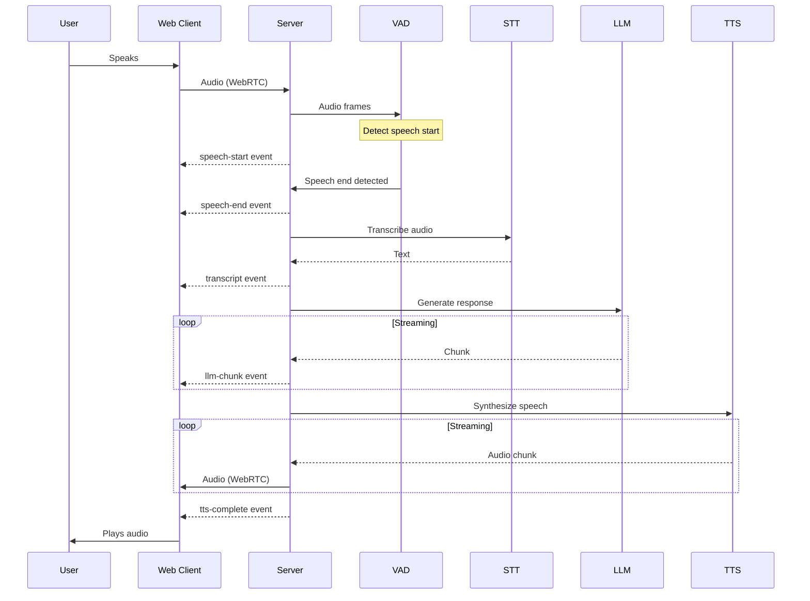

---

## Server Components

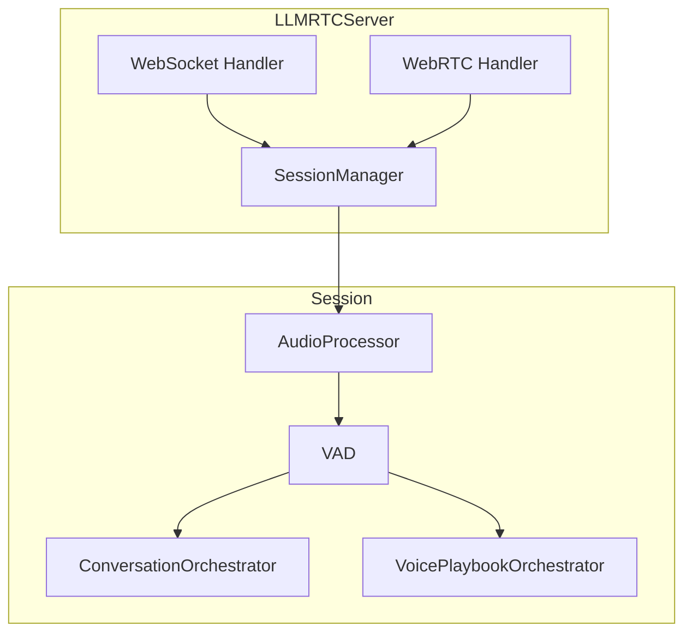

| Component | Responsibility |
|-----------|----------------|
| `WebSocket Handler` | Signaling, control messages |
| `WebRTC Handler` | Audio/video streaming |
| `SessionManager` | Session lifecycle, reconnection |
| `AudioProcessor` | Audio buffering, format conversion |
| `VAD` | Voice activity detection (Silero v5) |
| `ConversationOrchestrator` | Simple STT → LLM → TTS pipeline |
| `VoicePlaybookOrchestrator` | Two-phase execution with tools |

---

## Orchestrator Types

### ConversationOrchestrator

Simple pipeline for single-prompt assistants:

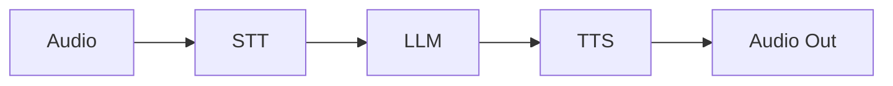

### PlaybookOrchestrator

Two-phase execution with stages and tools:

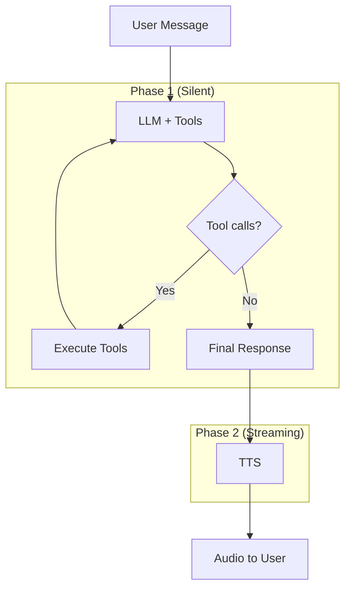

### VoicePlaybookOrchestrator

Wraps PlaybookOrchestrator with STT/TTS for voice:

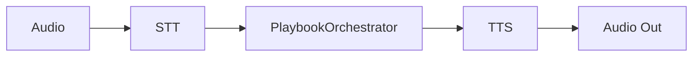

---

## Transport Layer

LLMRTC uses WebRTC for low-latency audio and WebSocket for signaling:

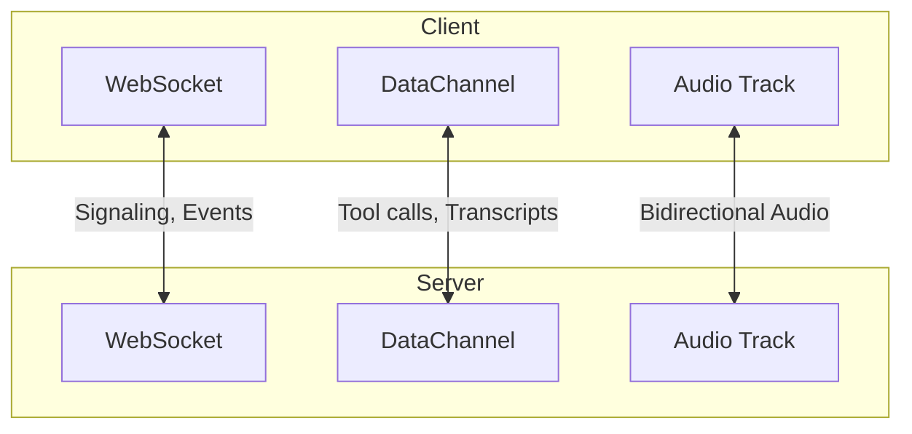

| Transport | Purpose |
|-----------|---------|
| WebSocket | Signaling (SDP, ICE), control messages |
| DataChannel | Low-latency JSON messages (transcripts, tool events) |
| Audio Track | Bidirectional audio streaming |

---

## Provider Architecture

Providers implement standardized interfaces:

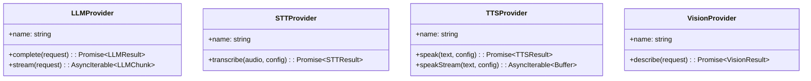

### Provider Selection

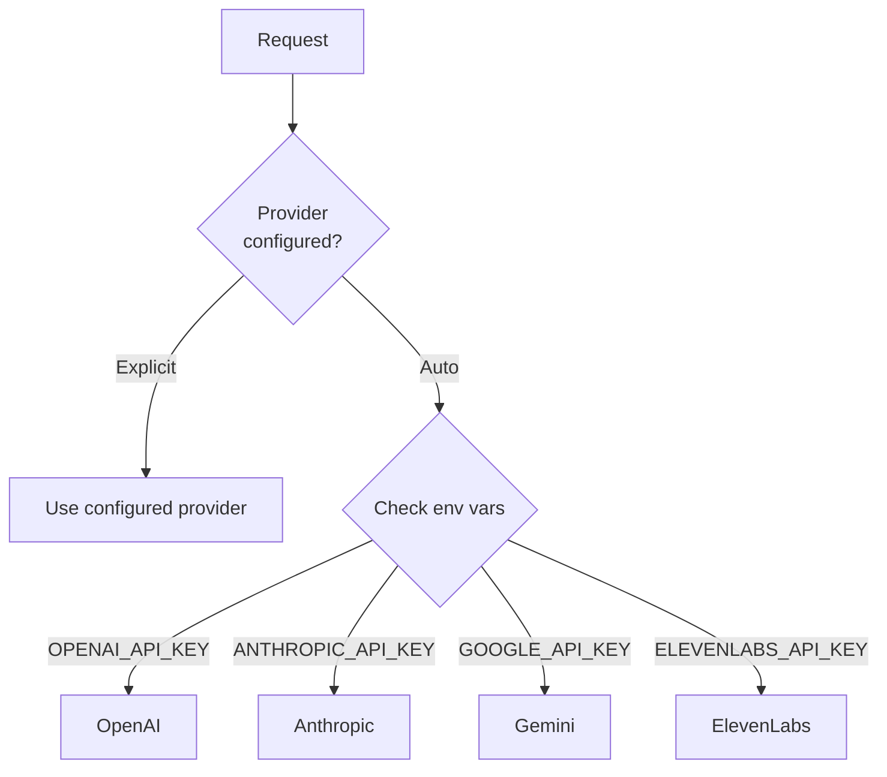

---

## Session Lifecycle

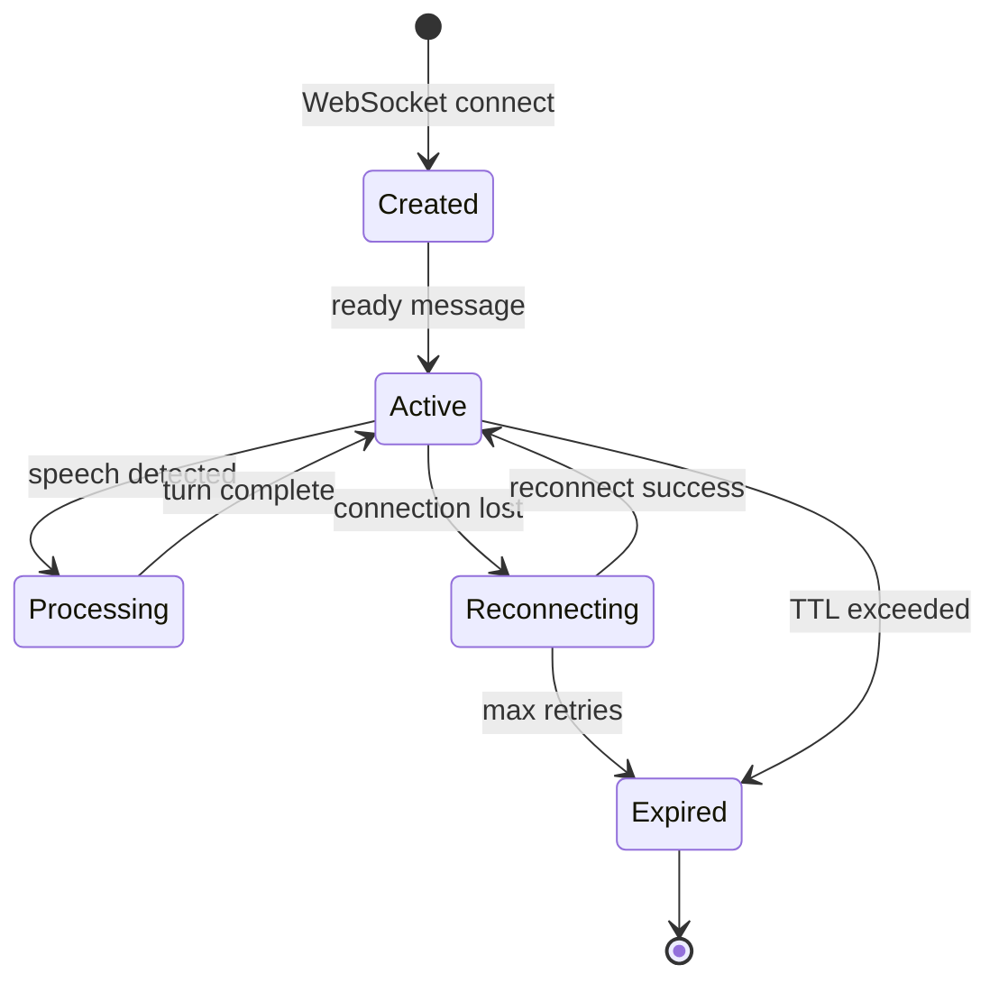

| State | Description |
|-------|-------------|
| Created | Session initialized, awaiting WebRTC setup |
| Active | Connected and ready for conversation |
| Processing | Currently handling a conversation turn |
| Reconnecting | Connection lost, attempting recovery |
| Expired | Session TTL exceeded or max reconnect attempts |

---

## Playbook State Machine

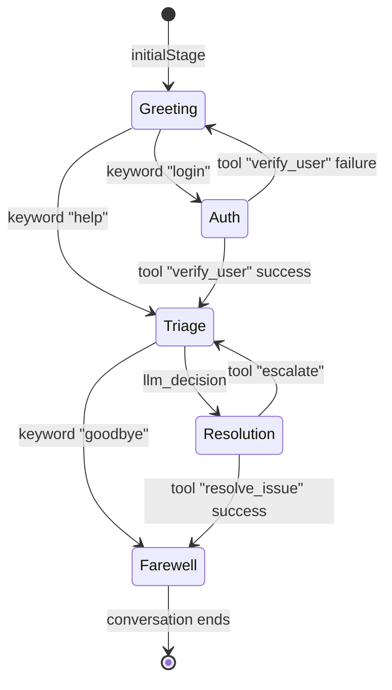

---

## Streaming TTS Architecture

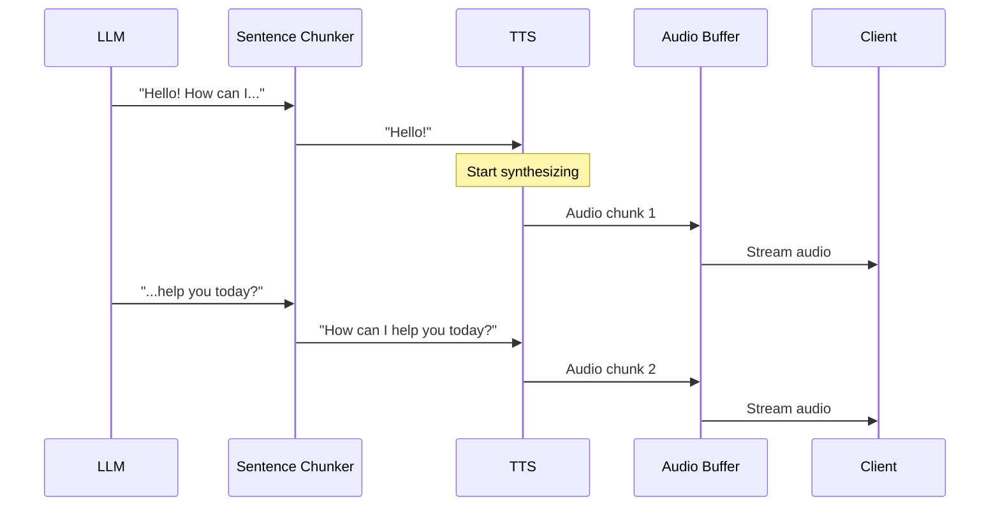

**Key:** Sentence chunking enables TTS to start before LLM finishes, reducing time-to-first-audio.

---

## Related

- [Backend Configuration](../backend/configuration) - Server setup
- [Web Client Overview](../web-client/overview) - Client setup
- [Playbooks Overview](../playbooks/overview) - Playbook concepts
- [Providers Overview](../providers/overview) - Provider system
