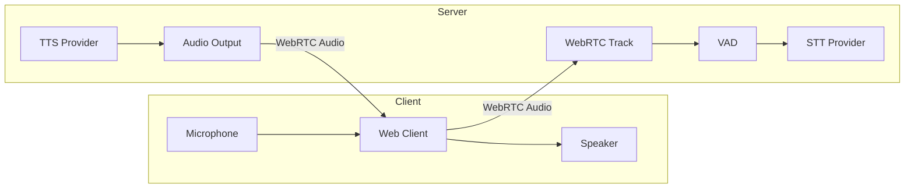
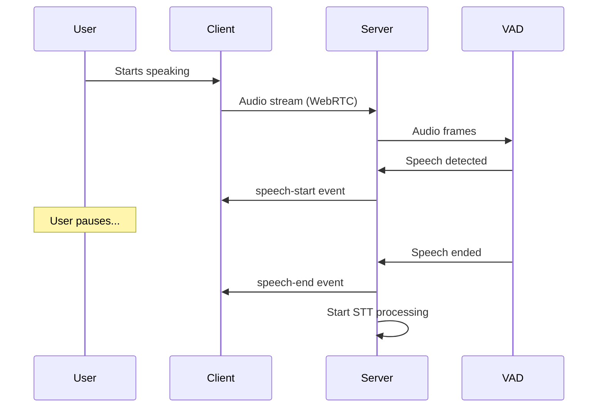
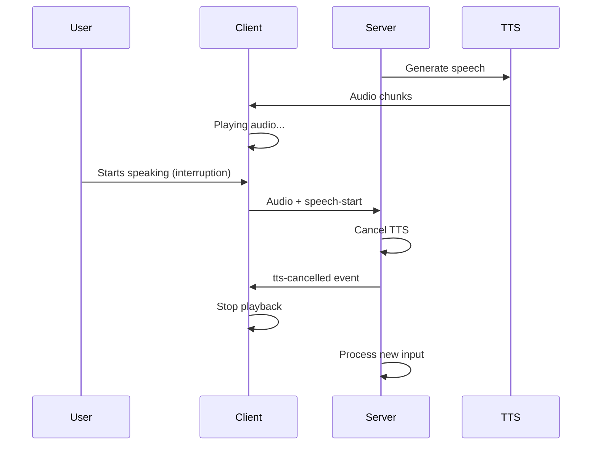
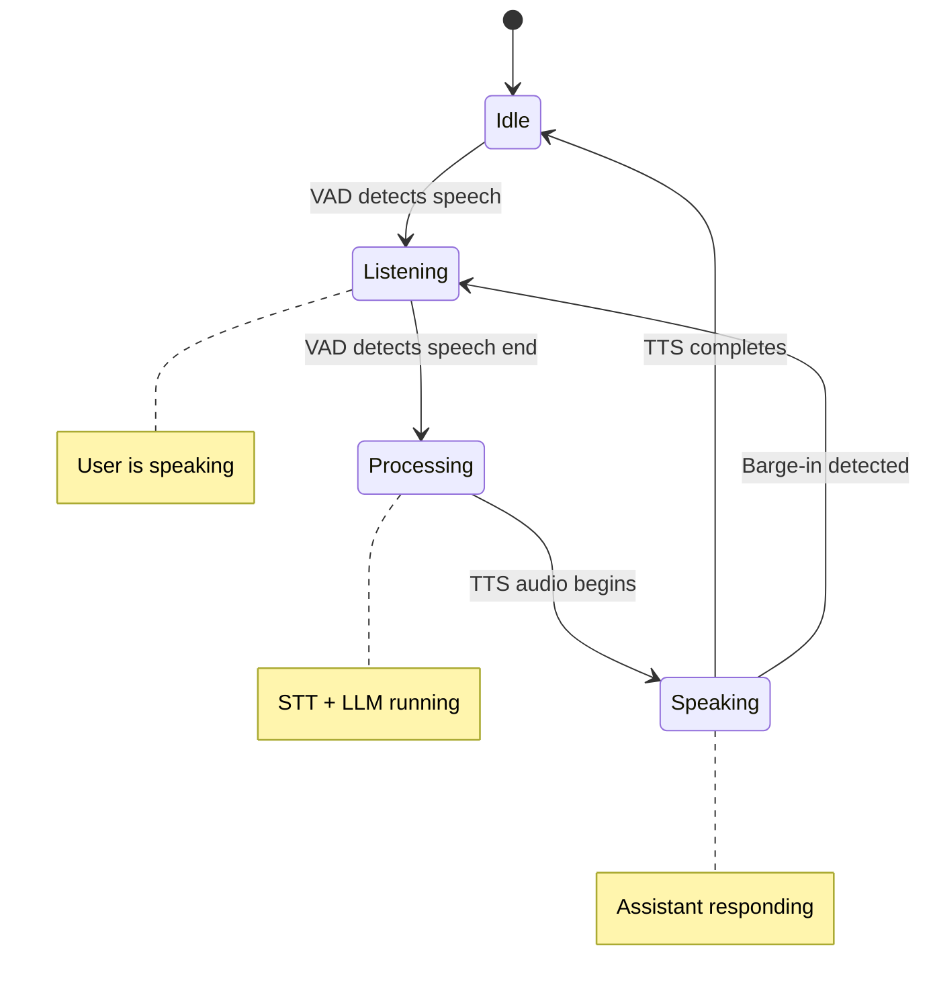

**Audio handling** and **Voice Activity Detection (VAD)** are the foundation of voice AI. They determine when the user is speaking, when they've finished, and how to handle interruptions.

---

## Audio Pipeline

Audio flows from the user's microphone through the server and back out as synthesized speech:

The primary audio path uses **WebRTC audio tracks** for low-latency, high-quality transmission. A fallback `audio` message (base64 WAV) exists for environments where WebRTC isn't available.

---

## Voice Activity Detection (VAD)

VAD answers a critical question: **"Is the user currently speaking?"**

LLMRTC uses **Silero VAD v5** server-side to detect speech boundaries:

### VAD Parameters

VAD uses several parameters to balance responsiveness with accuracy:

| Parameter | Default | Purpose |
|-----------|---------|---------|
| `positiveSpeechThreshold` | 0.5 | Confidence required to detect speech start |
| `negativeSpeechThreshold` | 0.35 | Confidence below which speech is considered ended |
| `minSpeechFrames` | 5 | Minimum frames before confirming speech |
| `redemptionFrames` | 50 | Frames of silence before declaring speech end (~500ms) |
| `preSpeechPadFrames` | 10 | Frames to include before detected speech (~100ms) |

The `preSpeechPadFrames` parameter is particularly important—it captures audio slightly before VAD triggered, preventing the first syllables from being clipped.

---

## Barge-in

**Barge-in** allows users to interrupt the assistant while it's speaking. This creates a more natural conversational experience.

When VAD detects user speech during TTS playback:

1. The server cancels any in-progress TTS generation
2. Emits `tts-cancelled` to the client
3. Begins processing the user's new utterance
4. Starts a fresh conversation turn

---

## Audio States

A voice session moves through distinct audio states:

These states map to UI indicators:
- **Idle**: Ready for input
- **Listening**: Microphone active, capturing speech
- **Processing**: "Thinking" indicator
- **Speaking**: Assistant response playing

---

## Audio Formats

LLMRTC works with specific audio formats at different stages:

| Stage | Format | Details |
|-------|--------|---------|
| WebRTC Input | Opus | Browser-native, low latency |
| VAD Processing | 16kHz PCM | Silero VAD requirement |
| STT Input | Provider-specific | Usually 16kHz WAV or streaming |
| TTS Output | 24kHz 16-bit PCM | Signed little-endian, mono |
| WebRTC Output | Opus | Re-encoded for transport |

The server handles all format conversions internally.

---

## Related Documentation

- [Architecture Overview](architecture) - System-wide audio flow
- [Web Client Audio](../web-client/audio) - Client-side audio handling
- [Streaming & Latency](streaming-and-latency) - Optimizing audio pipeline
- [Observability & Hooks](../backend/observability-and-hooks) - `onSpeechStart` / `onSpeechEnd` hooks
