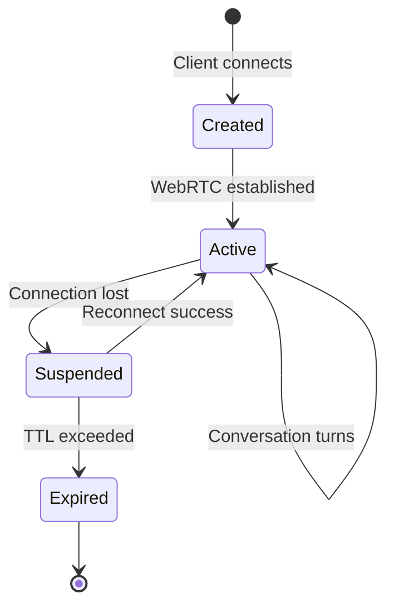
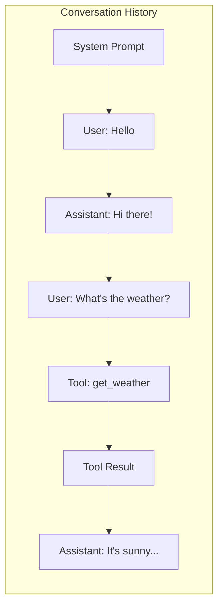
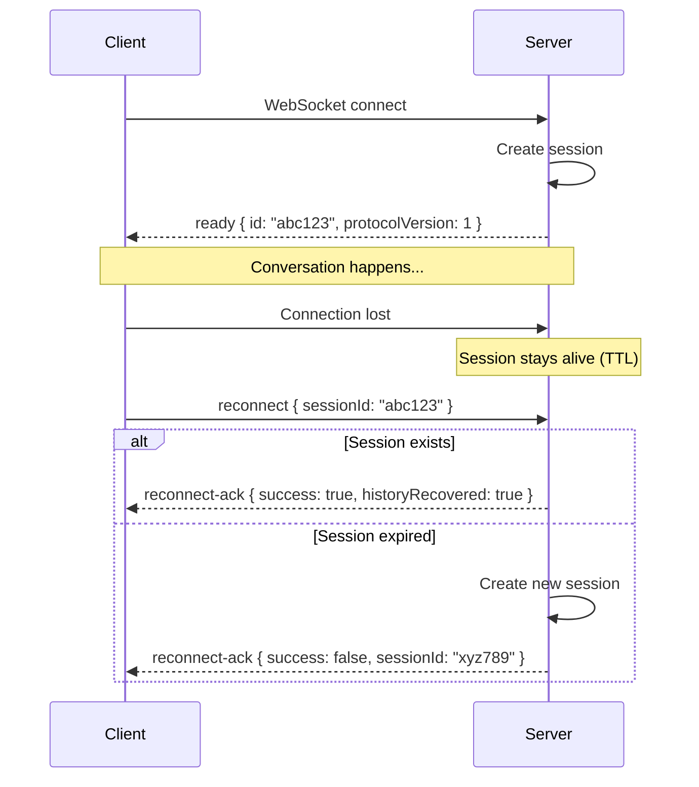
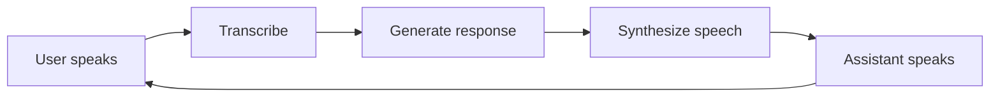
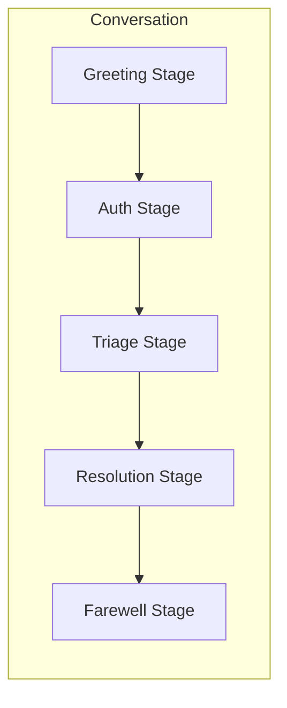

A **conversation** is a sequence of exchanges between a user and an AI assistant. A **session** is the container that holds a conversation's state, history, and connection context.

---

## What is a Session?

When a user connects to LLMRTC, the server creates a session that:

- Assigns a unique **session ID** for identification
- Maintains **conversation history** (messages exchanged so far)
- Tracks **connection state** (WebSocket, WebRTC)
- Enables **reconnection** if the network drops

---

## Conversation History

Every session maintains a rolling history of messages:

History serves two purposes:

1. **Context for the LLM** - The model sees previous exchanges to maintain coherent conversation
2. **Continuity on reconnect** - Users can resume where they left off after network issues

The `historyLimit` setting controls how many messages are retained. When exceeded, older messages are trimmed while preserving the integrity of tool call/result pairs.

---

## Session Lifecycle

Sessions have a **time-to-live (TTL)**. If a disconnected user doesn't reconnect within this window, the session expires and history is lost.

---

## Multi-Turn Conversations

A conversation consists of multiple **turns**. Each turn follows this pattern:

Within a turn, the orchestrator:
1. Receives user input (audio or text)
2. Transcribes to text (STT)
3. Adds to conversation history
4. Sends history to LLM
5. Gets response
6. Synthesizes speech (TTS)
7. Adds assistant response to history

---

## Conversations in Playbooks

When using [playbooks](playbooks), conversations gain additional structure:

- **Stages** - Conversation moves through defined phases
- **Stage-specific history** - Each stage can have its own context
- **Transitions** - Rules that move between stages based on conversation content

---

## Related Documentation

- [Architecture Overview](architecture) - How sessions fit in the system
- [Connection Lifecycle](../web-client/connection-lifecycle) - Client-side connection handling
- [Protocol Messages](../protocol/message-types) - Session-related message formats
- [Backend Configuration](../backend/configuration) - Session TTL and history settings
