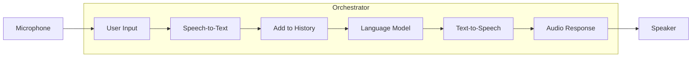
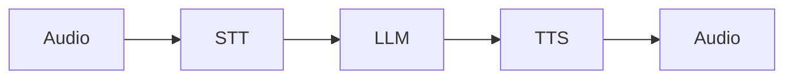
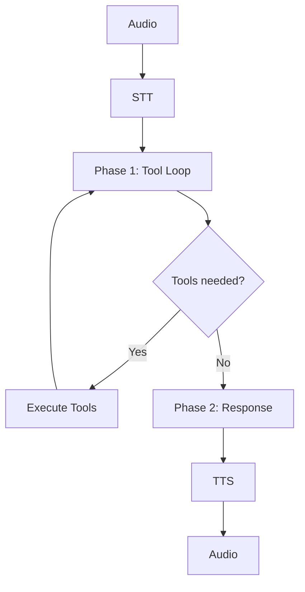
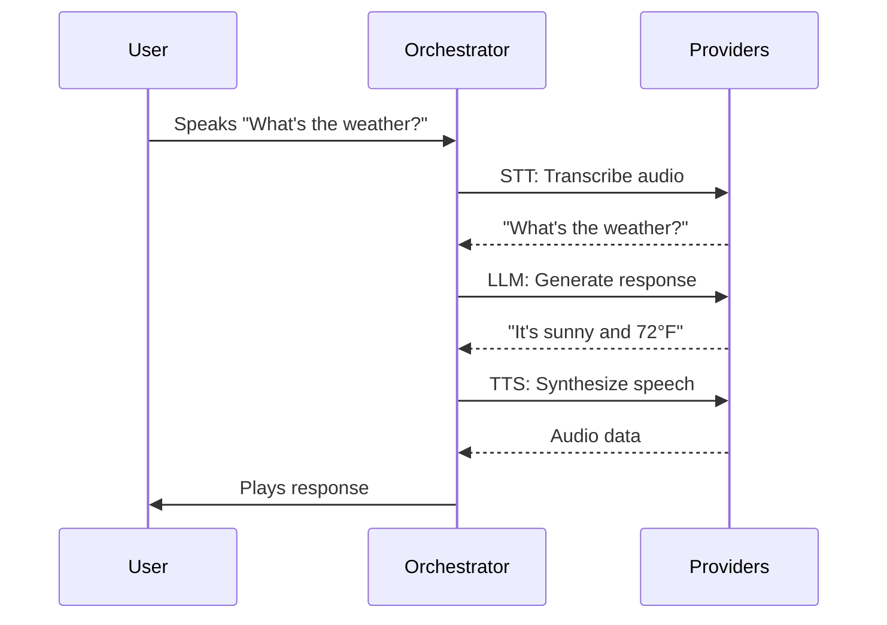
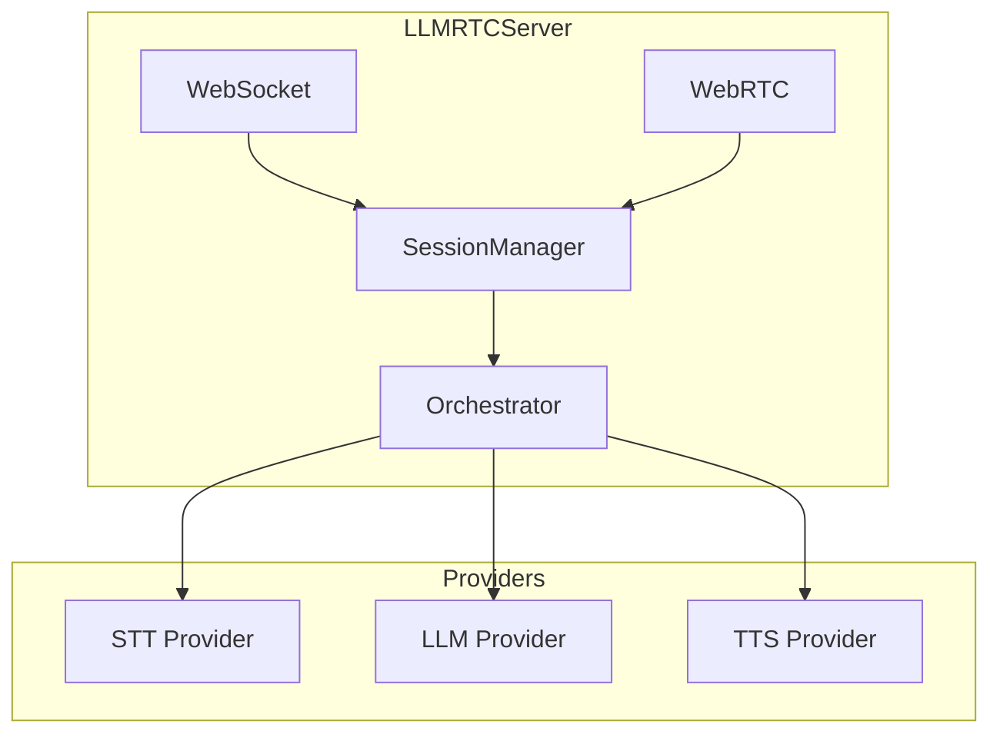

The **orchestrator** is the central coordinator that manages a conversation turn - receiving user input, processing it through providers, and producing a response.

---

## What Does an Orchestrator Do?

An orchestrator connects the pieces of a voice AI system:



The orchestrator:
1. **Coordinates providers** - Routes data between STT, LLM, and TTS
2. **Manages history** - Maintains conversation context across turns
3. **Handles streaming** - Enables low-latency response delivery
4. **Processes attachments** - Includes images/vision when available

---

## Types of Orchestrators

LLMRTC provides two orchestrator types for different use cases:

### ConversationOrchestrator

Simple, linear pipeline for basic voice assistants:



- Single system prompt
- No tool support
- Best for: Simple Q&A, basic assistants

### PlaybookOrchestrator

Advanced orchestrator with stages, tools, and two-phase execution:



- Multiple stages with different prompts/tools
- Two-phase execution (tools silently, then respond)
- Stage transitions based on conversation
- Best for: Complex workflows, support bots, booking systems

---

## The Turn Concept

A **turn** is one exchange: user says something, assistant responds.



Within a turn, the orchestrator emits events that can be used for UI updates:
- `transcript` - Speech transcription complete
- `llmChunk` - Streaming LLM response
- `ttsStart` / `ttsComplete` - TTS lifecycle

---

## Streaming vs Non-Streaming

Orchestrators support two modes:

### Non-Streaming
Wait for each step to complete before starting the next:

```
STT (500ms) → LLM (2000ms) → TTS (800ms) = 3300ms total latency
```

### Streaming
Start the next step as soon as data is available:

```mermaid
gantt
    title Streaming Timeline
    dateFormat X
    axisFormat %L

    section Pipeline
    STT           :0, 500
    LLM streaming :400, 2000
    TTS streaming :600, 2200
    Audio playing :700, 2300
```



With streaming, users hear the first audio ~700ms after speaking ends instead of waiting 3300ms.

---

## Orchestrator in the Architecture



Each session gets its own orchestrator instance, maintaining isolated conversation state.

---

## Related Documentation

- [Architecture Overview](architecture) - System-wide component diagram
- [Streaming & Latency](streaming-and-latency) - Optimizing response times
- [Playbooks](playbooks) - Multi-stage orchestration
- [Providers](providers) - STT, LLM, TTS provider system
