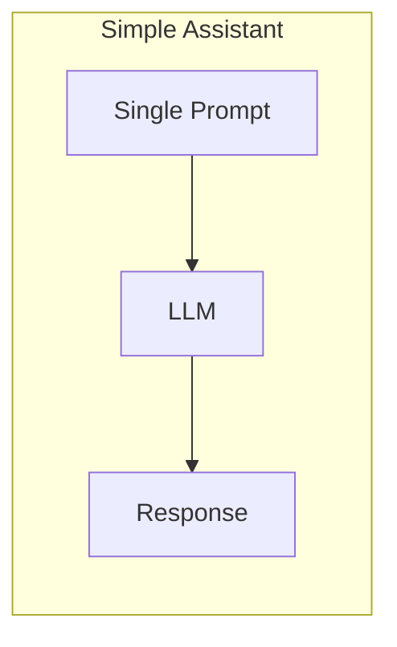
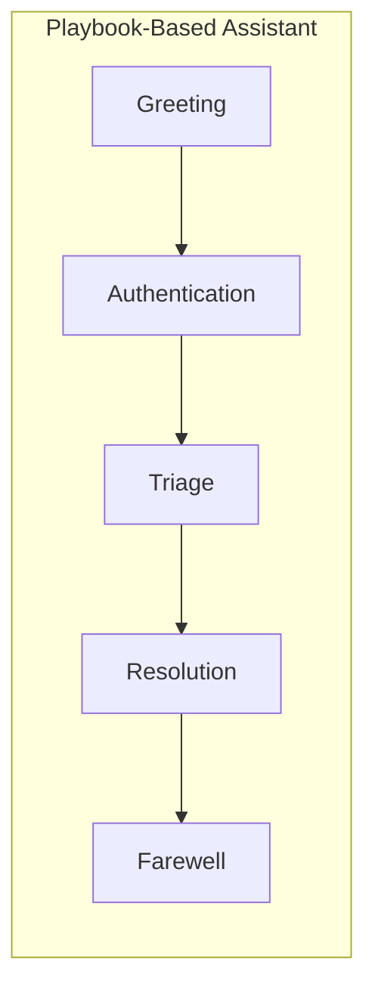
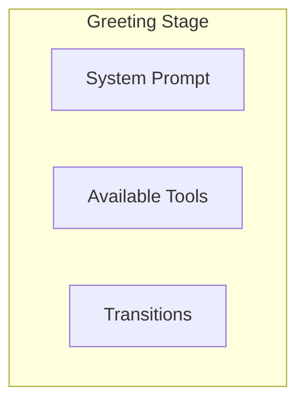
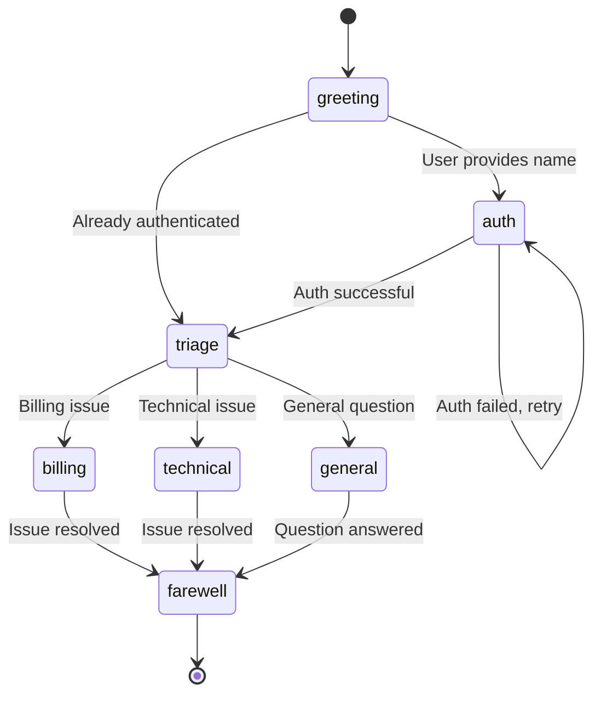
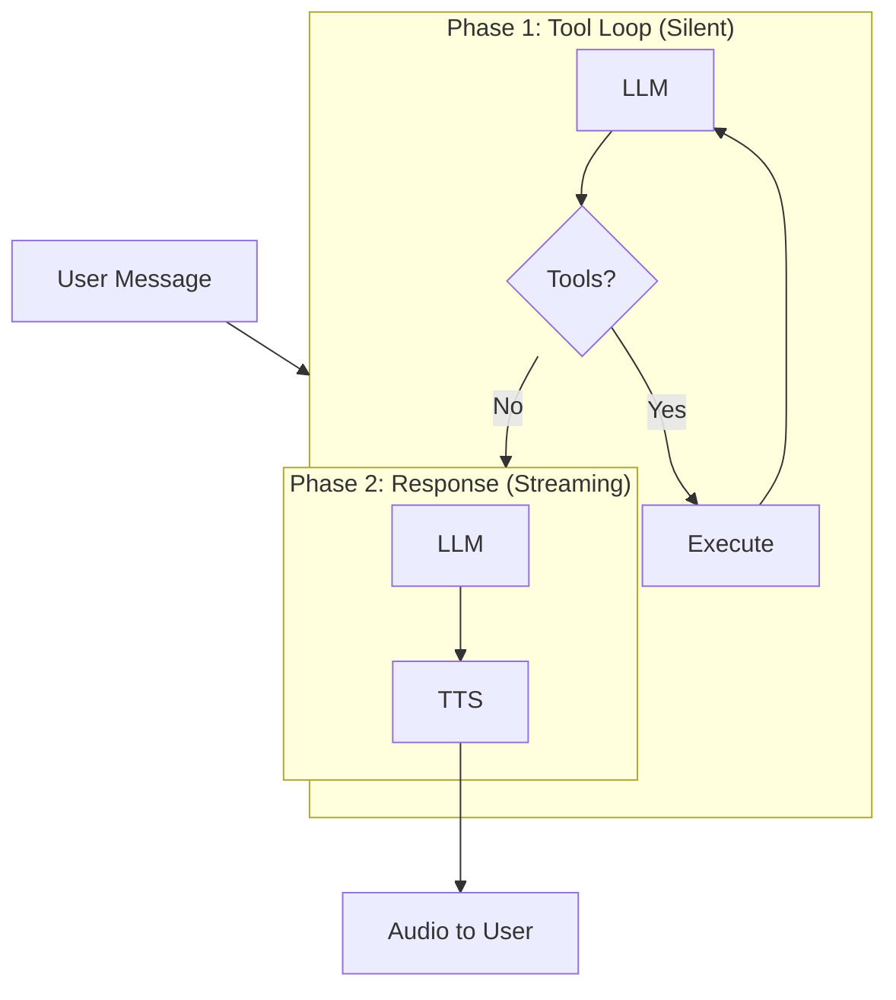
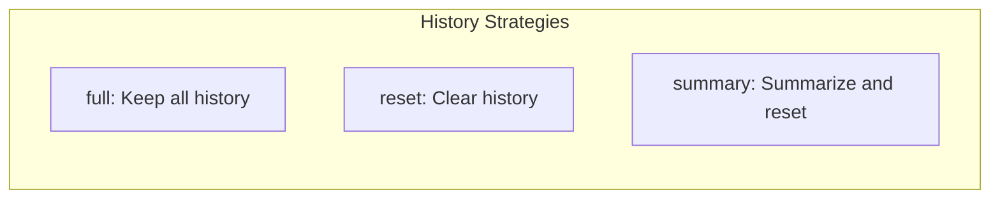
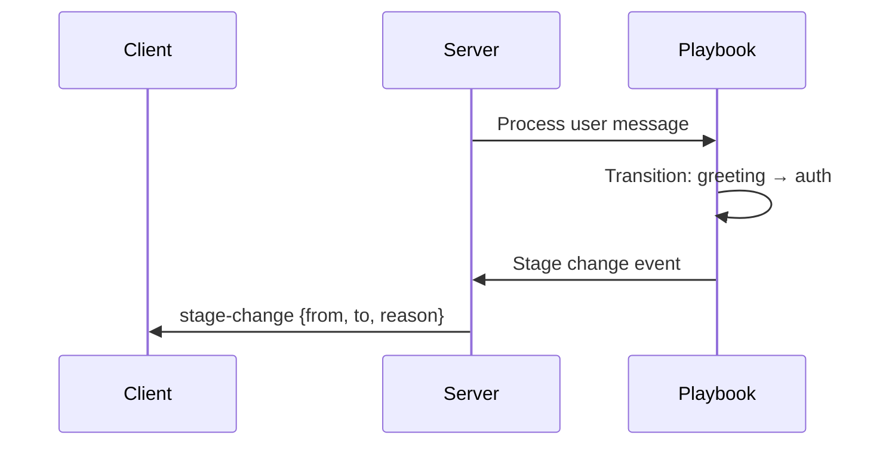
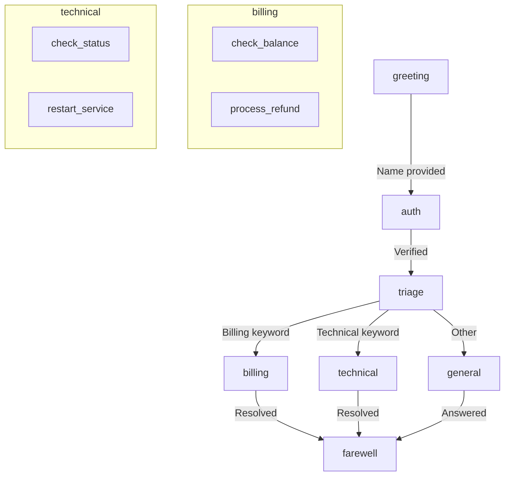

**Playbooks** define multi-stage conversations with structured flows. Instead of a single system prompt, playbooks organize conversations into stages—each with its own context, tools, and transition rules.

---

## Why Playbooks?

Simple assistants can use a single prompt. Complex workflows need structure:

Playbooks let you:
- Define different behaviors for different conversation phases
- Enable tools only when appropriate
- Control flow based on user input or tool results
- Track progress through a workflow

---

## Stages

A stage is a distinct phase of conversation with its own configuration:

Each stage can have:

| Component | Purpose |
|-----------|---------|
| `prompt` | System instructions for this phase |
| `tools` | Tools available in this stage |
| `transitions` | Rules for moving to other stages |
| `historyStrategy` | How to handle conversation history |

Stages are defined in a playbook configuration and managed by the PlaybookOrchestrator.

---

## Transitions

Transitions define how the conversation moves between stages:

Transitions can be triggered by:

| Trigger Type | Description |
|--------------|-------------|
| Tool result | A specific tool returns a trigger value |
| LLM decision | The model decides to transition |
| Keyword match | User input contains specific words |
| Condition | Custom logic evaluates to true |

---

## Two-Phase Execution

Playbooks use a two-phase turn model for cleaner responses:

**Phase 1** handles all tool calls silently—the user doesn't hear intermediate results. **Phase 2** generates the spoken response based on everything that happened in Phase 1.

This separation keeps responses concise while allowing complex tool workflows.

---

## Stage History

Each stage can control how conversation history is handled:

| Strategy | Behavior |
|----------|----------|
| `full` | Carry forward complete history |
| `reset` | Start fresh in new stage |
| `summary` | LLM summarizes, then reset |
| `lastN` | Keep only last N messages |

History management prevents context drift and controls token usage as conversations progress.

---

## Stage Change Events

When the conversation moves between stages, the system emits events:

The `stage-change` event includes:
- `from`: Previous stage name
- `to`: New stage name
- `reason`: What triggered the transition

These events enable UI updates, analytics, and debugging.

---

## Example: Support Flow

A support bot might use stages like this:

Each stage has specific tools:
- **greeting**: No tools, just conversation
- **auth**: `verify_customer` tool
- **billing**: `check_balance`, `process_refund` tools
- **technical**: `check_status`, `restart_service` tools
- **farewell**: `create_ticket` tool (if needed)

---

## Playbook vs Conversation Orchestrator

LLMRTC provides two orchestrators:

| Feature | ConversationOrchestrator | PlaybookOrchestrator |
|---------|-------------------------|---------------------|
| Stages | Single | Multiple |
| Tools | Global only | Per-stage |
| Two-phase | No | Yes |
| Transitions | No | Yes |
| History limit | 8 (default) | 50 (default) |
| Use case | Simple Q&A | Complex workflows |

Use ConversationOrchestrator for basic assistants. Use PlaybookOrchestrator when you need structured flows.

---

## Related Documentation

- [Playbooks Overview](../playbooks/overview) - Detailed implementation guide
- [Defining Playbooks](../playbooks/defining-playbooks) - Configuration reference
- [Voice Agents with Tools](../playbooks/voice-agents-with-tools) - Voice + playbooks integration
- [Tool Calling](tool-calling) - Tool execution concepts
- [Orchestrator](orchestrator) - Orchestrator comparison
