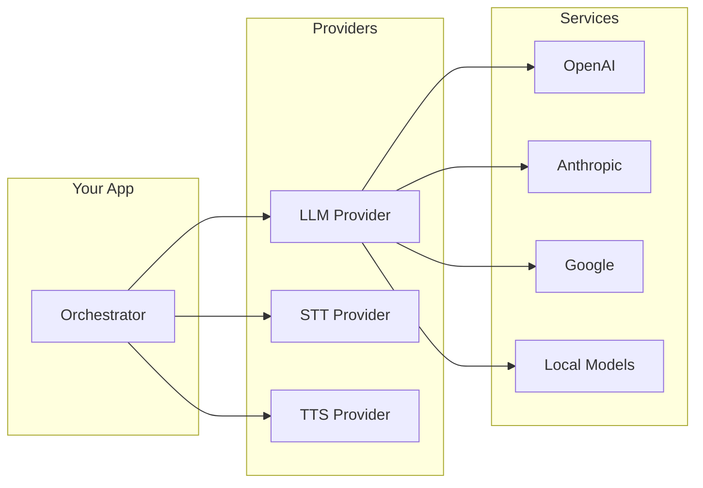
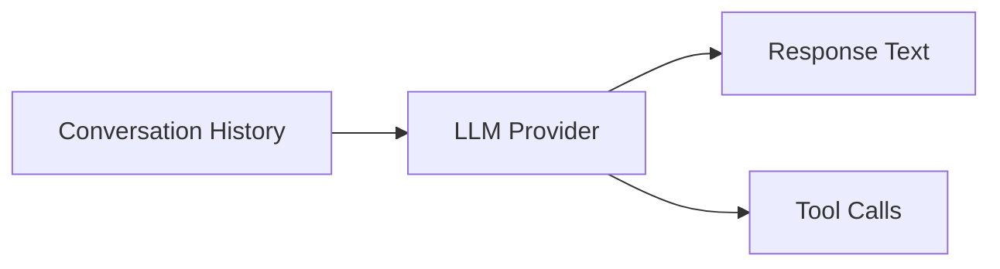
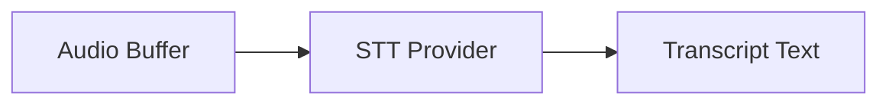
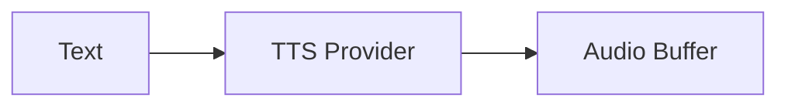
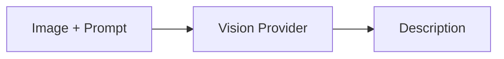
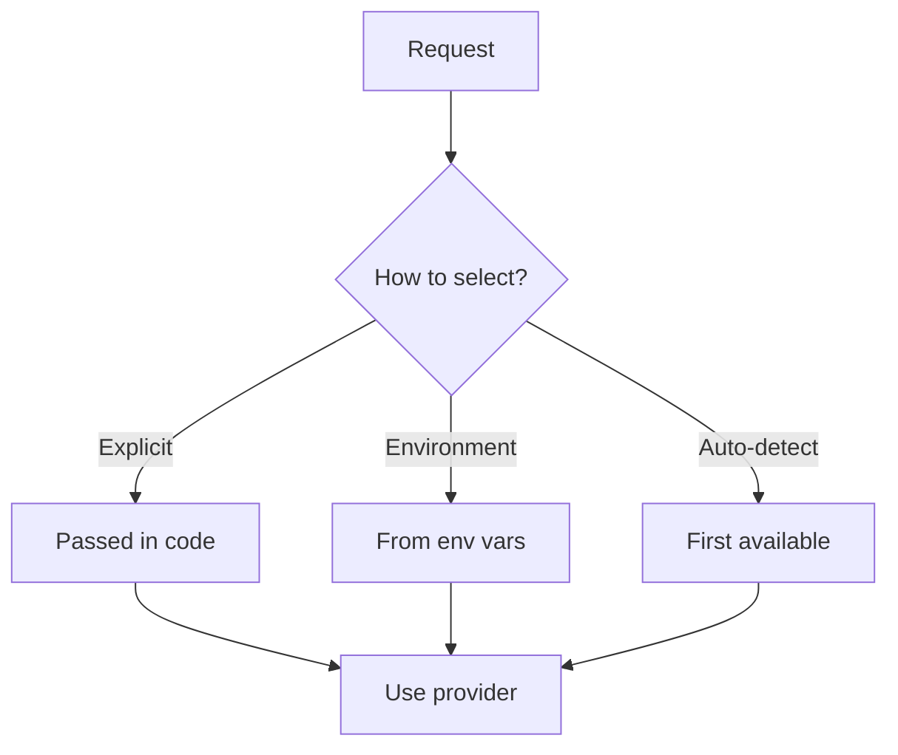
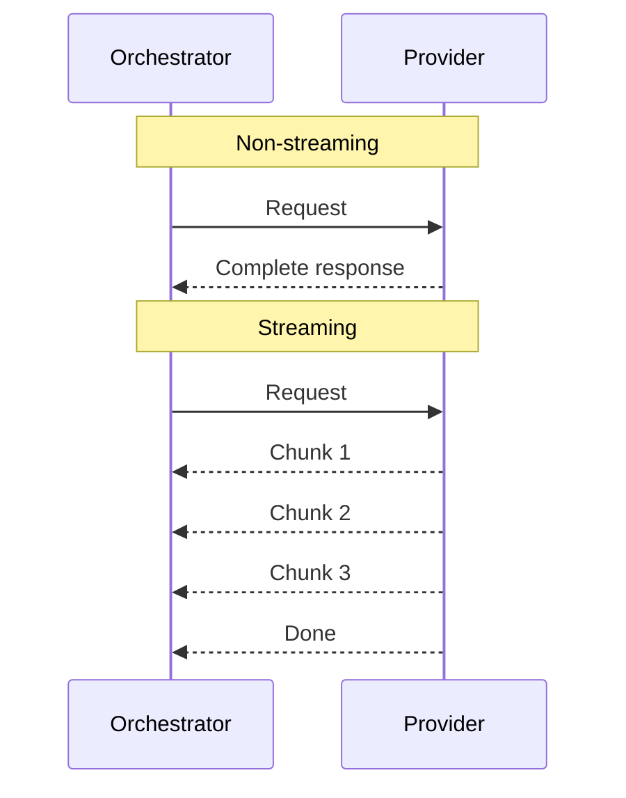

**Providers** are pluggable adapters that connect LLMRTC to AI services. They abstract away the differences between OpenAI, Anthropic, Google, local models, and others behind a consistent interface.

---

## Why Providers?

Different AI services have different APIs, authentication methods, and capabilities. Providers normalize these differences:



This means you can:
- Switch from OpenAI to Anthropic without changing your app code
- Use cloud services in production and local models in development
- Mix providers (e.g., OpenAI for LLM, ElevenLabs for TTS)

---

## Provider Types

LLMRTC uses four types of providers:

### LLM Provider
Generates text responses from conversation history.



Capabilities:
- Text completion (streaming and non-streaming)
- Tool/function calling
- Vision (with image attachments)

### STT Provider
Converts speech audio to text.



Capabilities:
- One-shot transcription
- Streaming transcription (partial results)
- Language detection

### TTS Provider
Converts text to speech audio.



Capabilities:
- One-shot synthesis
- Streaming synthesis (for low latency)
- Voice selection

### Vision Provider (Optional)
Analyzes images and returns descriptions.



Used when LLM provider doesn't support native vision.

---

## Available Providers

### Cloud Providers

| Provider | LLM | STT | TTS | Vision |
|----------|-----|-----|-----|--------|
| OpenAI | ✅ | ✅ (Whisper) | ✅ | ✅ |
| Anthropic | ✅ | - | - | ✅ |
| Google Gemini | ✅ | - | - | ✅ |
| AWS Bedrock | ✅ | - | - | varies |
| OpenRouter | ✅ | - | - | varies |
| ElevenLabs | - | - | ✅ | - |

### Local Providers

| Provider | LLM | STT | TTS | Vision |
|----------|-----|-----|-----|--------|
| Ollama | ✅ | - | - | varies |
| LM Studio | ✅ | - | - | - |
| Faster-Whisper | - | ✅ | - | - |
| Piper | - | - | ✅ | - |
| LLaVA | - | - | - | ✅ |

---

## Provider Selection

Providers can be selected in multiple ways:



**Explicit** - Pass provider instances directly:
```typescript
const server = new LLMRTCServer({
  providers: {
    llm: new OpenAILLMProvider({ apiKey: '...' }),
    stt: new OpenAIWhisperProvider({ apiKey: '...' }),
    tts: new ElevenLabsTTSProvider({ apiKey: '...' })
  }
});
```

**Environment** - Auto-detect from environment variables:
- `OPENAI_API_KEY` → OpenAI providers
- `ANTHROPIC_API_KEY` → Anthropic provider
- `ELEVENLABS_API_KEY` → ElevenLabs TTS

---

## Streaming Support

Providers can support streaming for lower latency:



Streaming allows the orchestrator to start the next step (e.g., TTS) before the current step (e.g., LLM) completes.

---

## Related Documentation

- [Architecture Overview](architecture) - How providers fit in the system
- [Providers Reference](../providers/overview) - Detailed provider documentation
- [Streaming & Latency](streaming-and-latency) - Optimizing with streaming
- [Backend Configuration](../backend/configuration) - Provider setup
