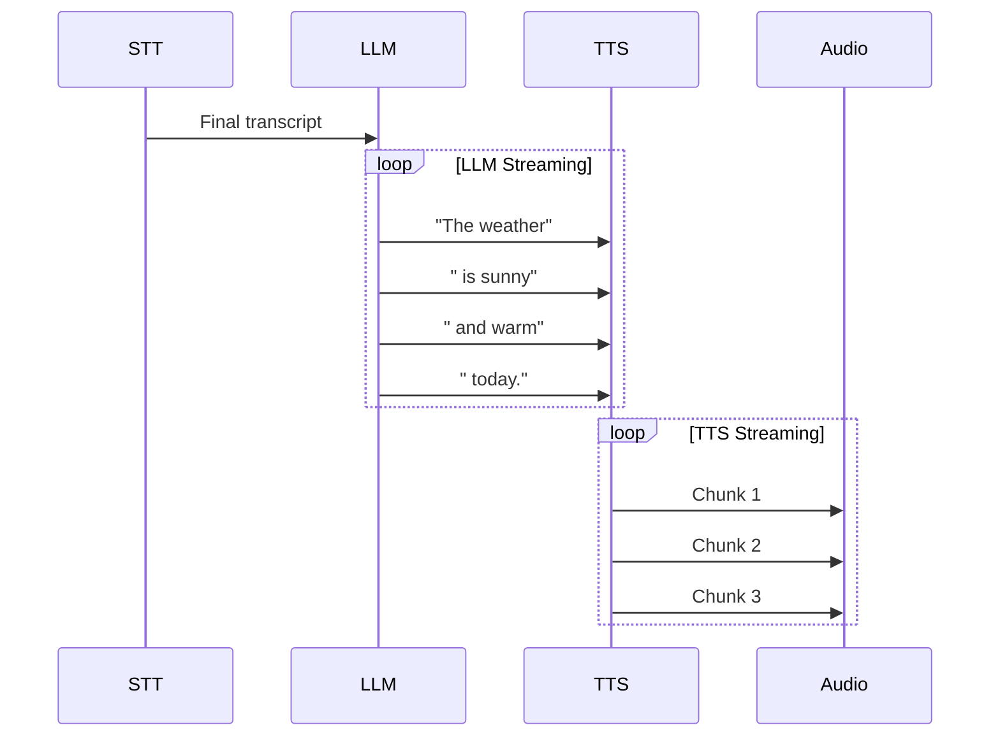
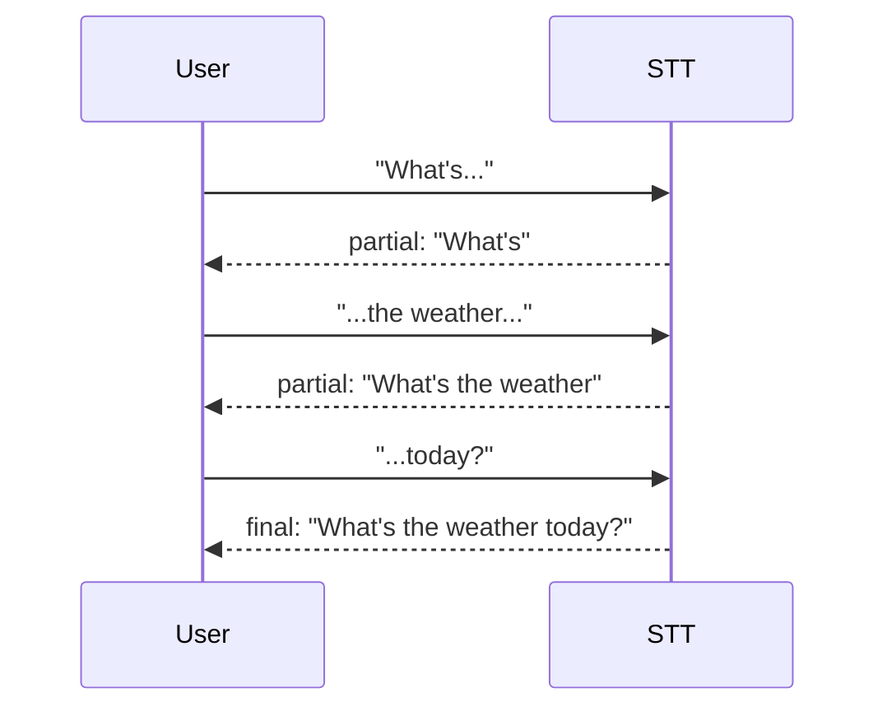
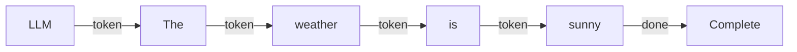
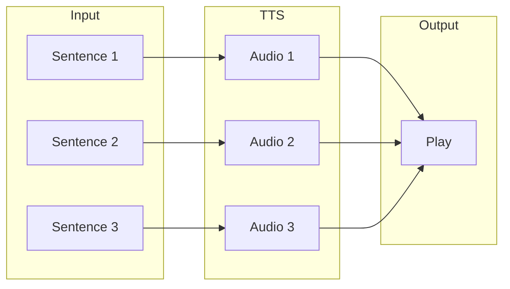
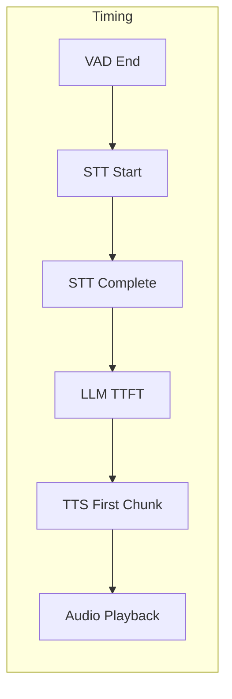
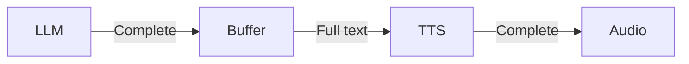

**Latency** is the enemy of natural conversation. **Streaming** is how LLMRTC minimizes it—starting each step before the previous one completes.

---

## The Latency Problem

Without streaming, each step waits for the previous one to finish:

```mermaid
gantt
    title Non-Streaming Pipeline
    dateFormat X
    axisFormat %L

    section Pipeline
    STT Complete    :0, 500
    LLM Complete    :500, 2500
    TTS Complete    :2500, 3300
```



Total latency: **3300ms** from speech end to first audio.

---

## Streaming Solution

With streaming, steps overlap:

```mermaid
gantt
    title Streaming Pipeline
    dateFormat X
    axisFormat %L

    section Pipeline
    STT             :0, 500
    LLM Streaming   :400, 2000
    TTS Streaming   :600, 2200
    Audio Playing   :700, 2300
```



First audio at **700ms**—a 4.7x improvement.

---

## How Streaming Works

Each component produces output incrementally:



The key insight: **TTS can start synthesizing the first sentence while the LLM is still generating the rest.**

---

## STT Streaming

Speech-to-text can provide partial results as audio arrives:



Partial transcripts enable:
- Real-time captions
- Early abort if user changes direction
- UI responsiveness

---

## LLM Streaming

Language models can stream tokens as they're generated:



Benefits:
- Time to first token (TTFT) is much lower than full completion
- TTS can start immediately
- Users see/hear responses sooner

LLMRTC tracks `llm.ttft_ms` (time to first token) as a key metric.

---

## TTS Streaming

Text-to-speech synthesizes audio in chunks:



The orchestrator buffers LLM output and sends complete sentences to TTS for natural-sounding output.

---

## Sentence Chunking

Text is split into sentence-sized chunks for TTS:

| Input | Chunks |
|-------|--------|
| "Hello. How are you?" | ["Hello.", "How are you?"] |
| "The weather is sunny and warm today." | ["The weather is sunny and warm today."] |

The default chunker splits on `.!?` followed by whitespace. For languages without these markers (like Chinese or Japanese), you can provide a custom `sentenceChunker` function.

---

## Audio Format

TTS produces PCM audio:

| Property | Value |
|----------|-------|
| Sample rate | 24kHz |
| Bit depth | 16-bit signed |
| Endianness | Little-endian |
| Channels | Mono |

This format is then encoded to Opus for WebRTC transport.

---

## Pipeline Timing

A complete turn has these timing components:



Key metrics:

| Metric | Description | Target |
|--------|-------------|--------|
| `stt.duration_ms` | Speech-to-text time | < 300ms |
| `llm.ttft_ms` | Time to first LLM token | < 200ms |
| `llm.duration_ms` | Total LLM time | varies |
| `tts.duration_ms` | TTS synthesis time | < 500ms |
| `turn.duration_ms` | Complete turn time | varies |

---

## Latency Factors

Several factors affect end-to-end latency:

### Network
- Physical distance to AI providers
- WebRTC connection quality
- TURN relay overhead (when needed)

### Model
- Model size (larger = slower)
- Max tokens setting
- Conversation history length

### Configuration
- Streaming enabled/disabled
- History limit
- TTS voice complexity

---

## Streaming Configuration

Enable streaming in the server:

```typescript
const server = new LLMRTCServer({
  streamingTTS: true,  // Enable TTS streaming
  // ...
});
```

LLM streaming is typically enabled by default in providers. TTS streaming requires FFmpeg for audio chunk processing.

---

## Non-Streaming Fallback

When streaming isn't available:



This is simpler but has higher latency. Useful for:
- Providers without streaming support
- Environments without FFmpeg
- Debugging

---

## Related Documentation

- [Architecture Overview](architecture) - System component diagram
- [Audio & VAD](audio-and-vad) - Audio pipeline details
- [Observability & Hooks](../backend/observability-and-hooks) - Timing hooks
- [Operations Monitoring](../operations/monitoring) - Latency metrics
