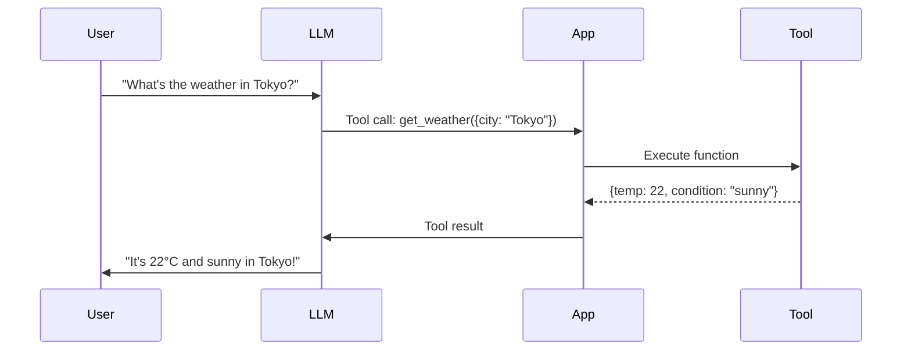
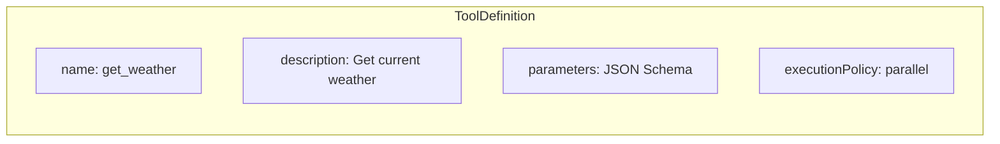
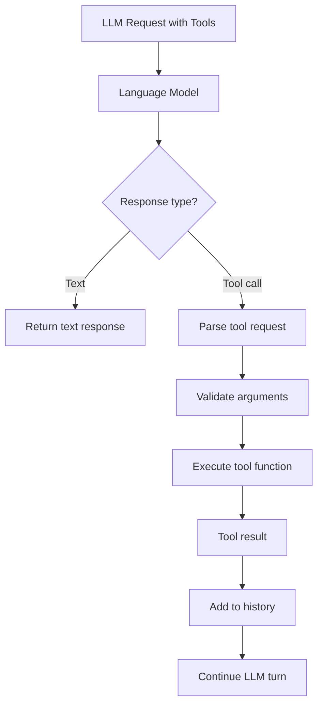
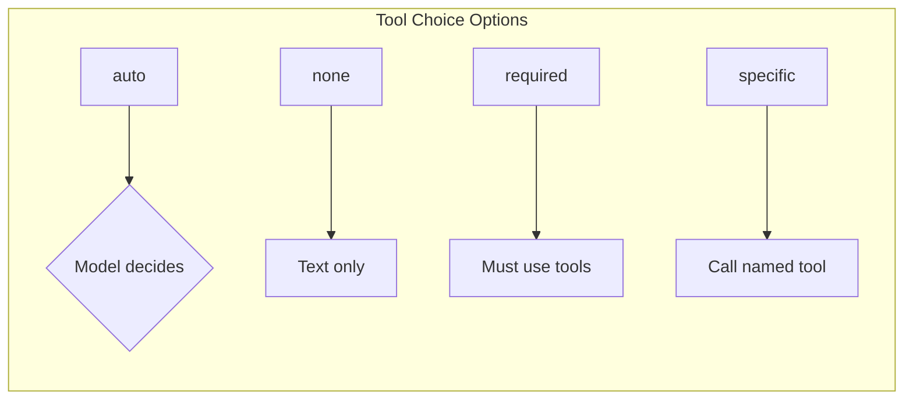
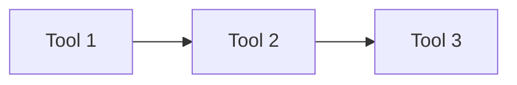
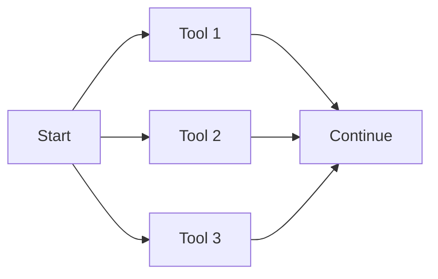
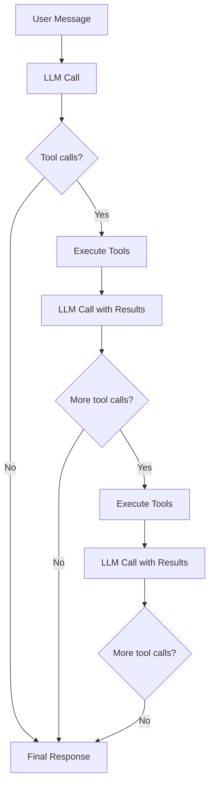
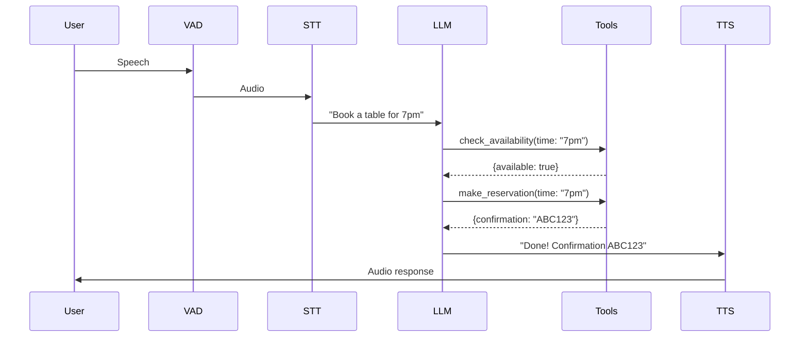
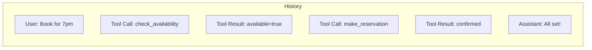

**Tool calling** (also known as function calling) allows language models to invoke functions in your application. Instead of just generating text, the model can request actions—checking weather, booking appointments, querying databases.

---

## How Tool Calling Works

When you provide tools to an LLM, it can decide to call them based on the conversation:

The model doesn't execute tools itself—it generates structured requests that your application fulfills.

---

## Tool Definition

Tools are defined with a name, description, and JSON Schema parameters:

The key components:

| Field | Purpose |
|-------|---------|
| `name` | Identifier the model uses to call the tool |
| `description` | Helps the model understand when to use it |
| `parameters` | JSON Schema defining expected arguments |
| `executionPolicy` | `sequential` or `parallel` execution |

The description is critical—it guides the model's decision to use the tool.

---

## Tool Execution Flow

When the model requests a tool call, this is what happens:

Tool calls and results become part of the conversation history, allowing the model to reason about them.

---

## Tool Choice

You can control when the model uses tools:

| Choice | Behavior |
|--------|----------|
| `auto` | Model decides whether to call tools (default) |
| `none` | Model won't call any tools |
| `required` | Model must call at least one tool |
| `{ name: "tool_name" }` | Model must call the specified tool |

---

## Execution Policies

Tools can run sequentially or in parallel:

### Sequential Execution

Use when tools depend on each other's results.

### Parallel Execution

Use when tools are independent—faster total execution time.

The `executionPolicy` is set per-tool, allowing mixed strategies.

---

## Tool Loop

In complex scenarios, the model may call multiple tools before responding:

This loop continues until the model produces a text response or hits the maximum tool calls limit.

---

## Tools in Voice AI

For voice applications, tool calling integrates with the speech pipeline:

With [playbooks](playbooks), you can run tools silently in Phase 1, then generate the spoken response in Phase 2.

---

## Tool Results in History

Tool calls and results are stored as messages in conversation history:

This context helps the model understand what actions were taken and reference them later.

---

## Related Documentation

- [Core SDK Tools](../core-sdk/tools) - Tool definition and execution APIs
- [Playbooks](playbooks) - Multi-stage conversations with tools
- [Two-Phase Execution](../playbooks/overview#two-phase-execution-model) - Silent tool loop + response
- [Providers](providers) - Provider-specific tool calling support
