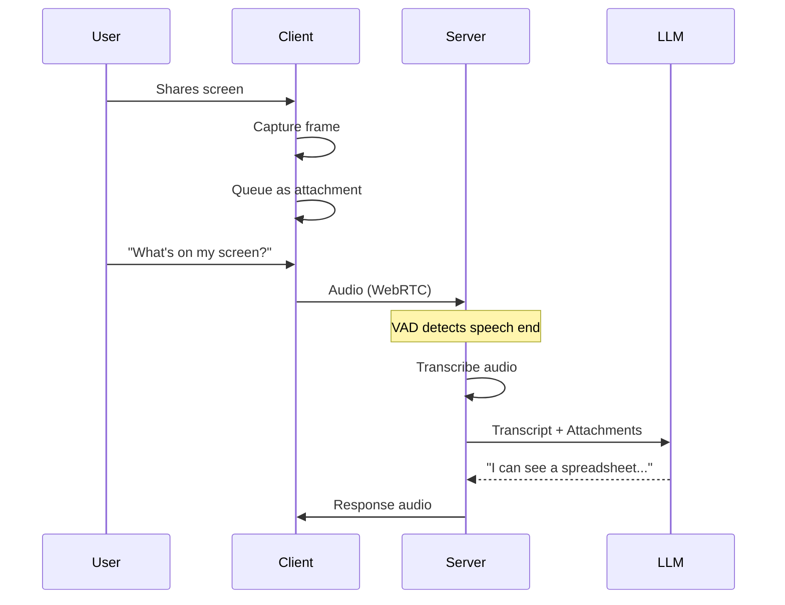

**Vision** enables AI to see what users see. **Attachments** are the mechanism for sending images alongside audio in multimodal conversations.

---

## What is Vision?

Vision allows the language model to process images as part of the conversation. Instead of just hearing the user, the AI can also see:

- Camera feeds (what the user is looking at)
- Screen shares (applications, documents, interfaces)
- Uploaded images (photos, diagrams, screenshots)


---

## Attachments

Attachments are images queued to be sent with the next speech segment. When the user finishes speaking, both the transcript and any queued attachments are sent to the LLM together.



### Attachment Format

Attachments are sent as base64-encoded data URIs or URLs:

```typescript
{
  type: 'attachments',
  attachments: [
    {
      data: 'data:image/jpeg;base64,/9j/4AAQ...',  // Data URI (required)
      mimeType: 'image/jpeg',                      // Optional MIME type
      alt: 'Screenshot of user dashboard'          // Optional description
    }
  ]
}
```

The `alt` text provides additional context for the model, improving response accuracy.

---

## Capture Methods

LLMRTC supports three ways to capture visual input:

### Camera Video

Capture frames from the user's camera:


Frames are captured at a configurable interval (default: 1 frame per second).

### Screen Sharing

Capture the user's screen or application window:


Screen capture follows the same pattern as camera capture.

### Manual Attachments

Send specific images programmatically:


Useful for sending uploaded images, generated graphics, or specific screenshots.

---

## Vision in the Conversation

When attachments are included, they become part of the conversation history:

```mermaid
flowchart TB
    subgraph History["Conversation History"]
        direction TB
        S[System: You can see images...]
        U1[User: What's this? + 🖼️]
        A1[Assistant: That's a bar chart...]
        U2[User: Compare it to this + 🖼️]
        A2[Assistant: The second chart shows...]
    end
```



Images in history allow the model to reference previous visual context ("the chart I showed you earlier").

---

## Vision Provider Support

Not all LLM providers support vision. Here's the compatibility:

| Provider | Vision Support | Notes |
|----------|---------------|-------|
| OpenAI | ✅ | GPT-4o, GPT-4 Vision |
| Anthropic | ✅ | Claude 3 family |
| Google Gemini | ✅ | Gemini Pro Vision, Gemini 1.5 |
| AWS Bedrock | ⚠️ | Depends on underlying model |
| OpenRouter | ⚠️ | Depends on routed model |
| Ollama | ✅ | Gemma3, LLaVA, Llama3.2-vision (auto-detected) |
| LM Studio | ❌ | Text-only models |

When using a provider without native vision, you can configure a separate **Vision Provider** to describe images before passing text to the LLM.

:::tip Local Vision with Ollama
`OllamaLLMProvider` automatically detects vision-capable models (Gemma3, LLaVA, Llama3.2-vision) via Ollama's `/api/show` endpoint. Just use a vision model and pass attachments - no separate vision provider needed. See [Local Ollama](../providers/local-ollama#multimodalvision-support).
:::

---

## Vision Processing Flow

When a non-vision LLM needs to process images:


This fallback allows voice assistants to "see" even when using text-only language models.

---

## Related Documentation

- [Architecture Overview](architecture) - System component diagram
- [Web Client Video & Vision](../web-client/video-and-vision) - Client-side capture APIs
- [Providers Overview](../providers/overview) - Provider vision capabilities
- [Streaming & Latency](streaming-and-latency) - Optimizing visual input
