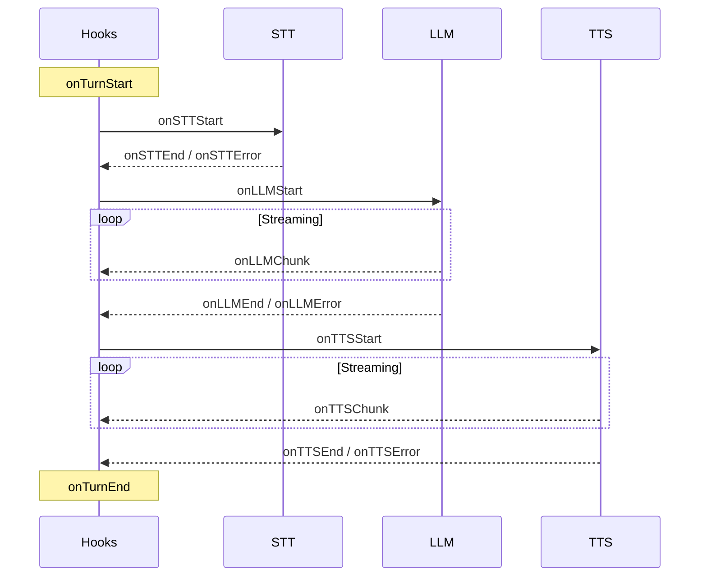

LLMRTC provides hooks for observability, logging, guardrails, and a pluggable metrics adapter for integrating with monitoring systems.

---

## Hooks Overview

Hooks are callback functions called at specific points in the pipeline. All hooks are optional and can be synchronous or async.



---

## Orchestrator Hooks

Called during the STT → LLM → TTS pipeline:

```typescript
interface OrchestratorHooks {
  // Turn lifecycle
  onTurnStart?(ctx: TurnContext, audio: Buffer): void | Promise<void>;
  onTurnEnd?(ctx: TurnContext, timing: TimingInfo): void | Promise<void>;

  // STT
  onSTTStart?(ctx: TurnContext, audio: Buffer): void | Promise<void>;
  onSTTEnd?(ctx: TurnContext, result: STTResult, timing: TimingInfo): void | Promise<void>;
  onSTTError?(ctx: TurnContext, error: Error): void | Promise<void>;

  // LLM
  onLLMStart?(ctx: TurnContext, request: LLMRequest): void | Promise<void>;
  onLLMChunk?(ctx: TurnContext, chunk: LLMChunk, chunkIndex: number): void | Promise<void>;
  onLLMEnd?(ctx: TurnContext, result: LLMResult, timing: TimingInfo): void | Promise<void>;
  onLLMError?(ctx: TurnContext, error: Error): void | Promise<void>;

  // TTS
  onTTSStart?(ctx: TurnContext, text: string): void | Promise<void>;
  onTTSChunk?(ctx: TurnContext, chunk: TTSChunk, chunkIndex: number): void | Promise<void>;
  onTTSEnd?(ctx: TurnContext, timing: TimingInfo): void | Promise<void>;
  onTTSError?(ctx: TurnContext, error: Error): void | Promise<void>;

  // Tools
  onToolStart?(ctx: TurnContext, request: ToolCallRequest): void | Promise<void>;
  onToolEnd?(ctx: TurnContext, result: ToolCallResult, timing: TimingInfo): void | Promise<void>;
  onToolError?(ctx: TurnContext, request: ToolCallRequest, error: Error): void | Promise<void>;
}
```

### Context Types

```typescript
interface TurnContext {
  turnId: string;      // Unique identifier for this turn
  sessionId?: string;  // Session identifier (if available)
  startTime: number;   // Date.now() when turn started
}

interface TimingInfo {
  startTime: number;   // Date.now() when operation started
  endTime: number;     // Date.now() when operation ended
  durationMs: number;  // Duration in milliseconds
}
```

---

## Server Hooks

Called for server-level events (connection, speech detection):

```typescript
interface ServerHooks {
  // Connection lifecycle
  onConnection?(sessionId: string, connectionId: string): void | Promise<void>;
  onDisconnect?(sessionId: string, timing: TimingInfo): void | Promise<void>;

  // Speech detection (VAD)
  onSpeechStart?(sessionId: string, timestamp: number): void | Promise<void>;
  onSpeechEnd?(sessionId: string, timestamp: number, audioDurationMs: number): void | Promise<void>;

  // Centralized error handling
  onError?(error: Error, context: ErrorContext): void | Promise<void>;
}

interface ErrorContext {
  code: ErrorCode;                    // Structured error code
  component: 'stt' | 'llm' | 'tts' | 'vad' | 'webrtc' | 'server' | 'tool' | 'playbook';
  sessionId?: string;
  turnId?: string;
  timestamp: number;
  details?: Record<string, unknown>;
}
```

---

## Playbook Hooks

Called during playbook stage transitions:

```typescript
interface PlaybookHooks {
  onStageEnter?(ctx: PlaybookContext, stage: Stage, previousStage?: Stage): void | Promise<void>;
  onStageExit?(ctx: PlaybookContext, stage: Stage, nextStage: Stage, timing: TimingInfo): void | Promise<void>;
  onTransition?(ctx: PlaybookContext, transition: Transition, from: Stage, to: Stage): void | Promise<void>;
  onPlaybookTurnEnd?(ctx: PlaybookContext, response: string, toolCallCount: number): void | Promise<void>;
  onPlaybookComplete?(ctx: PlaybookContext, finalStage: Stage, totalTurns: number): void | Promise<void>;
}

interface PlaybookContext {
  playbookId: string;
  stageId: string;
  sessionId?: string;
  turnCount: number;      // Turns in current stage
  timeInStage: number;    // Milliseconds in current stage
}
```

---

## Hook Presets

Built-in hook factories for common use cases:

```typescript
import {
  createLoggingHooks,
  createErrorOnlyHooks,
  createVerboseHooks,
  createTimingHooks
} from '@llmrtc/llmrtc-core';

// Basic logging with custom logger
const hooks = createLoggingHooks(myLogger);

// Only log errors
const errorHooks = createErrorOnlyHooks();

// Verbose debugging (logs everything)
const debugHooks = createVerboseHooks();

// Timing logs only (STT: 150ms, LLM: 1200ms, TTS: 300ms)
const timingHooks = createTimingHooks();
```

---

## Guardrails with Hooks

Use hooks to enforce content policies:

```typescript
const guardrailHooks: OrchestratorHooks = {
  // Block unsafe LLM responses
  onLLMEnd(ctx, result) {
    if (containsBannedContent(result.fullText)) {
      throw new Error('Content policy violation');
    }
  },

  // Redact sensitive data before logging
  onSTTEnd(ctx, result, timing) {
    const redacted = redactPII(result.text);
    logger.info(`Transcript: ${redacted}`);
  },

  // Rate limit by session
  onTurnStart(ctx) {
    if (isRateLimited(ctx.sessionId)) {
      throw new Error('Rate limit exceeded');
    }
  }
};
```

---

## Metrics Adapter

Implement `MetricsAdapter` to integrate with your monitoring system:

```typescript
interface MetricsAdapter {
  timing(name: string, durationMs: number, tags?: Record<string, string>): void;
  increment(name: string, value?: number, tags?: Record<string, string>): void;
  gauge(name: string, value: number, tags?: Record<string, string>): void;
}
```

### Built-in Adapters

```typescript
import { NoopMetrics, ConsoleMetrics, InMemoryMetrics } from '@llmrtc/llmrtc-core';

// No-op (default, does nothing)
const noop = new NoopMetrics();

// Console logging (for debugging)
const console = new ConsoleMetrics();

// In-memory storage (for testing)
const memory = new InMemoryMetrics();
```

### Prometheus Example

```typescript
import { Histogram, Counter, Gauge } from 'prom-client';

class PrometheusMetrics implements MetricsAdapter {
  private histograms = new Map<string, Histogram>();
  private counters = new Map<string, Counter>();
  private gauges = new Map<string, Gauge>();

  timing(name: string, durationMs: number, tags?: Record<string, string>): void {
    let histogram = this.histograms.get(name);
    if (!histogram) {
      histogram = new Histogram({ name, help: name, labelNames: Object.keys(tags || {}) });
      this.histograms.set(name, histogram);
    }
    histogram.observe(tags || {}, durationMs);
  }

  increment(name: string, value = 1, tags?: Record<string, string>): void {
    let counter = this.counters.get(name);
    if (!counter) {
      counter = new Counter({ name, help: name, labelNames: Object.keys(tags || {}) });
      this.counters.set(name, counter);
    }
    counter.inc(tags || {}, value);
  }

  gauge(name: string, value: number, tags?: Record<string, string>): void {
    let gauge = this.gauges.get(name);
    if (!gauge) {
      gauge = new Gauge({ name, help: name, labelNames: Object.keys(tags || {}) });
      this.gauges.set(name, gauge);
    }
    gauge.set(tags || {}, value);
  }
}
```

---

## Metric Names Reference

| Metric | Type | Description |
|--------|------|-------------|
| `llmrtc.stt.duration_ms` | timing | STT transcription time |
| `llmrtc.llm.ttft_ms` | timing | Time to first LLM token |
| `llmrtc.llm.duration_ms` | timing | Total LLM inference time |
| `llmrtc.llm.tokens` | counter | Token count (if available) |
| `llmrtc.tts.duration_ms` | timing | TTS synthesis time |
| `llmrtc.turn.duration_ms` | timing | Complete turn time (STT+LLM+TTS) |
| `llmrtc.session.duration_ms` | timing | Session lifetime |
| `llmrtc.connections.active` | gauge | Active connection count |
| `llmrtc.errors` | counter | Error count (tagged by component) |
| `llmrtc.tool.duration_ms` | timing | Tool execution time |
| `llmrtc.tool.calls` | counter | Tool call count |
| `llmrtc.playbook.stage.duration_ms` | timing | Time in playbook stage |
| `llmrtc.playbook.transitions` | counter | Stage transition count |

---

## Complete Example

```typescript
import {
  LLMRTCServer,
  createTimingHooks,
  type OrchestratorHooks,
  type ServerHooks
} from '@llmrtc/llmrtc-backend';

// Combine hooks
const hooks: OrchestratorHooks & ServerHooks = {
  ...createTimingHooks(),

  onConnection(sessionId, connectionId) {
    console.log(`[${sessionId}] Connected`);
  },

  onDisconnect(sessionId, timing) {
    console.log(`[${sessionId}] Disconnected after ${timing.durationMs}ms`);
  },

  onLLMEnd(ctx, result, timing) {
    // Guardrail: check for banned content
    if (result.fullText.includes('forbidden')) {
      throw new Error('Content blocked');
    }
  },

  onError(error, context) {
    // Report to error tracking
    sentry.captureException(error, { extra: context });
  }
};

const server = new LLMRTCServer({
  providers: { llm, stt, tts },
  hooks,
  metrics: new PrometheusMetrics()
});
```

---

## Related

- [Logging & Metrics](../operations/logging-and-metrics) - Operational setup
- [Backend Configuration](../backend/configuration) - Hook configuration
