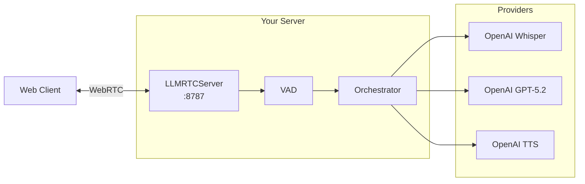
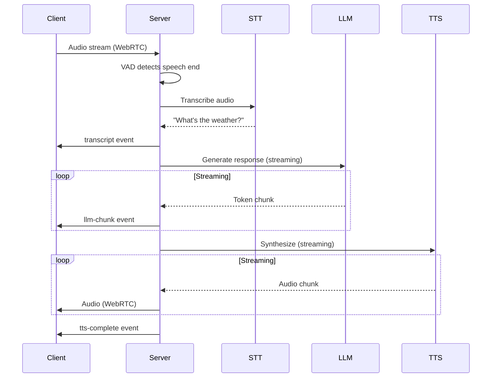

This guide walks you through creating your first LLMRTC voice server. By the end, you'll have a working backend that can process speech and generate responses.

---

## What You'll Build



The server handles:
- WebRTC connection from browsers
- Voice activity detection (speech boundaries)
- Speech-to-text transcription
- LLM response generation
- Text-to-speech synthesis

---

## Prerequisites

Before starting, ensure you have:

- [x] Node.js 20+ installed
- [x] FFmpeg installed
- [x] OpenAI API key

```bash
# Verify prerequisites
node --version   # v20.x.x or higher
ffmpeg -version  # FFmpeg 4.x or higher
```

---

## Step 1: Create Project

Create a new directory and initialize the project:

```bash
mkdir my-voice-server
cd my-voice-server
npm init -y
npm pkg set type=module
```

Install dependencies:

```bash
npm install @llmrtc/llmrtc-backend dotenv
```

---

## Step 2: Configure Environment

Create a `.env` file with your API key:

```bash
# .env
OPENAI_API_KEY=sk-...
```

:::caution
Never commit `.env` files to version control. Add `.env` to your `.gitignore`.
:::

---

## Step 3: Create Server

Create `server.js`:

```javascript
import 'dotenv/config';
import {
  LLMRTCServer,
  OpenAILLMProvider,
  OpenAIWhisperProvider,
  OpenAITTSProvider
} from '@llmrtc/llmrtc-backend';

// Create providers
const llmProvider = new OpenAILLMProvider({
  apiKey: process.env.OPENAI_API_KEY,
  model: 'gpt-5.2-chat-latest'
});

const sttProvider = new OpenAIWhisperProvider({
  apiKey: process.env.OPENAI_API_KEY
});

const ttsProvider = new OpenAITTSProvider({
  apiKey: process.env.OPENAI_API_KEY,
  voice: 'alloy'
});

// Create server
const server = new LLMRTCServer({
  providers: {
    llm: llmProvider,
    stt: sttProvider,
    tts: ttsProvider
  },
  systemPrompt: `You are a helpful voice assistant.
Keep responses concise and conversational.
Respond in 1-2 sentences when possible.`,
  streamingTTS: true,
  port: 8787
});

// Log events
server.on('connection', ({ id }) => {
  console.log(`Client connected: ${id}`);
});

server.on('disconnect', ({ id }) => {
  console.log(`Client disconnected: ${id}`);
});

server.on('error', (error) => {
  console.error('Server error:', error);
});

// Start server
await server.start();
console.log('Voice server running on ws://localhost:8787');
```

---

## Step 4: Run Server

Start the server:

```bash
node server.js
```

You should see:

```
Voice server running on ws://localhost:8787
```

---

## Step 5: Verify Server

### Health Check

Open in browser or curl:

```bash
curl http://localhost:8787/health
```

Response:

```json
{"ok":true}
```

### WebSocket Connection Test

You can test the WebSocket is accepting connections:

```bash
# Install wscat if needed
npm install -g wscat

# Connect to server
wscat -c ws://localhost:8787
```

Type `{"type": "ping"}` and you should receive a response.

---

## Understanding the Code

### Providers

Each provider handles one AI capability:

```javascript
// LLM: Generates text responses
const llmProvider = new OpenAILLMProvider({
  apiKey: process.env.OPENAI_API_KEY,
  model: 'gpt-5.2-chat-latest'  // or 'gpt-5.2' for harder tasks; 'gpt-5.1-mini' for lower cost
});

// STT: Converts speech to text
const sttProvider = new OpenAIWhisperProvider({
  apiKey: process.env.OPENAI_API_KEY
  // model: 'whisper-1' (default)
});

// TTS: Converts text to speech
const ttsProvider = new OpenAITTSProvider({
  apiKey: process.env.OPENAI_API_KEY,
  voice: 'alloy'  // alloy, echo, fable, onyx, nova, shimmer
});
```

### Server Options

Key configuration options:

```javascript
const server = new LLMRTCServer({
  // Required: AI providers
  providers: { llm, stt, tts },

  // System prompt defines assistant behavior
  systemPrompt: 'You are a helpful assistant.',

  // Enable streaming TTS for lower latency
  streamingTTS: true,

  // Network configuration
  port: 8787,
  host: '127.0.0.1',

  // CORS for browser connections
  cors: { origin: ['http://localhost:5173'] }
});
```

### Events

Monitor server activity:

```javascript
// Client connects
server.on('connection', ({ id }) => {
  console.log(`New connection: ${id}`);
});

// Client disconnects
server.on('disconnect', ({ id }) => {
  console.log(`Disconnected: ${id}`);
});

// Server listening
server.on('listening', ({ host, port }) => {
  console.log(`Server listening on ${host}:${port}`);
});

// Error occurred
server.on('error', (error) => {
  console.error('Server error:', error);
});
```

:::tip
For speech events like `speechStart` and `speechEnd`, use the hooks system instead of EventEmitter events. See [Observability and Hooks](../backend/observability-and-hooks) for details.
:::

---

## Alternative Configurations

### OpenAI-Only Stack

Simplest setup using only OpenAI:

```javascript
import {
  LLMRTCServer,
  OpenAILLMProvider,
  OpenAIWhisperProvider,
  OpenAITTSProvider
} from '@llmrtc/llmrtc-backend';

const server = new LLMRTCServer({
  providers: {
    llm: new OpenAILLMProvider({ apiKey: process.env.OPENAI_API_KEY }),
    stt: new OpenAIWhisperProvider({ apiKey: process.env.OPENAI_API_KEY }),
    tts: new OpenAITTSProvider({ apiKey: process.env.OPENAI_API_KEY })
  },
  systemPrompt: 'You are a helpful assistant.'
});
```

### OpenAI + ElevenLabs (Higher Quality TTS)

```javascript
import {
  LLMRTCServer,
  OpenAILLMProvider,
  OpenAIWhisperProvider,
  ElevenLabsTTSProvider
} from '@llmrtc/llmrtc-backend';

const server = new LLMRTCServer({
  providers: {
    llm: new OpenAILLMProvider({ apiKey: process.env.OPENAI_API_KEY }),
    stt: new OpenAIWhisperProvider({ apiKey: process.env.OPENAI_API_KEY }),
    tts: new ElevenLabsTTSProvider({
      apiKey: process.env.ELEVENLABS_API_KEY,
      voiceId: 'EXAVITQu4vr4xnSDxMaL'  // Sarah voice
    })
  },
  systemPrompt: 'You are a helpful assistant.'
});
```

### Anthropic Claude

```javascript
import {
  LLMRTCServer,
  AnthropicLLMProvider,
  OpenAIWhisperProvider,
  OpenAITTSProvider
} from '@llmrtc/llmrtc-backend';

const server = new LLMRTCServer({
  providers: {
    llm: new AnthropicLLMProvider({
      apiKey: process.env.ANTHROPIC_API_KEY,
      model: 'claude-sonnet-4-20250514'
    }),
    stt: new OpenAIWhisperProvider({ apiKey: process.env.OPENAI_API_KEY }),
    tts: new OpenAITTSProvider({ apiKey: process.env.OPENAI_API_KEY })
  },
  systemPrompt: 'You are a helpful assistant.'
});
```

---

## Conversation Flow

When the server is running, here's what happens:



---

## Troubleshooting

### "OPENAI_API_KEY is not set"

Ensure your `.env` file exists and has the correct format:

```bash
# Check file exists
cat .env

# Verify environment variable
echo $OPENAI_API_KEY
```

### "EADDRINUSE: address already in use"

Another process is using port 8787:

```bash
# Find the process
lsof -i :8787

# Kill it or change port in server.js
# Update the port option in LLMRTCServer config
```

### "FFmpeg not found"

Streaming TTS requires FFmpeg:

```bash
# macOS
brew install ffmpeg

# Ubuntu
sudo apt install ffmpeg

# Verify
ffmpeg -version
```

### No Audio Output

1. Check browser console for errors
2. Ensure microphone permission is granted
3. Verify WebRTC connection established
4. Check server logs for STT/LLM/TTS errors

---

## Next Steps

Your backend is running! Next, connect a web client:

<div className="row">
  <div className="col col--6">
    <a href="web-client-quickstart" className="card">
      <strong>Web Client Quickstart</strong>
      <p>Connect from the browser</p>
    </a>
  </div>
  <div className="col col--6">
    <a href="tool-calling-quickstart" className="card">
      <strong>Tool Calling</strong>
      <p>Add custom capabilities</p>
    </a>
  </div>
</div>

---

## Related Documentation

- [Backend Overview](../backend/overview) - Full server capabilities
- [Backend Configuration](../backend/library) - All server options
- [Providers](../providers/overview) - Available providers
- [Deployment](../backend/deployment) - Production deployment
