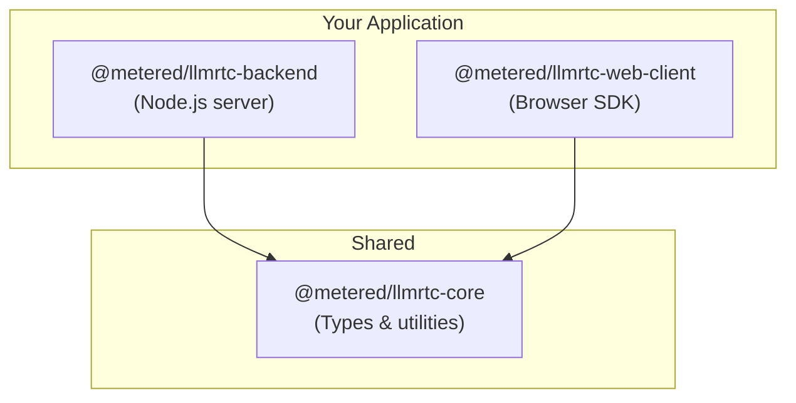

Install LLMRTC packages and dependencies. This guide covers both backend and web client setup.

---

## Package Overview

LLMRTC consists of three packages:



| Package | Description | Use When |
|---------|-------------|----------|
| `@metered/llmrtc-backend` | Node.js server with all providers | Building the voice server |
| `@metered/llmrtc-web-client` | Browser SDK for audio/video | Building the client UI |
| `@metered/llmrtc-core` | Shared types and orchestrators | Building custom integrations |

---

## Backend Installation

### npm

```bash
npm install @metered/llmrtc-backend
```

### yarn

```bash
yarn add @metered/llmrtc-backend
```

### pnpm

```bash
pnpm add @metered/llmrtc-backend
```

The backend package includes:
- LLMRTCServer with WebRTC and WebSocket transport
- All provider implementations (OpenAI, Anthropic, Gemini, etc.)
- VAD (Voice Activity Detection)
- Session management

---

## Web Client Installation

### npm

```bash
npm install @metered/llmrtc-web-client
```

### yarn

```bash
yarn add @metered/llmrtc-web-client
```

### pnpm

```bash
pnpm add @metered/llmrtc-web-client
```

The web client includes:
- WebRTC connection management
- Microphone capture
- Camera/screen capture for vision
- Automatic TTS playback
- Reconnection handling

---

## FFmpeg Installation

FFmpeg is required for streaming TTS (converting audio formats). Install it for your operating system:

### macOS

```bash
# Using Homebrew
brew install ffmpeg
```

### Ubuntu/Debian

```bash
sudo apt update
sudo apt install ffmpeg
```

### Windows

Download from [ffmpeg.org](https://ffmpeg.org/download.html) or use Chocolatey:

```bash
choco install ffmpeg
```

### Verify Installation

```bash
ffmpeg -version
# Should show version info
```

---

## Node.js Requirements

LLMRTC requires Node.js 20 or higher.

### Check Your Version

```bash
node --version
# Should be v20.x.x or higher
```

### Upgrade with nvm

```bash
# Install nvm if needed: https://github.com/nvm-sh/nvm
nvm install 20
nvm use 20
```

---

## Browser Requirements

The web client requires a modern browser with:

| Feature | Purpose | Support |
|---------|---------|---------|
| WebRTC | Real-time audio/video | Chrome 56+, Firefox 44+, Safari 11+ |
| getUserMedia | Microphone access | Chrome 53+, Firefox 36+, Safari 11+ |
| WebSocket | Signaling | All modern browsers |
| ES Modules | Package format | Chrome 61+, Firefox 60+, Safari 11+ |

**Recommended:** Chrome or Firefox for development (best WebRTC debugging tools).

---

## Project Setup

### New Project

Create a new project from scratch:

```bash
# Create directory
mkdir my-voice-assistant
cd my-voice-assistant

# Initialize package.json
npm init -y

# Set module type for ES imports
npm pkg set type=module

# Install packages
npm install @metered/llmrtc-backend
```

### TypeScript Project

For TypeScript projects:

```bash
npm install @metered/llmrtc-backend typescript @types/node
npx tsc --init
```

Update `tsconfig.json`:

```json
{
  "compilerOptions": {
    "target": "ES2022",
    "module": "NodeNext",
    "moduleResolution": "NodeNext",
    "esModuleInterop": true,
    "strict": true,
    "outDir": "dist"
  }
}
```

### Monorepo Setup

If you cloned the LLMRTC repository:

```bash
# Install all workspace dependencies
npm install

# Build all packages
npm run build
```

---

## Environment Setup

Create a `.env` file for your API keys:

```bash
# .env
OPENAI_API_KEY=sk-...
```

Install dotenv to load environment variables:

```bash
npm install dotenv
```

Load in your application:

```typescript
import 'dotenv/config';
// or
import { config } from 'dotenv';
config();
```

---

## Verify Installation

### Backend Verification

Create `test-backend.ts`:

```typescript
import { LLMRTCServer, OpenAILLMProvider } from '@metered/llmrtc-backend';

console.log('LLMRTCServer imported successfully');
console.log('OpenAILLMProvider imported successfully');

// Verify types
const config = {
  providers: {
    llm: new OpenAILLMProvider({
      apiKey: process.env.OPENAI_API_KEY || 'test'
    })
  }
};

console.log('Configuration valid');
console.log('Installation verified!');
```

Run:

```bash
npx tsx test-backend.ts
```

### Web Client Verification

Create a simple HTML file:

```html
<!DOCTYPE html>
<html>
<head>
  <title>LLMRTC Test</title>
</head>
<body>
  <script type="module">
    import { LLMRTCWebClient } from 'https://esm.sh/@metered/llmrtc-web-client';

    console.log('LLMRTCWebClient imported successfully');

    const client = new LLMRTCWebClient({
      signallingUrl: 'ws://localhost:8787'
    });

    console.log('Client created:', client);
    console.log('Installation verified!');
  </script>
</body>
</html>
```

Open in a browser and check the console.

---

## Common Installation Issues

### "Cannot find module" Errors

Ensure your `package.json` has `"type": "module"`:

```json
{
  "type": "module"
}
```

### TypeScript Import Errors

Use `.js` extensions in imports (even for `.ts` files) with NodeNext:

```typescript
// Correct
import { something } from './utils.js';

// Incorrect
import { something } from './utils';
```

Or use a bundler like tsx, ts-node, or esbuild.

### FFmpeg Not Found

Ensure FFmpeg is in your PATH:

```bash
# Check if ffmpeg is accessible
which ffmpeg

# Add to PATH if needed (macOS/Linux)
export PATH="/usr/local/bin:$PATH"
```

### Permission Denied (npm)

Fix npm permissions:

```bash
# Option 1: Use nvm (recommended)
nvm use 20

# Option 2: Fix npm prefix
mkdir ~/.npm-global
npm config set prefix '~/.npm-global'
export PATH=~/.npm-global/bin:$PATH
```

---

## Next Steps

With packages installed, continue to the backend quickstart:

<div className="row">
  <div className="col col--6">
    <a href="backend-quickstart" className="card">
      <strong>Backend Quickstart</strong>
      <p>Run your first voice server</p>
    </a>
  </div>
  <div className="col col--6">
    <a href="web-client-quickstart" className="card">
      <strong>Web Client Quickstart</strong>
      <p>Connect from the browser</p>
    </a>
  </div>
</div>

---

## Related Documentation

- [Backend Overview](../backend/overview) - Server architecture
- [Web Client Overview](../web-client/overview) - Client architecture
- [Providers](../providers/overview) - Available providers
