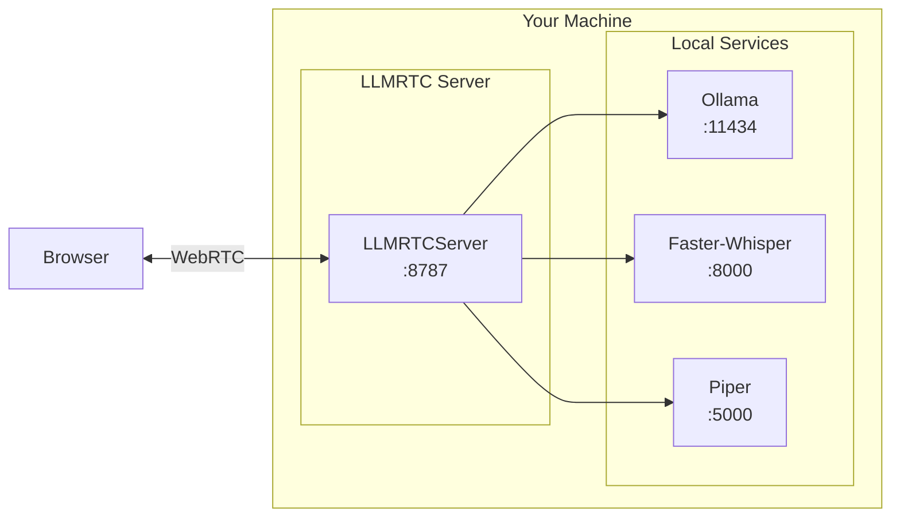

This guide shows how to run LLMRTC entirely locally without any cloud APIs. By the end, you'll have a fully offline voice assistant running on your machine.

---

## What You'll Build



**Benefits:**
- Complete privacy—data never leaves your machine
- No API costs
- Works offline
- Full control over models

**Requirements:**
- Decent CPU (or GPU for faster inference)
- 8GB+ RAM (16GB+ recommended)
- 10GB+ disk space for models

---

## Step 1: Install Ollama

[Ollama](https://ollama.com) runs LLMs locally.

### macOS

```bash
# Install
brew install ollama

# Start Ollama service
ollama serve
```

### Linux

```bash
# Install
curl -fsSL https://ollama.com/install.sh | sh

# Start Ollama service
ollama serve
```

### Windows

Download from [ollama.com/download](https://ollama.com/download/windows) and install.

### Download a Model

```bash
# Recommended for voice (fast, good quality)
ollama pull llama3.2

# Alternative: smaller model for low-resource machines
ollama pull phi3

# Alternative: larger model for better quality
ollama pull llama3.1:8b
```

### Verify

```bash
# Test the model
ollama run llama3.2 "Hello, how are you?"

# Check API
curl http://localhost:11434/api/tags
```

---

## Step 2: Install Faster-Whisper

[Faster-Whisper](https://github.com/SYSTRAN/faster-whisper) provides fast local speech-to-text.

### Using Docker (Recommended)

```bash
docker run -d \
  --name faster-whisper \
  -p 9000:8000 \
  fedirz/faster-whisper-server:latest-cpu

# Or with GPU (NVIDIA)
docker run -d \
  --gpus all \
  --name faster-whisper \
  -p 9000:8000 \
  fedirz/faster-whisper-server:latest-cuda
```

### Using pip

```bash
# Install
pip install faster-whisper-server

# Run
faster-whisper-server --host 0.0.0.0 --port 9000
```

### Verify

```bash
curl http://localhost:9000/health
# Should return: {"ok":true}
```

---

## Step 3: Install Piper

[Piper](https://github.com/rhasspy/piper) provides fast local text-to-speech.

### Using Docker (Recommended)

```bash
docker run -d \
  --name piper \
  -p 5002:5000 \
  rhasspy/piper:latest
```

### Manual Installation

```bash
# Download Piper
wget https://github.com/rhasspy/piper/releases/latest/download/piper_linux_x86_64.tar.gz
tar -xzf piper_linux_x86_64.tar.gz
cd piper

# Download a voice model
wget https://huggingface.co/rhasspy/piper-voices/resolve/main/en/en_US/amy/medium/en_US-amy-medium.onnx
wget https://huggingface.co/rhasspy/piper-voices/resolve/main/en/en_US/amy/medium/en_US-amy-medium.onnx.json

# Run HTTP server (requires piper-http-server)
pip install piper-http-server
piper-http-server --port 5002 --model en_US-amy-medium.onnx
```

### Available Voices

| Voice | Language | Quality | Size |
|-------|----------|---------|------|
| `en_US-amy-medium` | English (US) | Good | 60MB |
| `en_US-lessac-medium` | English (US) | Good | 60MB |
| `en_GB-cori-medium` | English (UK) | Good | 60MB |
| `de_DE-thorsten-medium` | German | Good | 60MB |
| `es_ES-mls_9972-medium` | Spanish | Good | 60MB |

Browse all voices at [rhasspy.github.io/piper-samples](https://rhasspy.github.io/piper-samples/).

### Verify

```bash
# Test TTS endpoint
curl -X POST http://localhost:5002/synthesize \
  -H "Content-Type: application/json" \
  -d '{"text": "Hello world"}' \
  --output test.wav

# Play the audio
ffplay test.wav  # or: aplay test.wav
```

---

## Step 4: Configure LLMRTC Server

Create `server.js`:

```javascript
import 'dotenv/config';
import {
  LLMRTCServer,
  OllamaLLMProvider,
  FasterWhisperProvider,
  PiperTTSProvider
} from '@llmrtc/llmrtc-backend';

// Create local providers
const llmProvider = new OllamaLLMProvider({
  baseUrl: process.env.OLLAMA_BASE_URL || 'http://localhost:11434',
  model: 'llama3.2'
});

const sttProvider = new FasterWhisperProvider({
  baseUrl: process.env.FASTER_WHISPER_URL || 'http://localhost:9000'
});

const ttsProvider = new PiperTTSProvider({
  baseUrl: process.env.PIPER_URL || 'http://localhost:5002',
  voice: 'en_US-amy-medium'
});

// Create server
const server = new LLMRTCServer({
  providers: {
    llm: llmProvider,
    stt: sttProvider,
    tts: ttsProvider
  },
  systemPrompt: `You are a helpful voice assistant running entirely locally.
Keep responses concise and conversational.`,
  streamingTTS: true,
  port: 8787
});

server.on('connection', ({ id }) => {
  console.log(`Connected: ${id}`);
});

server.on('error', (error) => {
  console.error('Error:', error);
});

await server.start();
console.log('Local voice server running on ws://localhost:8787');
console.log('Using: Ollama + Faster-Whisper + Piper');
```

Create `.env`:

```bash
# .env
OLLAMA_BASE_URL=http://localhost:11434
FASTER_WHISPER_URL=http://localhost:9000
PIPER_URL=http://localhost:5002
```

---

## Step 5: Start Everything

### Start Services

In separate terminals (or use Docker Compose):

```bash
# Terminal 1: Ollama
ollama serve

# Terminal 2: Faster-Whisper
docker start faster-whisper
# or: faster-whisper-server --host 0.0.0.0 --port 9000

# Terminal 3: Piper
docker start piper
# or: piper-http-server --port 5002 --model en_US-amy-medium.onnx

# Terminal 4: LLMRTC Server
node server.js
```

### Verify All Services

```bash
# Check Ollama
curl http://localhost:11434/api/tags

# Check Faster-Whisper
curl http://localhost:9000/health

# Check Piper
curl http://localhost:5002/health

# Check LLMRTC
curl http://localhost:8787/health
```

---

## Docker Compose Setup

Create `docker-compose.yml` for easy management:

```yaml
version: '3.8'

services:
  ollama:
    image: ollama/ollama:latest
    ports:
      - "11434:11434"
    volumes:
      - ollama_data:/root/.ollama
    # Uncomment for GPU support
    # deploy:
    #   resources:
    #     reservations:
    #       devices:
    #         - driver: nvidia
    #           count: 1
    #           capabilities: [gpu]

  faster-whisper:
    image: fedirz/faster-whisper-server:latest-cpu
    ports:
      - "9000:8000"
    # Use latest-cuda for GPU

  piper:
    image: rhasspy/piper:latest
    ports:
      - "5002:5000"

volumes:
  ollama_data:
```

Start all services:

```bash
docker-compose up -d

# Pull Ollama model
docker exec -it ollama ollama pull llama3.2

# Start LLMRTC server
node server.js
```

---

## Vision Support

There are two ways to add local vision:

### Option A: Native Vision with Gemma3 (Recommended)

Use `OllamaLLMProvider` with a vision-capable model. The provider automatically detects vision support.

```bash
# Pull Gemma3 (recommended for vision)
ollama pull gemma3

# Or pull LLaVA
ollama pull llava
```

Update server to use a vision model:

```javascript
import {
  LLMRTCServer,
  OllamaLLMProvider,
  FasterWhisperProvider,
  PiperTTSProvider
} from '@llmrtc/llmrtc-backend';

const server = new LLMRTCServer({
  providers: {
    llm: new OllamaLLMProvider({
      baseUrl: 'http://localhost:11434',
      model: 'gemma3'  // Vision-capable model handles images natively
    }),
    stt: new FasterWhisperProvider({
      baseUrl: 'http://localhost:9000'
    }),
    tts: new PiperTTSProvider({
      baseUrl: 'http://localhost:5002'
    })
    // No separate vision provider needed!
  },
  systemPrompt: 'You are a helpful assistant that can see and hear.'
});
```

### Option B: Separate Vision Provider

Use a dedicated vision provider alongside a text-only LLM:

```bash
# Pull LLaVA for vision
ollama pull llava
```

```javascript
import {
  LLMRTCServer,
  OllamaLLMProvider,
  LlavaVisionProvider,
  FasterWhisperProvider,
  PiperTTSProvider
} from '@llmrtc/llmrtc-backend';

const server = new LLMRTCServer({
  providers: {
    llm: new OllamaLLMProvider({
      baseUrl: 'http://localhost:11434',
      model: 'llama3.2'  // Text-only model
    }),
    stt: new FasterWhisperProvider({
      baseUrl: 'http://localhost:9000'
    }),
    tts: new PiperTTSProvider({
      baseUrl: 'http://localhost:5002'
    }),
    vision: new LlavaVisionProvider({
      baseUrl: 'http://localhost:11434',
      model: 'llava'
    })
  },
  systemPrompt: 'You are a helpful assistant that can see and hear.'
});
```

### Vision Model Comparison

| Model | Provider | Notes |
|-------|----------|-------|
| `gemma3` | OllamaLLMProvider | Google's multimodal, good balance of speed/quality |
| `llava` | OllamaLLMProvider or LlavaVisionProvider | General vision tasks |
| `llama3.2-vision` | OllamaLLMProvider | Meta's vision model, larger but more capable |

---

## Performance Tuning

### Ollama Options

```javascript
const llmProvider = new OllamaLLMProvider({
  baseUrl: 'http://localhost:11434',
  model: 'llama3.2',
  options: {
    // Context window size
    num_ctx: 4096,

    // Number of tokens to predict
    num_predict: 256,

    // Temperature (lower = more focused)
    temperature: 0.7,

    // Number of CPU threads
    num_thread: 8
  }
});
```

### Faster-Whisper Options

```javascript
const sttProvider = new FasterWhisperProvider({
  baseUrl: 'http://localhost:9000',
  model: 'base',  // tiny, base, small, medium, large-v3
  language: 'en'  // Force language for faster processing
});
```

Model size comparison:

| Model | Size | Speed | Accuracy |
|-------|------|-------|----------|
| `tiny` | 75MB | Fastest | Basic |
| `base` | 145MB | Fast | Good |
| `small` | 500MB | Medium | Better |
| `medium` | 1.5GB | Slower | Great |
| `large-v3` | 3GB | Slowest | Best |

---

## Troubleshooting

### Ollama Not Responding

```bash
# Check if Ollama is running
curl http://localhost:11434/api/tags

# Restart Ollama
ollama serve

# Check logs
journalctl -u ollama -f
```

### Slow LLM Responses

1. Use a smaller model: `ollama pull phi3` or `llama3.2:3b`
2. Reduce context: `num_ctx: 2048`
3. Enable GPU acceleration if available

### Faster-Whisper Errors

```bash
# Check container logs
docker logs faster-whisper

# Restart container
docker restart faster-whisper

# Try CPU-only if GPU issues
docker run -d -p 9000:8000 fedirz/faster-whisper-server:latest-cpu
```

### Piper No Audio

```bash
# Test directly
curl -X POST http://localhost:5002/synthesize \
  -H "Content-Type: application/json" \
  -d '{"text": "Test"}' \
  --output test.wav

# Check voice model is loaded
curl http://localhost:5002/voices
```

### High Latency

Local models are slower than cloud APIs. To improve:

1. Use smaller models (llama3.2:3b, phi3)
2. Enable GPU acceleration
3. Pre-warm models by sending a test request on startup
4. Reduce `num_predict` for shorter responses

---

## Resource Requirements

| Setup | RAM | CPU | GPU |
|-------|-----|-----|-----|
| Minimal (tiny models) | 4GB | 4 cores | - |
| Standard (base models) | 8GB | 8 cores | - |
| Quality (medium models) | 16GB | 8 cores | Optional |
| Best (large models) | 32GB | 8 cores | Recommended |

---

## Next Steps

Your local stack is running! Explore more:

<div className="row">
  <div className="col col--6">
    <a href="tool-calling-quickstart" className="card">
      <strong>Tool Calling</strong>
      <p>Add custom capabilities</p>
    </a>
  </div>
  <div className="col col--6">
    <a href="../playbooks/overview" className="card">
      <strong>Playbooks</strong>
      <p>Multi-stage conversation flows</p>
    </a>
  </div>
</div>

---

## Related Documentation

- [Providers Overview](../providers/overview) - All available providers
- [Ollama Provider](../providers/local-ollama) - Ollama configuration
- [Backend Configuration](../backend/library) - Server options
