This guide takes you from zero to a working voice assistant. By the end, you'll have a real-time conversational AI application running locally.

---

## Learning Path


| Guide | What You'll Learn |
|-------|-------------------|
| [Installation](installation) | Install packages and dependencies |
| [Backend Quickstart](backend-quickstart) | Run the server with cloud providers |
| [Web Client Quickstart](web-client-quickstart) | Connect a browser and speak to your assistant |
| [Tool Calling](tool-calling-quickstart) | Give your assistant custom capabilities |
| [Local-Only Stack](local-only-stack) | Run entirely locally without cloud APIs |

---

## What You'll Build

By the end of the quickstarts, you'll have:

1. **A working voice server** that processes speech, generates responses, and synthesizes audio
2. **A browser client** that captures your microphone and plays assistant responses
3. **Custom tools** that let your assistant perform actions like checking the weather
4. **Optionally**, a fully local stack for privacy-sensitive applications

```mermaid
flowchart LR
    subgraph "Your Browser"
        MIC[🎤 Microphone] --> CLIENT[Web Client]
        CLIENT --> SPEAKER[🔊 Speaker]
    end

    subgraph "Your Server"
        CLIENT <-->|WebRTC| SERVER[LLMRTC Backend]
    end

    subgraph "AI Providers"
        SERVER --> STT[Speech-to-Text]
        SERVER --> LLM[Language Model]
        SERVER --> TTS[Text-to-Speech]
    end
```



---

## Prerequisites

### Required

| Requirement | Version | Check Command |
|-------------|---------|---------------|
| Node.js | 20+ | `node --version` |
| npm | 9+ | `npm --version` |

### For Cloud Path (Recommended for Getting Started)

You'll need API keys for at least one provider per capability:

| Capability | Provider Options |
|------------|------------------|
| LLM | OpenAI, Anthropic, Google Gemini |
| Speech-to-Text | OpenAI Whisper |
| Text-to-Speech | OpenAI TTS, ElevenLabs |

**Quickest setup:** An OpenAI API key covers all three capabilities.

### For Local Path (No Cloud Dependencies)

| Component | Software |
|-----------|----------|
| LLM | [Ollama](https://ollama.com) with `llama3.2` or similar |
| Speech-to-Text | [Faster-Whisper Server](https://github.com/fedirz/faster-whisper-server) |
| Text-to-Speech | [Piper](https://github.com/rhasspy/piper) |

---

## Two Paths

Choose your approach:

### Cloud Path (Start Here)

Best for: Quick setup, production deployments, highest quality


**Pros:**
- Fastest setup (minutes)
- Best quality models
- No local GPU required

**Cons:**
- Requires API keys
- Ongoing API costs
- Data sent to cloud providers

### Local Path

Best for: Privacy, offline use, development without API costs


**Pros:**
- Complete privacy
- No API costs
- Works offline

**Cons:**
- Longer setup
- Requires decent CPU/GPU
- Smaller model selection

---

## Quick Reference

### Environment Variables

```bash
# Cloud providers
OPENAI_API_KEY=sk-...
ANTHROPIC_API_KEY=sk-ant-...
ELEVENLABS_API_KEY=...

# Local providers (defaults shown)
OLLAMA_BASE_URL=http://localhost:11434
FASTER_WHISPER_URL=http://localhost:9000
PIPER_URL=http://localhost:5002
```

### Default Ports

| Service | Default Port |
|---------|--------------|
| LLMRTC Backend | 8787 |
| Ollama | 11434 |
| Faster-Whisper | 9000 |
| Piper | 5002 |

---

## Running the Examples

After completing the quickstarts, try the included examples:

### Vite Demo (Full-Featured)

```bash
cd examples/vite-demo
npm install
npm run dev
```

Features: Audio visualization, transcript display, tool calling UI

### Minimal Example (80 Lines)

```bash
cd examples/minimal
npm install
npm run dev
```

A bare-bones implementation showing the essential code.

---

## Troubleshooting Setup

### Node.js Version Issues

```bash
# Check version
node --version

# If < 20, use nvm to upgrade
nvm install 20
nvm use 20
```

### API Key Problems

Verify your key works:

```bash
# Test OpenAI key
curl https://api.openai.com/v1/models \
  -H "Authorization: Bearer $OPENAI_API_KEY"
```

### Port Conflicts

If port 8787 is in use:

```bash
# Find what's using the port
lsof -i :8787

# Or use a different port
PORT=9000 npm start
```

---

## Next Steps

Ready to start? Begin with installation:

<div className="row">
  <div className="col col--6">
    <a href="installation" className="card">
      <strong>Installation</strong>
      <p>Set up packages and dependencies</p>
    </a>
  </div>
  <div className="col col--6">
    <a href="backend-quickstart" className="card">
      <strong>Backend Quickstart</strong>
      <p>Run your first voice server</p>
    </a>
  </div>
</div>
