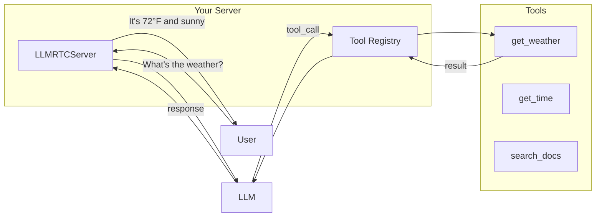
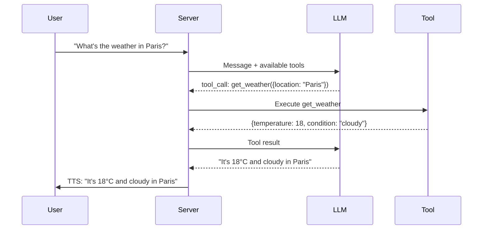

This guide shows how to give your voice assistant custom capabilities through tool calling. By the end, you'll have an assistant that can check the weather, look up information, or perform any action you define.

---

## What You'll Build



Tools let your assistant:
- Fetch real-time data (weather, stocks, news)
- Interact with your systems (databases, APIs)
- Perform calculations
- Control devices

---

## Prerequisites

- [x] Backend server running (from [Backend Quickstart](backend-quickstart))
- [x] Web client working (from [Web Client Quickstart](web-client-quickstart))

---

## Step 1: Define a Tool

Create a tool using the `defineTool` helper:

```typescript
import { defineTool } from '@metered/llmrtc-core';

// Define the weather tool
const getWeatherTool = defineTool({
  name: 'get_weather',
  description: 'Get the current weather for a location',
  parameters: {
    type: 'object',
    properties: {
      location: {
        type: 'string',
        description: 'City name, e.g., "San Francisco" or "Tokyo"'
      },
      units: {
        type: 'string',
        enum: ['celsius', 'fahrenheit'],
        description: 'Temperature units (default: celsius)'
      }
    },
    required: ['location']
  }
}, async ({ location, units = 'celsius' }) => {
  // Your implementation here
  // This could call a real weather API
  const weather = {
    location,
    temperature: units === 'celsius' ? 22 : 72,
    units,
    condition: 'sunny',
    humidity: 65
  };

  return weather;
});
```

### Tool Definition Structure

| Field | Required | Description |
|-------|----------|-------------|
| `name` | Yes | Unique identifier (lowercase, underscores) |
| `description` | Yes | What the tool does (helps LLM decide when to use it) |
| `parameters` | Yes | JSON Schema for the input parameters |
| `handler` | Yes | Async function that executes the tool |

---

## Step 2: Register Tools

Create a `ToolRegistry` and register your tools:

```typescript
import { ToolRegistry, defineTool } from '@metered/llmrtc-core';

// Create registry
const registry = new ToolRegistry();

// Register weather tool
registry.register(getWeatherTool);

// Register more tools
registry.register(defineTool({
  name: 'get_time',
  description: 'Get the current time in a timezone',
  parameters: {
    type: 'object',
    properties: {
      timezone: {
        type: 'string',
        description: 'Timezone, e.g., "America/New_York" or "Asia/Tokyo"'
      }
    },
    required: ['timezone']
  }
}, async ({ timezone }) => {
  const time = new Date().toLocaleString('en-US', { timeZone: timezone });
  return { timezone, time };
}));
```

---

## Step 3: Add Tools to Server

Update your server to include tools:

```typescript
import 'dotenv/config';
import {
  LLMRTCServer,
  OpenAILLMProvider,
  OpenAIWhisperProvider,
  OpenAITTSProvider
} from '@metered/llmrtc-backend';
import { ToolRegistry, defineTool } from '@metered/llmrtc-core';

// Create tool registry
const registry = new ToolRegistry();

// Register weather tool
registry.register(defineTool({
  name: 'get_weather',
  description: 'Get the current weather for a location',
  parameters: {
    type: 'object',
    properties: {
      location: { type: 'string', description: 'City name' },
      units: { type: 'string', enum: ['celsius', 'fahrenheit'] }
    },
    required: ['location']
  }
}, async ({ location, units = 'celsius' }) => {
  // Simulated weather data
  return {
    location,
    temperature: units === 'celsius' ? 22 : 72,
    units,
    condition: 'sunny'
  };
}));

// Register time tool
registry.register(defineTool({
  name: 'get_time',
  description: 'Get the current time in a timezone',
  parameters: {
    type: 'object',
    properties: {
      timezone: { type: 'string', description: 'Timezone name' }
    },
    required: ['timezone']
  }
}, async ({ timezone }) => {
  try {
    const time = new Date().toLocaleString('en-US', { timeZone: timezone });
    return { timezone, time };
  } catch {
    return { error: `Unknown timezone: ${timezone}` };
  }
}));

// Create server with tools
const server = new LLMRTCServer({
  providers: {
    llm: new OpenAILLMProvider({ apiKey: process.env.OPENAI_API_KEY }),
    stt: new OpenAIWhisperProvider({ apiKey: process.env.OPENAI_API_KEY }),
    tts: new OpenAITTSProvider({ apiKey: process.env.OPENAI_API_KEY })
  },
  tools: registry,
  systemPrompt: `You are a helpful voice assistant with access to tools.
Use the get_weather tool when asked about weather.
Use the get_time tool when asked about time in different locations.
Always use tools when you have relevant ones available.`,
  port: 8787
});

server.on('connection', ({ sessionId }) => {
  console.log(`Connected: ${sessionId}`);
});

await server.start();
console.log('Server with tools running on ws://localhost:8787');
```

---

## Step 4: Test Your Tools

Start your server and connect with the web client. Try asking:

- "What's the weather in Tokyo?"
- "What time is it in New York?"
- "Is it warmer in London or Paris?"

The assistant will call the appropriate tools and respond with the results.

---

## Tool Execution Flow

When a user asks something that requires a tool:



---

## Real-World Tool Examples

### Database Lookup

```typescript
registry.register(defineTool({
  name: 'lookup_customer',
  description: 'Look up customer information by email or phone',
  parameters: {
    type: 'object',
    properties: {
      email: { type: 'string', description: 'Customer email' },
      phone: { type: 'string', description: 'Customer phone number' }
    }
  }
}, async ({ email, phone }) => {
  // Query your database
  const customer = await db.customers.findOne({
    where: { OR: [{ email }, { phone }] }
  });

  if (!customer) {
    return { found: false };
  }

  return {
    found: true,
    name: customer.name,
    accountStatus: customer.status,
    memberSince: customer.createdAt
  };
}));
```

### API Integration

```typescript
registry.register(defineTool({
  name: 'search_products',
  description: 'Search for products in the catalog',
  parameters: {
    type: 'object',
    properties: {
      query: { type: 'string', description: 'Search query' },
      category: { type: 'string', description: 'Product category' },
      maxPrice: { type: 'number', description: 'Maximum price' }
    },
    required: ['query']
  }
}, async ({ query, category, maxPrice }) => {
  const response = await fetch('https://api.yourstore.com/search', {
    method: 'POST',
    headers: { 'Content-Type': 'application/json' },
    body: JSON.stringify({ query, category, maxPrice })
  });

  const products = await response.json();

  return {
    count: products.length,
    products: products.slice(0, 5).map(p => ({
      name: p.name,
      price: p.price,
      inStock: p.inventory > 0
    }))
  };
}));
```

### External Service

```typescript
registry.register(defineTool({
  name: 'send_notification',
  description: 'Send a notification to the user',
  parameters: {
    type: 'object',
    properties: {
      type: { type: 'string', enum: ['email', 'sms'] },
      message: { type: 'string', description: 'Notification message' }
    },
    required: ['type', 'message']
  }
}, async ({ type, message }, context) => {
  // Use context.sessionId to get user info
  const user = await getUserFromSession(context.sessionId);

  if (type === 'email') {
    await sendEmail(user.email, message);
  } else {
    await sendSMS(user.phone, message);
  }

  return { sent: true, type };
}));
```

---

## Tool Best Practices

### Clear Descriptions

Help the LLM understand when to use each tool:

```typescript
// Good: Specific and helpful
description: 'Get the current weather forecast including temperature, conditions, and humidity for any city worldwide'

// Bad: Vague
description: 'Weather stuff'
```

### Parameter Validation

Use JSON Schema constraints:

```typescript
parameters: {
  type: 'object',
  properties: {
    email: {
      type: 'string',
      format: 'email',
      description: 'Valid email address'
    },
    age: {
      type: 'integer',
      minimum: 0,
      maximum: 150,
      description: 'Age in years'
    },
    status: {
      type: 'string',
      enum: ['active', 'inactive', 'pending'],
      description: 'Account status'
    }
  },
  required: ['email']
}
```

### Error Handling

Return meaningful errors:

```typescript
registry.register(defineTool({
  name: 'book_appointment',
  // ...
}, async ({ date, time }) => {
  try {
    const result = await bookingService.create({ date, time });
    return { success: true, confirmationId: result.id };
  } catch (error) {
    if (error.code === 'SLOT_UNAVAILABLE') {
      return {
        success: false,
        error: 'That time slot is no longer available',
        suggestedTimes: await bookingService.getAvailable(date)
      };
    }
    return { success: false, error: 'Unable to book appointment' };
  }
}));
```

---

## Show Tool Calls in UI

Update your web client to display tool activity:

```typescript
client.on('toolCallStart', ({ name, args }) => {
  console.log(`Calling tool: ${name}`);
  showToolIndicator(name);
});

client.on('toolCallEnd', ({ name, result }) => {
  console.log(`Tool result:`, result);
  hideToolIndicator();
});
```

---

## Tool Execution Options

Configure the `ToolExecutor` for your needs:

```typescript
import { ToolExecutor } from '@metered/llmrtc-core';

const executor = new ToolExecutor(registry, {
  // Maximum execution time per tool (ms)
  timeout: 30000,

  // How many tools can run concurrently
  maxConcurrency: 5,

  // Validate arguments against JSON Schema
  validateArguments: true,

  // Callbacks for monitoring
  onToolStart: (name, args) => {
    console.log(`Starting ${name}`, args);
  },
  onToolEnd: (name, result, durationMs) => {
    console.log(`${name} completed in ${durationMs}ms`);
  },
  onToolError: (name, error) => {
    console.error(`${name} failed:`, error);
  }
});
```

---

## Troubleshooting

### Tool Not Being Called

1. Check the tool description is clear about when to use it
2. Ensure the tool name is in the system prompt
3. Verify tools are registered before server starts:

```typescript
console.log('Registered tools:', registry.getDefinitions().map(t => t.name));
```

### Tool Errors

Add error handling and logging:

```typescript
registry.register(defineTool({
  name: 'my_tool',
  // ...
}, async (args, context) => {
  console.log('Tool called with:', args);
  console.log('Context:', context);

  try {
    const result = await doSomething(args);
    console.log('Tool result:', result);
    return result;
  } catch (error) {
    console.error('Tool error:', error);
    return { error: error.message };
  }
}));
```

### Timeout Issues

Increase timeout for slow operations:

```typescript
const executor = new ToolExecutor(registry, {
  timeout: 60000  // 60 seconds
});
```

---

## Next Steps

With tools working, try building more complex flows:

<div className="row">
  <div className="col col--6">
    <a href="local-only-stack" className="card">
      <strong>Local-Only Stack</strong>
      <p>Run without cloud APIs</p>
    </a>
  </div>
  <div className="col col--6">
    <a href="../playbooks/overview" className="card">
      <strong>Playbooks</strong>
      <p>Multi-stage conversation flows</p>
    </a>
  </div>
</div>

---

## Related Documentation

- [Tool Calling Concepts](../concepts/tool-calling) - Deep dive into tool system
- [Core SDK Tools](../core-sdk/tools) - Full tool API reference
- [Playbooks with Tools](../playbooks/voice-agents-with-tools) - Tools in playbooks
