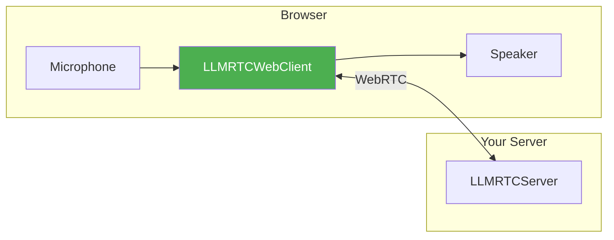
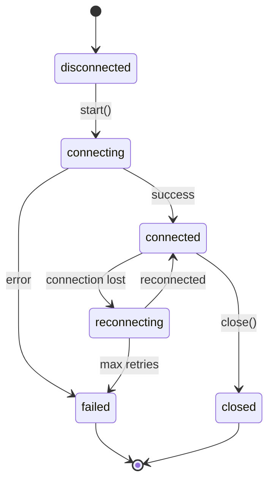

This guide walks you through connecting a browser to your LLMRTC server. By the end, you'll have a working voice interface that captures your microphone and plays assistant responses.

---

## What You'll Build



The web client handles:
- WebRTC connection to the server
- Microphone capture and streaming
- Automatic TTS playback
- Reconnection on network issues

---

## Prerequisites

Before starting, ensure you have:

- [x] Backend server running (from [Backend Quickstart](backend-quickstart))
- [x] Modern browser (Chrome, Firefox, Safari)

```bash
# Verify backend is running
curl http://localhost:8787/health
# Should return: {"ok":true}
```

---

## Option 1: Vanilla HTML

The simplest approach—no build tools required.

### Create HTML File

Create `index.html`:

```html
<!DOCTYPE html>
<html>
<head>
  <title>Voice Assistant</title>
  <style>
    body {
      font-family: system-ui, sans-serif;
      max-width: 600px;
      margin: 50px auto;
      padding: 20px;
    }
    #status {
      padding: 10px 20px;
      border-radius: 20px;
      display: inline-block;
      margin-bottom: 20px;
    }
    .disconnected { background: #e0e0e0; }
    .connecting { background: #ff9800; color: white; }
    .connected { background: #4caf50; color: white; }
    #transcript {
      border: 1px solid #ddd;
      padding: 20px;
      min-height: 200px;
      border-radius: 8px;
    }
    .user { color: #1976d2; }
    .assistant { color: #388e3c; }
    button {
      padding: 12px 24px;
      font-size: 16px;
      border: none;
      border-radius: 8px;
      cursor: pointer;
      margin-top: 20px;
    }
    #startBtn { background: #4caf50; color: white; }
    #stopBtn { background: #f44336; color: white; }
  </style>
</head>
<body>
  <h1>Voice Assistant</h1>
  <div id="status" class="disconnected">Disconnected</div>

  <div id="transcript"></div>

  <button id="startBtn">Start Conversation</button>
  <button id="stopBtn" style="display: none;">Stop</button>

  <script type="module">
    import { LLMRTCWebClient } from 'https://esm.sh/@llmrtc/llmrtc-web-client';

    const status = document.getElementById('status');
    const transcript = document.getElementById('transcript');
    const startBtn = document.getElementById('startBtn');
    const stopBtn = document.getElementById('stopBtn');

    let client;
    let micStream;

    function addMessage(role, text) {
      const div = document.createElement('div');
      div.className = role;
      div.innerHTML = `<strong>${role}:</strong> ${text}`;
      transcript.appendChild(div);
      transcript.scrollTop = transcript.scrollHeight;
    }

    function updateStatus(state) {
      status.textContent = state;
      status.className = state.toLowerCase();
    }

    async function start() {
      // Create client
      client = new LLMRTCWebClient({
        signallingUrl: 'ws://localhost:8787'
      });

      // Handle events
      client.on('stateChange', updateStatus);

      client.on('transcript', (text) => {
        addMessage('user', text);
      });

      client.on('llmChunk', (chunk) => {
        // Append to last assistant message or create new
        const lastMsg = transcript.lastElementChild;
        if (lastMsg?.className === 'assistant') {
          lastMsg.innerHTML += chunk;
        } else {
          addMessage('assistant', chunk);
        }
      });

      client.on('error', (error) => {
        console.error('Error:', error);
        addMessage('system', `Error: ${error.message}`);
      });

      // Connect
      updateStatus('Connecting');
      await client.start();

      // Get microphone
      micStream = await navigator.mediaDevices.getUserMedia({ audio: true });
      client.shareAudio(micStream);

      // Update UI
      startBtn.style.display = 'none';
      stopBtn.style.display = 'inline-block';
    }

    function stop() {
      // Stop microphone
      micStream?.getTracks().forEach(track => track.stop());

      // Close client
      client?.close();

      // Update UI
      startBtn.style.display = 'inline-block';
      stopBtn.style.display = 'none';
      updateStatus('Disconnected');
    }

    startBtn.addEventListener('click', start);
    stopBtn.addEventListener('click', stop);
  </script>
</body>
</html>
```

### Run It

Open `index.html` directly in your browser, or serve it:

```bash
# Using Python
python3 -m http.server 5000

# Using Node
npx serve .
```

Open `http://localhost:5000` and click "Start Conversation".

---

## Option 2: Vite + React

For a more structured project.

### Create Project

```bash
npm create vite@latest my-voice-client -- --template react-ts
cd my-voice-client
npm install @llmrtc/llmrtc-web-client
```

### Create Voice Component

Create `src/VoiceAssistant.tsx`:

```tsx
import { useEffect, useState, useRef } from 'react';
import { LLMRTCWebClient, ConnectionState } from '@llmrtc/llmrtc-web-client';

interface Message {
  role: 'user' | 'assistant';
  content: string;
}

export function VoiceAssistant() {
  const [status, setStatus] = useState<ConnectionState>('disconnected');
  const [messages, setMessages] = useState<Message[]>([]);
  const [isActive, setIsActive] = useState(false);

  const clientRef = useRef<LLMRTCWebClient | null>(null);
  const streamRef = useRef<MediaStream | null>(null);
  const currentResponseRef = useRef('');

  const start = async () => {
    // Create client
    const client = new LLMRTCWebClient({
      signallingUrl: 'ws://localhost:8787'
    });
    clientRef.current = client;

    // State changes
    client.on('stateChange', setStatus);

    // User transcript
    client.on('transcript', (text) => {
      setMessages(prev => [...prev, { role: 'user', content: text }]);
      currentResponseRef.current = '';
    });

    // LLM response chunks
    client.on('llmChunk', (chunk) => {
      currentResponseRef.current += chunk;
      setMessages(prev => {
        const last = prev[prev.length - 1];
        if (last?.role === 'assistant') {
          return [...prev.slice(0, -1), { role: 'assistant', content: currentResponseRef.current }];
        }
        return [...prev, { role: 'assistant', content: currentResponseRef.current }];
      });
    });

    // Errors
    client.on('error', (error) => {
      console.error('Client error:', error);
    });

    // Connect
    await client.start();

    // Start microphone
    const stream = await navigator.mediaDevices.getUserMedia({ audio: true });
    streamRef.current = stream;
    client.shareAudio(stream);

    setIsActive(true);
  };

  const stop = () => {
    streamRef.current?.getTracks().forEach(track => track.stop());
    clientRef.current?.close();
    setIsActive(false);
    setStatus('disconnected');
  };

  // Cleanup on unmount
  useEffect(() => {
    return () => {
      stop();
    };
  }, []);

  return (
    <div style={{ maxWidth: 600, margin: '50px auto', padding: 20 }}>
      <h1>Voice Assistant</h1>

      <div style={{
        padding: '10px 20px',
        borderRadius: 20,
        display: 'inline-block',
        marginBottom: 20,
        background: status === 'connected' ? '#4caf50' :
                   status === 'connecting' ? '#ff9800' : '#e0e0e0',
        color: status === 'disconnected' ? 'black' : 'white'
      }}>
        {status}
      </div>

      <div style={{
        border: '1px solid #ddd',
        padding: 20,
        minHeight: 200,
        borderRadius: 8,
        marginBottom: 20
      }}>
        {messages.map((msg, i) => (
          <div key={i} style={{ color: msg.role === 'user' ? '#1976d2' : '#388e3c' }}>
            <strong>{msg.role}:</strong> {msg.content}
          </div>
        ))}
      </div>

      {!isActive ? (
        <button
          onClick={start}
          style={{
            padding: '12px 24px',
            fontSize: 16,
            background: '#4caf50',
            color: 'white',
            border: 'none',
            borderRadius: 8,
            cursor: 'pointer'
          }}
        >
          Start Conversation
        </button>
      ) : (
        <button
          onClick={stop}
          style={{
            padding: '12px 24px',
            fontSize: 16,
            background: '#f44336',
            color: 'white',
            border: 'none',
            borderRadius: 8,
            cursor: 'pointer'
          }}
        >
          Stop
        </button>
      )}
    </div>
  );
}
```

### Update App

Update `src/App.tsx`:

```tsx
import { VoiceAssistant } from './VoiceAssistant';

function App() {
  return <VoiceAssistant />;
}

export default App;
```

### Run It

```bash
npm run dev
```

Open `http://localhost:5173`.

---

## Understanding the Code

### Client Configuration

```typescript
const client = new LLMRTCWebClient({
  // Required: WebSocket URL to your backend
  signallingUrl: 'ws://localhost:8787',

  // Optional: Custom ICE servers for NAT traversal
  iceServers: [
    { urls: 'stun:stun.l.google.com:19302' }
  ],

  // Optional: Reconnection settings
  reconnection: {
    enabled: true,
    maxRetries: 5,
    baseDelayMs: 1000
  }
});
```

:::note Audio Playback
The client does not auto-play TTS audio. You must handle the `ttsTrack` event and connect it to an `<audio>` element yourself (see examples above).
:::

### Key Events

| Event | Description | Payload |
|-------|-------------|---------|
| `stateChange` | Connection state changed | `ConnectionState` |
| `transcript` | User speech transcribed | `string` |
| `llmChunk` | LLM response chunk | `string` |
| `ttsStart` | TTS playback started | - |
| `ttsComplete` | TTS playback finished | - |
| `ttsCancelled` | TTS interrupted (barge-in) | - |
| `speechStart` | User started speaking | - |
| `speechEnd` | User stopped speaking | - |
| `error` | Error occurred | `ClientError` |

### Connection States



---

## Handling Barge-In

When users interrupt the assistant, handle it gracefully:

```typescript
let currentAudio: HTMLAudioElement | null = null;

client.on('ttsTrack', (stream) => {
  currentAudio = new Audio();
  currentAudio.srcObject = stream;
  currentAudio.play();
});

client.on('ttsCancelled', () => {
  // User interrupted—stop current playback
  if (currentAudio) {
    currentAudio.pause();
    currentAudio.srcObject = null;
    currentAudio = null;
  }
  console.log('User interrupted');
});
```

---

## Adding Visual Feedback

### Speaking Indicator

```typescript
const [isSpeaking, setIsSpeaking] = useState(false);

client.on('speechStart', () => setIsSpeaking(true));
client.on('speechEnd', () => setIsSpeaking(false));

// In render:
{isSpeaking && <div className="pulse">Listening...</div>}
```

### Assistant Speaking

```typescript
const [assistantSpeaking, setAssistantSpeaking] = useState(false);

client.on('ttsStart', () => setAssistantSpeaking(true));
client.on('ttsComplete', () => setAssistantSpeaking(false));
client.on('ttsCancelled', () => setAssistantSpeaking(false));
```

---

## Troubleshooting

### "NotAllowedError: Permission denied"

Microphone permission was denied:

1. Click the lock/camera icon in the address bar
2. Allow microphone access
3. Refresh the page

### "WebSocket connection failed"

The backend isn't running or is on a different URL:

```bash
# Verify backend
curl http://localhost:8787/health

# Check URL matches in client config
signallingUrl: 'ws://localhost:8787'
```

### No Audio Playback

1. Check browser console for errors
2. Ensure you're handling the `ttsTrack` event and connecting it to an `<audio>` element
3. Check volume isn't muted
4. Try clicking the page first (browser autoplay policies require user interaction)

### Audio Echo

Enable echo cancellation:

```typescript
const stream = await navigator.mediaDevices.getUserMedia({
  audio: {
    echoCancellation: true,
    noiseSuppression: true,
    autoGainControl: true
  }
});
```

---

## Next Steps

Your voice interface is working! Next, add custom capabilities:

<div className="row">
  <div className="col col--6">
    <a href="tool-calling-quickstart" className="card">
      <strong>Tool Calling</strong>
      <p>Add custom capabilities to your assistant</p>
    </a>
  </div>
  <div className="col col--6">
    <a href="local-only-stack" className="card">
      <strong>Local-Only Stack</strong>
      <p>Run without cloud APIs</p>
    </a>
  </div>
</div>

---

## Related Documentation

- [Web Client Overview](../web-client/overview) - Full client capabilities
- [Audio Handling](../web-client/audio) - Advanced audio configuration
- [UI Patterns](../web-client/ui-patterns) - Common UI implementations
- [Events Reference](../web-client/events) - All client events
