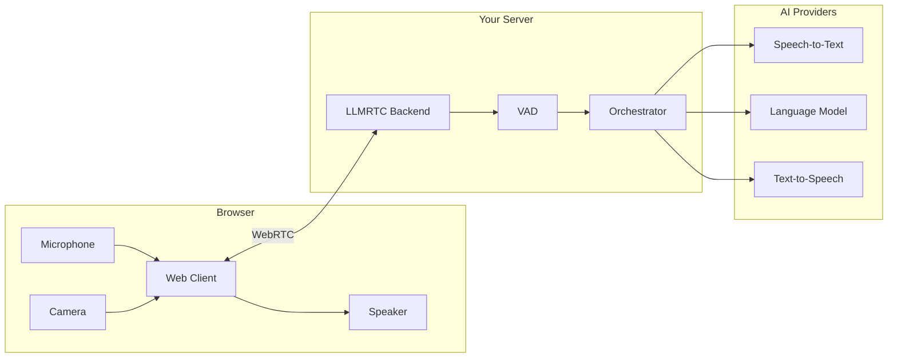
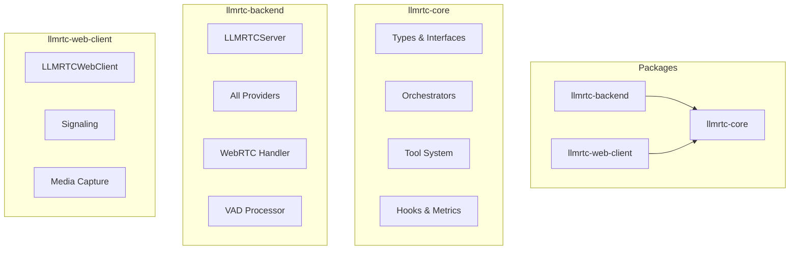

# LLMRTC Docs

**LLMRTC** is an Open Source TypeScript SDK for building real-time voice and vision AI agents. It combines WebRTC for low-latency audio/video streaming with LLMs, speech-to-text, and text-to-speech—all through a unified, provider-agnostic API.

With LLMRTC you can add real-time capabilities to any LLM wether it is self-hosted or cloud-hosted. 

You can connect multiple LLMs together, and launch AI agents playbooks, delegating different tasks to different LLMs, and combine them to create a powerful system.

---

## What is LLMRTC? - Add Real-Time capabilities to any LLM

LLMRTC handles the complex infrastructure needed for conversational AI:



You focus on your application logic. LLMRTC handles:
- Real-time audio/video streaming via WebRTC
- Voice activity detection and barge-in
- Provider orchestration and streaming pipelines
- Session management and reconnection

---

## Key Features

### Real-Time Voice
Stream audio bidirectionally with sub-second latency. Server-side VAD detects speech boundaries, and barge-in lets users interrupt the assistant naturally.

### Vision Support
Send camera frames or screen captures alongside speech. Vision-capable models can see what users see.

### Provider Agnostic
Switch between OpenAI, Anthropic, Google Gemini, AWS Bedrock, or local models without changing your code. Mix providers freely (e.g., Claude for LLM, Whisper for STT, ElevenLabs for TTS).

### Tool Calling
Define tools with JSON Schema. The model calls them, you execute them, and the conversation continues seamlessly.

### Playbooks
Build multi-stage conversations with per-stage prompts, tools, and automatic transitions. Two-phase execution separates tool work from responses. Six transition types (tool calls, intents, keywords, LLM decision, timeouts, custom) give precise control over conversation flow.

### Streaming Pipeline
Responses start playing before generation completes. Sentence-boundary detection ensures TTS starts at natural pause points, reducing perceived latency. STT → LLM → TTS streams end-to-end.

### Hooks & Observability
20+ hook points for logging, debugging, and custom behavior. Built-in metrics track TTFT, token counts, and durations. Plug into your existing monitoring stack.

### Session Resilience
Automatic reconnection with exponential backoff. Conversation history survives network interruptions. Graceful degradation when providers fail.

---

## Architecture

LLMRTC consists of three packages:



| Package | Purpose |
|---------|---------|
| `@llmrtc/llmrtc-core` | Types, orchestrators, tools, hooks—shared foundation |
| `@llmrtc/llmrtc-backend` | Node.js server with WebRTC, VAD, and all providers |
| `@llmrtc/llmrtc-web-client` | Browser SDK for audio/video capture and playback |

---

## Supported Providers

### Cloud Providers

| Provider | LLM | STT | TTS | Vision |
|----------|-----|-----|-----|--------|
| OpenAI | GPT-5.2, GPT-5.1 | Whisper | TTS-1, TTS-1-HD | GPT-5.2 |
| Anthropic | Claude 4.5 (Sonnet/Haiku/Opus) | - | - | Claude 4.5 |
| Google Gemini | Gemini 1.5, Gemini Pro | - | - | Gemini Vision |
| AWS Bedrock | Claude, Llama, etc. | - | - | varies |
| OpenRouter | 100+ models | - | - | varies |
| ElevenLabs | - | - | Multilingual v2 | - |

### Local Providers

| Provider | LLM | STT | TTS | Vision |
|----------|-----|-----|-----|--------|
| Ollama | Llama, Mistral, etc. | - | - | LLaVA |
| LM Studio | Any GGUF model | - | - | - |
| Faster-Whisper | - | Whisper (fast) | - | - |
| Piper | - | - | Many voices | - |

---

## Use Cases

### Voice Assistants
Build Siri/Alexa-style assistants with custom capabilities. Add tools for your domain—check orders, book appointments, control devices.

### Customer Support
Multi-stage playbooks guide conversations through authentication, triage, and resolution. Tools integrate with your CRM and ticketing systems.

### Multimodal Agents
Combine voice with vision for screen-aware assistants. Users can share their screen or camera and ask questions about what they see.

### On-Device AI
Run entirely locally with Ollama, Faster-Whisper, and Piper. No cloud dependencies, no API costs, full privacy.

---

## Developer Experience

- **TypeScript-First**: Full type safety with IntelliSense support across all APIs
- **Tool Validation**: JSON Schema validation catches malformed LLM arguments before execution
- **Smart Error Handling**: Automatic retry with error classification (retryable vs non-retryable)
- **Comprehensive Types**: Every provider, hook, and event is fully typed

---

## Production Deployment

For production use, WebRTC requires a TURN server to ensure reliable connections for users behind NAT/firewalls.

**Recommended:** The [OpenRelay Project](https://www.metered.ca/tools/openrelay/) by Metered provides a free global TURN server network with **20GB of monthly TURN usage at no cost** — sufficient for most applications.

```typescript
const server = new LLMRTCServer({
  providers: { llm, stt, tts },
  metered: {
    appName: 'your-app-name',
    apiKey: 'your-api-key'
  }
});
```

See [Networking & TURN](backend/networking-and-turn) for detailed configuration options.

---

## Quick Example

**Backend (Node.js):**

```typescript
import { LLMRTCServer, OpenAILLMProvider, OpenAIWhisperProvider, OpenAITTSProvider } from '@llmrtc/llmrtc-backend';

const server = new LLMRTCServer({
  providers: {
    llm: new OpenAILLMProvider({ apiKey: process.env.OPENAI_API_KEY! }),
    stt: new OpenAIWhisperProvider({ apiKey: process.env.OPENAI_API_KEY! }),
    tts: new OpenAITTSProvider({ apiKey: process.env.OPENAI_API_KEY! })
  },
  systemPrompt: 'You are a helpful voice assistant.'
});

await server.start();
```

**Frontend (Browser):**

```typescript
import { LLMRTCWebClient } from '@llmrtc/llmrtc-web-client';

const client = new LLMRTCWebClient({
  signallingUrl: 'ws://localhost:8787'
});

client.on('transcript', (text) => console.log('User:', text));
client.on('llmChunk', (chunk) => console.log('Assistant:', chunk));

await client.start();
const stream = await navigator.mediaDevices.getUserMedia({ audio: true });
await client.shareAudio(stream);
```

---

## Getting Started

Ready to build? Follow our quickstart guides:

1. **[Installation](getting-started/installation)** - Set up packages and dependencies
2. **[Backend Quickstart](getting-started/backend-quickstart)** - Run your first server
3. **[Web Client Quickstart](getting-started/web-client-quickstart)** - Connect from the browser
4. **[Tool Calling](getting-started/tool-calling-quickstart)** - Add custom capabilities
5. **[Local-Only Stack](getting-started/local-only-stack)** - Run without cloud APIs

---

## Documentation Structure

| Section | Contents |
|---------|----------|
| **Getting Started** | Installation, quickstarts, first application |
| **Concepts** | Architecture, streaming, VAD, playbooks, tools |
| **Backend** | Server configuration, deployment, security |
| **Web Client** | Browser SDK, audio/video, UI patterns |
| **Playbooks** | Multi-stage conversations, text and voice agents |
| **Providers** | Provider-specific configuration and features |
| **Recipes** | Complete examples for common use cases |
| **Operations** | Monitoring, troubleshooting, scaling |
| **Protocol** | Wire protocol for custom clients |

---

## Community

- **GitHub**: [github.com/llmrtc/llmrtc](https://github.com/llmrtc/llmrtc)
- **Issues**: [Report bugs and request features](https://github.com/llmrtc/llmrtc/issues)
- **Email**: contact@llmrtc.org

---

## Next Steps

<div className="row">
  <div className="col col--6">
    <a href="getting-started/overview" className="card">
      <strong>Getting Started</strong>
      <p>Build your first voice assistant in minutes</p>
    </a>
  </div>
  <div className="col col--6">
    <a href="concepts/architecture" className="card">
      <strong>Architecture</strong>
      <p>Understand how LLMRTC works</p>
    </a>
  </div>
</div>
