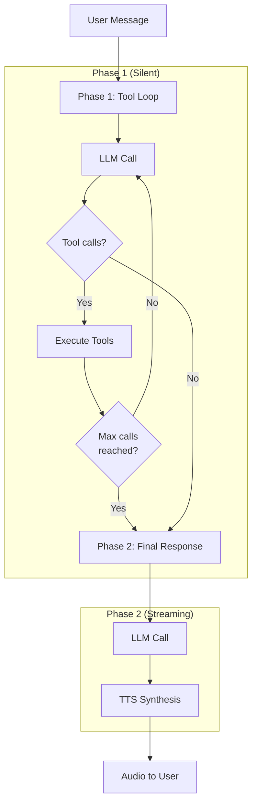

Playbooks are structured conversation flows made of **stages** and **transitions**. They sit on top of an LLM + tools and let you build agents that move through named phases instead of a single amorphous chat.

## When to Use Playbooks

Use a playbook when:
- You have a clear multi-step flow (greeting → auth → triage → resolution → farewell)
- Different stages need different tools, prompts, or models
- You want observability into which stage a user is in and how they move
- You need to coordinate multiple tools before responding to the user

For simple agents with no structured flow, use `ConversationOrchestrator` instead.

---

## Core Concepts

### Stages

A **stage** is a named state with its own configuration:

```typescript
interface Stage {
  id: string;                    // Unique identifier (required)
  name: string;                  // Human-readable name (required)
  systemPrompt: string;          // Stage-specific system prompt (required)
  tools?: ToolDefinition[];      // Tools available in this stage
  llmConfig?: StageLLMConfig;    // Temperature, maxTokens, etc.
  twoPhaseExecution?: boolean;   // Enable/disable two-phase (default: true)
  toolChoice?: ToolChoice;       // 'auto' | 'none' | 'required' | { type: 'tool', toolName: string }
  maxTurns?: number;             // Max turns before forcing transition
  timeoutMs?: number;            // Stage timeout in milliseconds
}
```

### Transitions

A **transition** moves the conversation from one stage to another based on conditions:

```typescript
interface Transition {
  id: string;                    // Unique identifier (required)
  from: string | '*';            // Source stage, or '*' for any
  condition: TransitionCondition; // What causes the transition
  action: TransitionAction;       // What to do when triggered
  priority?: number;             // Higher priority evaluated first
  description?: string;          // Human-readable description
}

interface TransitionAction {
  targetStage: string;           // Stage to transition to
  transitionMessage?: string;    // Optional message to inject
  clearHistory?: boolean;        // Clear history on transition
  data?: Record<string, unknown>; // Data to pass to target stage
}

// Condition types
type TransitionCondition =
  | { type: 'keyword'; keywords: string[] }           // Match keywords in response
  | { type: 'tool_call'; toolName: string }           // When a specific tool is called
  | { type: 'intent'; intent: string; confidence?: number } // Intent classification
  | { type: 'llm_decision' }                          // LLM uses playbook_transition tool
  | { type: 'max_turns'; count: number }              // After N turns in stage
  | { type: 'timeout'; durationMs: number }           // Time-based transition
  | { type: 'custom'; evaluate: (ctx) => boolean };   // Custom evaluation function
```

---

## Two-Phase Execution Model

The playbook orchestrator uses a **two-phase turn execution model** that separates tool work from user response generation. This is critical for voice agents where you want tools to execute silently before speaking.



### Phase 1: Tool Loop

In Phase 1, the LLM can call tools repeatedly until it has gathered all necessary information:

1. LLM receives user message + conversation history + available tools
2. If LLM requests tool calls → execute them → feed results back to LLM
3. Repeat until LLM stops requesting tools or limits are reached
4. **Silent execution** - no audio/response sent to user during this phase

**Configuration options:**

| Option | Default | Description |
|--------|---------|-------------|
| `maxToolCallsPerTurn` | 10 | Maximum tool calls before forcing Phase 2 |
| `phase1TimeoutMs` | 60000 | Timeout for entire Phase 1 (ms) |

### Phase 2: Final Response

In Phase 2, the LLM generates the user-facing response:

1. LLM receives updated history including all tool results
2. Generates final response (streaming enabled)
3. Response is sent to TTS for voice synthesis
4. **Streaming output** - audio/text delivered to user in real-time

### Disabling Two-Phase Execution

For stages that don't need the separation (e.g., simple greeting), disable two-phase mode:

```typescript
const greetingStage: Stage = {
  id: 'greeting',
  name: 'Greeting',
  systemPrompt: 'Greet the user warmly.',
  twoPhaseExecution: false  // LLM responds directly, no separate phases
};
```

When disabled, the LLM's first response (including any tool work) streams directly to the user.

---

## PlaybookOrchestrator Options (Core SDK)

When using `PlaybookOrchestrator` directly from the core SDK, the following options are available:

```typescript
interface PlaybookOrchestratorOptions {
  maxToolCallsPerTurn?: number;  // Default: 10
  phase1TimeoutMs?: number;      // Default: 60000 (1 minute)
  llmRetries?: number;           // Default: 3
  historyLimit?: number;         // Default: 50 messages
  debug?: boolean;               // Default: false
}
```

### LLM Retry Logic

The orchestrator includes smart retry logic with exponential backoff:

- **Retries on:** rate limits (429), server errors (5xx), timeouts
- **No retry on:** client errors (400, 401, 403, 404)
- **Backoff:** 1s → 2s → 4s (exponential)

### History Management

Conversation history is automatically trimmed to prevent context overflow while preserving tool call/result pairs (required by OpenAI API):

The trimming algorithm:
1. When history exceeds limit, find oldest safe trim point
2. Never split tool call from its result (would cause API errors)
3. Remove complete message groups from the beginning

:::note Server-Level Options
When using `LLMRTCServer`, only `maxToolCallsPerTurn`, `phase1TimeoutMs`, and `debug` are configurable via `playbookOptions`. Use the core SDK directly for access to `llmRetries` and `historyLimit`.
:::

---

## Implementation Classes

Playbooks are implemented via three main classes:

| Class | Package | Purpose |
|-------|---------|---------|
| `PlaybookEngine` | `@metered/llmrtc-core` | Stage/transition state machine |
| `PlaybookOrchestrator` | `@metered/llmrtc-core` | Two-phase execution, tool loop |
| `VoicePlaybookOrchestrator` | `@metered/llmrtc-backend` | Adds STT/TTS, streams events |

---

## Events

The orchestrator emits events throughout execution:

```typescript
type OrchestratorEvent =
  | { type: 'phase1_start' }
  | { type: 'tool_call_start'; call: ToolCallRequest }
  | { type: 'tool_call_complete'; call: ToolCallRequest; result: ToolCallResult }
  | { type: 'phase1_complete'; toolCallCount: number }
  | { type: 'phase2_start' }
  | { type: 'phase2_complete'; response: string }
  | { type: 'transition_triggered'; transition: Transition }
  | { type: 'stage_entered'; stage: Stage }
  | { type: 'stage_exited'; stage: Stage };
```

Subscribe to events:

```typescript
const orchestrator = new PlaybookOrchestrator(llm, playbook, tools);

const unsubscribe = orchestrator.on((event) => {
  if (event.type === 'tool_call_start') {
    console.log(`Calling tool: ${event.call.name}`);
  }
});
```

---

## Next Steps

- [Defining Playbooks](defining-playbooks) - Stage and transition configuration
- [Text Agents](text-agents) - Using PlaybookOrchestrator directly
- [Voice Agents with Tools](voice-agents-with-tools) - Full voice pipeline integration
