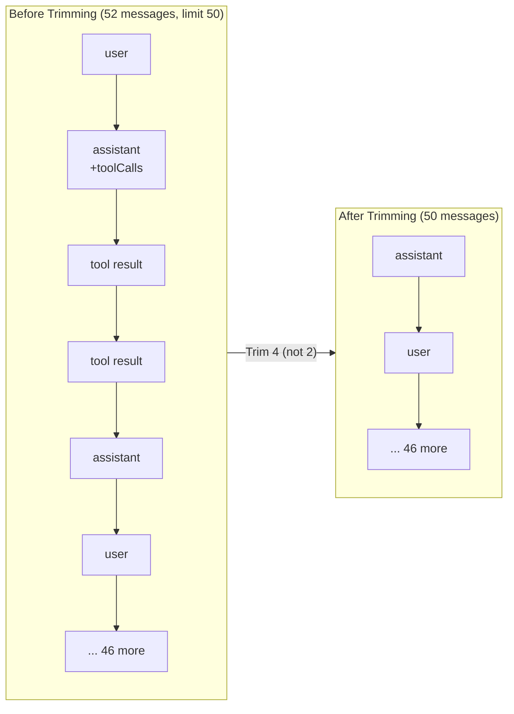

`PlaybookOrchestrator` lets you use playbooks in plain text/chat settings (no audio). It handles the tool loop, stage transitions, and history management.

## 1. Setup

```ts
import {
  PlaybookOrchestrator,
  ToolRegistry,
  defineTool,
  type Playbook
} from '@llmrtc/llmrtc-core';
import { OpenAILLMProvider } from '@llmrtc/llmrtc-provider-openai';

const llm = new OpenAILLMProvider({
  apiKey: process.env.OPENAI_API_KEY!,
  model: 'gpt-5-mini'
});

const tools = new ToolRegistry();
// tools.register(defineTool(...));

const playbook: Playbook = /* define stages + transitions */;

const orchestrator = new PlaybookOrchestrator(llm, playbook, tools, {
  maxToolCallsPerTurn: 10,
  phase1TimeoutMs: 60_000,
  llmRetries: 3,
  historyLimit: 50,
  debug: true
});
```

## 2. Single-turn execution

Use `executeTurn` when you want a simple request/response per turn.

```ts
const userInput = 'I want to check my order 12345';

const result = await orchestrator.executeTurn(userInput);

console.log('Assistant:', result.response);
console.log('Tool calls this turn:', result.toolCalls.length);
console.log('Transitioned?', result.transitioned, '→', result.newStage?.id);
```

`TurnResult` includes:
- `response` – final assistant text.
- `toolCalls` – `{ request, result }[]` for tools executed.
- `transitioned` / `transition` / `newStage` – what changed.
- `llmResponses` – raw `LLMResult[]` from Phase 1.
- `stopReason` – final LLM stop reason.

## 3. Streaming responses

Use `streamTurn` for streaming LLM output + visibility into tool calls:

```ts
for await (const event of orchestrator.streamTurn('Book a table for 2')) {
  if (event.type === 'tool_call') {
    const call = event.data; // ToolCallRequest
    console.log('Tool requested:', call.name, call.arguments);
  } else if (event.type === 'content') {
    const chunk = event.data as string;
    process.stdout.write(chunk);
  } else if (event.type === 'done') {
    const turn = event.data; // TurnResult
    console.log('\nTurn complete in stage:', turn.newStage?.id ?? 'unchanged');
  }
}
```

## 4. History Management

The orchestrator automatically manages conversation history to prevent context overflow while preserving message integrity.

### Configuration

```typescript
const orchestrator = new PlaybookOrchestrator(llm, playbook, tools, {
  historyLimit: 50  // Default: 50 messages
});
```

### Smart History Trimming

When history exceeds the limit, the orchestrator uses a smart trimming algorithm:

1. **Find safe trim point** - Scan from oldest messages forward
2. **Preserve tool pairs** - Never split assistant tool calls from their tool results
3. **Remove complete groups** - Only trim at message boundaries

This is critical for OpenAI API compatibility, which requires tool result messages to immediately follow their corresponding assistant message with `toolCalls`.



**Why not trim at message 2?** Trimming between the assistant with `toolCalls` and its tool results would cause OpenAI API errors. The algorithm skips forward to find the next safe boundary.

### Clearing History

Reset conversation history manually:

```typescript
orchestrator.clearHistory();  // Removes all messages
```

### Getting Current History

Access the current conversation:

```typescript
const messages = orchestrator.getHistory();  // Returns Message[]
```

---

## 5. Hooks and Metrics

Subscribe to orchestrator events for observability:

```typescript
const orchestrator = new PlaybookOrchestrator(llm, playbook, tools);

orchestrator.on((event) => {
  switch (event.type) {
    case 'phase1_start':
      console.log('Tool loop starting');
      break;
    case 'tool_call_start':
      console.log('Calling:', event.call.name);
      break;
    case 'tool_call_complete':
      console.log('Result:', event.result);
      break;
    case 'phase1_complete':
      console.log('Tools done, count:', event.toolCallCount);
      break;
    case 'phase2_start':
      console.log('Generating response');
      break;
    case 'phase2_complete':
      console.log('Response:', event.response);
      break;
    case 'transition_triggered':
      console.log('Transitioning:', event.transition);
      break;
    case 'stage_entered':
      console.log('Now in stage:', event.stage.id);
      break;
  }
});
```

See [Hooks & Metrics](../core-sdk/hooks-and-metrics) for complete hook and metrics reference.

---

## 6. When to Use PlaybookOrchestrator vs ConversationOrchestrator

- Use **ConversationOrchestrator** for simple, single-prompt assistants where tools are optional but you don’t need stages.
- Use **PlaybookOrchestrator** when you want:
  - Multiple named stages with different prompts/tools.
  - Rich tool loops and transition rules.
  - Higher-level analytics (stage durations, transitions).

For voice, `VoicePlaybookOrchestrator` wraps PlaybookOrchestrator and adds STT/TTS and client events (see next page).
