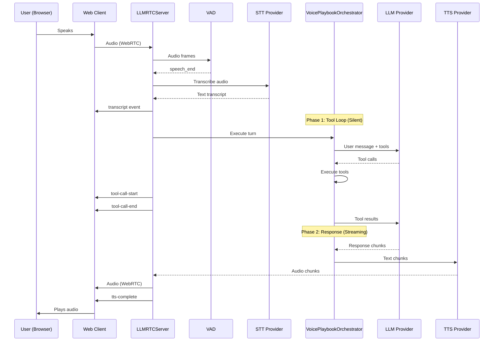

This guide shows how to combine **playbooks**, **tools**, and the **voice pipeline** to build multi-stage voice agents that can use tools silently before responding.

## Architecture Overview



## Components

| Component | Package | Role |
|-----------|---------|------|
| `Playbook` | `@metered/llmrtc-core` | Defines stages, transitions, and tools |
| `PlaybookOrchestrator` | `@metered/llmrtc-core` | Two-phase execution engine |
| `VoicePlaybookOrchestrator` | `@metered/llmrtc-backend` | Adds STT/TTS, emits events |
| `LLMRTCServer` | `@metered/llmrtc-backend` | WebSocket/WebRTC server |
| `LLMRTCWebClient` | `@metered/llmrtc-web-client` | Browser client |

## 1. Define tools and playbook

Use the same patterns as the tool-calling quickstart and playbook definitions.

```ts
import {
  ToolRegistry,
  defineTool,
  type Playbook,
  type Stage,
  type Transition
} from '@metered/llmrtc-backend';

const tools = new ToolRegistry();
// tools.register(defineTool(...));

const stages: Stage[] = [/* greeting, auth, triage, resolution, farewell */];
const transitions: Transition[] = [/* keyword, tool_call, llm_decision, etc. */];

const supportPlaybook: Playbook = {
  id: 'support',
  name: 'Voice Support Assistant',
  stages,
  transitions,
  initialStage: 'greeting',
  globalSystemPrompt: 'You are a concise, polite voice support assistant.'
};
```

## 2. Wire into LLMRTCServer

In the backend, pass `playbook` and `toolRegistry` to `LLMRTCServer`. It will automatically use `VoicePlaybookOrchestrator` internally.

```ts
import {
  LLMRTCServer,
  OpenAILLMProvider,
  OpenAIWhisperProvider,
  ElevenLabsTTSProvider,
  ToolRegistry,
  type Playbook
} from '@metered/llmrtc-backend';

const llm = new OpenAILLMProvider({ apiKey: process.env.OPENAI_API_KEY! });
const stt = new OpenAIWhisperProvider({ apiKey: process.env.OPENAI_API_KEY! });
const tts = new ElevenLabsTTSProvider({ apiKey: process.env.ELEVENLABS_API_KEY! });

const tools = new ToolRegistry();
// register tools...

const playbook: Playbook = supportPlaybook;

const server = new LLMRTCServer({
  providers: { llm, stt, tts },
  playbook,
  toolRegistry: tools,
  playbookOptions: {
    maxToolCallsPerTurn: 10,
    phase1TimeoutMs: 60_000,
    debug: false
  },
  streamingTTS: true
});

await server.start();
```

## 3. Handle events on the client

The web client exposes events for tool calls and stage changes in addition to the usual transcript/LLM/TTS events.

```ts
import { LLMRTCWebClient } from '@metered/llmrtc-web-client';

const client = new LLMRTCWebClient({ signallingUrl: 'ws://localhost:8787' });

client.on('stageChange', ({ from, to, reason }) => {
  setCurrentStage(to);
  addStageHistory({ from, to, reason, at: Date.now() });
});

client.on('toolCallStart', ({ name, callId, arguments: args }) => {
  addToolCall({ callId, name, args, status: 'running' });
});

client.on('toolCallEnd', ({ callId, result, error, durationMs }) => {
  updateToolCall(callId, { result, error, durationMs, status: 'done' });
});

client.on('transcript', (text) => setTranscript(text));
client.on('llmChunk', (chunk) => setResponse((prev) => prev + chunk));
client.on('ttsTrack', (stream) => attachAudioStream(stream));
```

## 4. UX and metrics tips

- Show the current stage in the UI (e.g., chips for Greeting/Auth/Triage/Resolution/Farewell).
- Visualize tool calls (loading indicators per tool) so users see what the agent is doing.
- Use playbook hooks + metrics (`llmrtc.playbook.*`) to track:
  - Time spent per stage.
  - Drop-off by stage.
  - Which transitions fire most often.

For concrete code, see the **Support Bot** and **Weather Assistant** examples in `examples/support-bot` and `examples/weather-assistant`.
