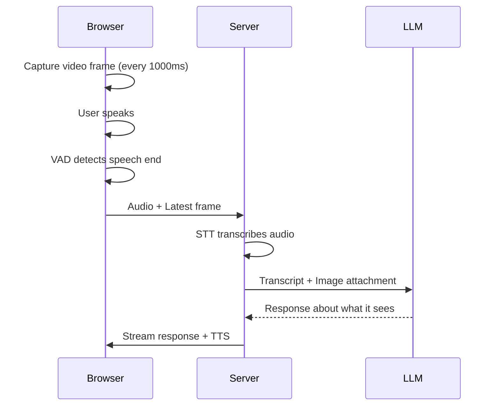

# Add Vision to Your Voice Assistant

**Builds on:** [Tutorial 1: Build Your First Voice Assistant](./build-voice-assistant)

This tutorial adds vision capabilities to your voice assistant. By the end, the AI will be able to see what you show it via camera or screen share.

**What you'll add:**
- Camera sharing so the AI can see you or objects you show
- Screen sharing so the AI can see your display
- Visual context sent automatically with your speech

**Time:** ~10 minutes

---

## Starting Point

Choose your starting point:

### Option A: Continue from Tutorial 1

If you completed [Tutorial 1](./build-voice-assistant), continue with your existing code.

### Option B: Use Starter Code

<details>
<summary><strong>Click to expand starter code</strong></summary>

Create the same project structure from Tutorial 1:

```
voice-assistant/
├── server.ts
├── package.json
├── tsconfig.json
├── .env
└── client/
    ├── index.html
    ├── package.json
    ├── vite.config.ts
    └── src/
        ├── main.tsx
        └── App.tsx
```

**Root `package.json`:**

```json
{
  "name": "voice-assistant",
  "version": "1.0.0",
  "type": "module",
  "scripts": {
    "start": "tsx server.ts",
    "dev": "concurrently \"tsx watch server.ts\" \"npm run dev --prefix client\""
  },
  "dependencies": {
    "@llmrtc/llmrtc-backend": "^0.1.0",
    "dotenv": "^16.4.5"
  },
  "devDependencies": {
    "tsx": "^4.19.0",
    "typescript": "^5.6.0",
    "concurrently": "^9.0.0"
  }
}
```

**`tsconfig.json`:**

```json
{
  "compilerOptions": {
    "target": "ES2022",
    "module": "ESNext",
    "moduleResolution": "bundler",
    "strict": true,
    "esModuleInterop": true,
    "skipLibCheck": true,
    "resolveJsonModule": true
  },
  "include": ["server.ts"]
}
```

**`.env`:**

```bash
OPENAI_API_KEY=sk-...
ANTHROPIC_API_KEY=sk-ant-...
```

**`server.ts`:**

```typescript
import { config } from 'dotenv';
config();

import {
  LLMRTCServer,
  AnthropicLLMProvider,
  OpenAIWhisperProvider,
  OpenAITTSProvider
} from '@llmrtc/llmrtc-backend';

if (!process.env.OPENAI_API_KEY) {
  console.error('Error: OPENAI_API_KEY is required');
  process.exit(1);
}
if (!process.env.ANTHROPIC_API_KEY) {
  console.error('Error: ANTHROPIC_API_KEY is required');
  process.exit(1);
}

const server = new LLMRTCServer({
  providers: {
    llm: new AnthropicLLMProvider({
      apiKey: process.env.ANTHROPIC_API_KEY,
      model: 'claude-sonnet-4-20250514'
    }),
    stt: new OpenAIWhisperProvider({
      apiKey: process.env.OPENAI_API_KEY
    }),
    tts: new OpenAITTSProvider({
      apiKey: process.env.OPENAI_API_KEY,
      voice: 'nova'
    })
  },
  port: 8787,
  streamingTTS: true,
  systemPrompt: `You are a helpful voice assistant. Keep your responses concise
and conversational - typically 1-2 sentences. Speak naturally as if having
a real conversation.`
});

server.on('listening', ({ host, port }) => {
  console.log(`Server running at http://${host}:${port}`);
});

await server.start();
```

**`client/package.json`:**

```json
{
  "name": "voice-assistant-client",
  "version": "1.0.0",
  "type": "module",
  "scripts": {
    "dev": "vite",
    "build": "vite build"
  },
  "dependencies": {
    "@llmrtc/llmrtc-web-client": "^0.1.0",
    "react": "^18.3.1",
    "react-dom": "^18.3.1"
  },
  "devDependencies": {
    "@types/react": "^18.3.12",
    "@types/react-dom": "^18.3.1",
    "@vitejs/plugin-react": "^4.3.3",
    "typescript": "^5.6.0",
    "vite": "^5.4.10"
  }
}
```

**`client/vite.config.ts`:**

```typescript
import { defineConfig } from 'vite';
import react from '@vitejs/plugin-react';

export default defineConfig({
  plugins: [react()],
  server: { port: 5173 }
});
```

**`client/index.html`:**

```html
<!DOCTYPE html>
<html lang="en">
<head>
  <meta charset="UTF-8" />
  <meta name="viewport" content="width=device-width, initial-scale=1.0" />
  <title>Voice Assistant</title>
  <style>
    * { box-sizing: border-box; margin: 0; padding: 0; }
    body {
      font-family: -apple-system, BlinkMacSystemFont, 'Segoe UI', Roboto, sans-serif;
      background: linear-gradient(135deg, #1a1a2e 0%, #16213e 100%);
      color: #eee;
      min-height: 100vh;
      display: flex;
      justify-content: center;
      align-items: center;
    }
    #root { width: 100%; max-width: 600px; padding: 2rem; }
  </style>
</head>
<body>
  <div id="root"></div>
  <script type="module" src="/src/main.tsx"></script>
</body>
</html>
```

**`client/src/main.tsx`:**

```tsx
import { StrictMode } from 'react';
import { createRoot } from 'react-dom/client';
import App from './App';

createRoot(document.getElementById('root')!).render(
  <StrictMode>
    <App />
  </StrictMode>
);
```

**`client/src/App.tsx`:** See [Tutorial 1](./build-voice-assistant#build-the-frontend) for the full App.tsx code.

</details>

---

## Backend Changes

No backend changes are required for vision. Claude (and GPT-5.2) natively support vision - they can process images directly without a separate vision provider.

The server automatically forwards image attachments from the client to the LLM.

:::info Vision-Capable LLM Required
This tutorial uses Claude (`claude-sonnet-4-5`), which supports vision natively. If you switch to a different LLM, ensure it supports image inputs. Most modern models (GPT-5.2, Gemini 2.5) do.

**Local Vision Options:**
- Use `OllamaLLMProvider` with a vision model like `gemma3` or `llava` - vision support is auto-detected
- Use a separate `LlavaVisionProvider` alongside a text-only LLM

See [Local Ollama - Multimodal Support](../providers/local-ollama#multimodalvision-support) for details.
:::

---

## Frontend Changes

All the vision magic happens in the frontend. We'll add camera and screen share toggles.

### Update App.tsx

Open `client/src/App.tsx` and make these changes:

#### 1. Add New Imports and Types

At the top of the file, update the imports:

```typescript
import { useState, useEffect, useRef } from 'react';
import { LLMRTCWebClient } from '@llmrtc/llmrtc-web-client';
import type { FrameCaptureController } from '@llmrtc/llmrtc-web-client';
```

#### 2. Add State for Video Streams

Inside your `App` component, add state for camera and screen:

```typescript
export default function App() {
  // Existing state...
  const [status, setStatus] = useState<Status>('disconnected');
  const [transcript, setTranscript] = useState('');
  const [response, setResponse] = useState('');
  const [error, setError] = useState<string | null>(null);

  // ADD: Video state
  const [cameraStream, setCameraStream] = useState<MediaStream | null>(null);
  const [screenStream, setScreenStream] = useState<MediaStream | null>(null);

  // Existing refs...
  const clientRef = useRef<LLMRTCWebClient | null>(null);
  const audioRef = useRef<HTMLAudioElement | null>(null);

  // ADD: Frame capture controller refs
  const cameraCtrlRef = useRef<FrameCaptureController | null>(null);
  const screenCtrlRef = useRef<FrameCaptureController | null>(null);
  const videoPreviewRef = useRef<HTMLVideoElement | null>(null);
```

#### 3. Add Toggle Functions

After your `useEffect`, add functions to toggle camera and screen:

```typescript
  // Toggle camera on/off
  async function toggleCamera() {
    if (cameraStream) {
      // Stop camera
      cameraCtrlRef.current?.stop();
      cameraStream.getTracks().forEach(track => track.stop());
      setCameraStream(null);
      if (videoPreviewRef.current) {
        videoPreviewRef.current.srcObject = null;
      }
    } else {
      try {
        // Start camera
        const stream = await navigator.mediaDevices.getUserMedia({
          video: { width: 640, height: 480 }
        });
        setCameraStream(stream);

        // Show preview
        if (videoPreviewRef.current) {
          videoPreviewRef.current.srcObject = stream;
        }

        // Share with server - captures frame every 1000ms
        cameraCtrlRef.current = clientRef.current?.shareVideo(stream, 1000) ?? null;
      } catch (err) {
        setError('Camera access denied');
      }
    }
  }

  // Toggle screen share on/off
  async function toggleScreen() {
    if (screenStream) {
      // Stop screen share
      screenCtrlRef.current?.stop();
      screenStream.getTracks().forEach(track => track.stop());
      setScreenStream(null);
    } else {
      try {
        // Start screen share
        const stream = await navigator.mediaDevices.getDisplayMedia({
          video: true
        });
        setScreenStream(stream);

        // Handle user clicking "Stop sharing" in browser UI
        stream.getVideoTracks()[0].onended = () => {
          screenCtrlRef.current?.stop();
          setScreenStream(null);
        };

        // Share with server - captures frame every 1000ms
        screenCtrlRef.current = clientRef.current?.shareScreen(stream, 1000) ?? null;
      } catch (err) {
        // User cancelled the screen picker
        console.log('Screen share cancelled');
      }
    }
  }
```

#### 4. Add Video Controls to UI

In your JSX, add the control buttons and video preview. Add this right after the status indicator:

```tsx
      {/* Video Controls */}
      <div style={{
        display: 'flex',
        gap: '1rem',
        justifyContent: 'center',
        marginBottom: '1.5rem'
      }}>
        <button
          onClick={toggleCamera}
          disabled={status === 'disconnected' || status === 'connecting'}
          style={{
            padding: '0.75rem 1.5rem',
            borderRadius: '0.5rem',
            border: 'none',
            background: cameraStream ? '#e74c3c' : '#3498db',
            color: 'white',
            cursor: 'pointer',
            fontSize: '0.9rem',
            opacity: status === 'disconnected' || status === 'connecting' ? 0.5 : 1
          }}
        >
          {cameraStream ? 'Stop Camera' : 'Start Camera'}
        </button>

        <button
          onClick={toggleScreen}
          disabled={status === 'disconnected' || status === 'connecting'}
          style={{
            padding: '0.75rem 1.5rem',
            borderRadius: '0.5rem',
            border: 'none',
            background: screenStream ? '#e74c3c' : '#9b59b6',
            color: 'white',
            cursor: 'pointer',
            fontSize: '0.9rem',
            opacity: status === 'disconnected' || status === 'connecting' ? 0.5 : 1
          }}
        >
          {screenStream ? 'Stop Sharing' : 'Share Screen'}
        </button>
      </div>

      {/* Camera Preview */}
      {cameraStream && (
        <div style={{
          marginBottom: '1.5rem',
          borderRadius: '1rem',
          overflow: 'hidden',
          background: '#000'
        }}>
          <video
            ref={videoPreviewRef}
            autoPlay
            playsInline
            muted
            style={{
              width: '100%',
              maxHeight: '300px',
              objectFit: 'cover'
            }}
          />
        </div>
      )}
```

#### 5. Clean Up on Unmount

Update the cleanup in your `useEffect` to stop video streams:

```typescript
    // Cleanup on unmount
    return () => {
      client.close();
      if (audioRef.current) {
        audioRef.current.srcObject = null;
      }
      // ADD: Clean up video streams
      cameraCtrlRef.current?.stop();
      screenCtrlRef.current?.stop();
    };
```

---

## Complete Updated App.tsx

Here's the complete updated `App.tsx` with vision support:

<details>
<summary><strong>Click to expand full App.tsx</strong></summary>

```tsx
import { useState, useEffect, useRef } from 'react';
import { LLMRTCWebClient } from '@llmrtc/llmrtc-web-client';
import type { FrameCaptureController } from '@llmrtc/llmrtc-web-client';

type Status = 'disconnected' | 'connecting' | 'idle' | 'listening' | 'thinking' | 'speaking';

export default function App() {
  const [status, setStatus] = useState<Status>('disconnected');
  const [transcript, setTranscript] = useState('');
  const [response, setResponse] = useState('');
  const [error, setError] = useState<string | null>(null);

  // Video state
  const [cameraStream, setCameraStream] = useState<MediaStream | null>(null);
  const [screenStream, setScreenStream] = useState<MediaStream | null>(null);

  // Refs
  const clientRef = useRef<LLMRTCWebClient | null>(null);
  const audioRef = useRef<HTMLAudioElement | null>(null);
  const cameraCtrlRef = useRef<FrameCaptureController | null>(null);
  const screenCtrlRef = useRef<FrameCaptureController | null>(null);
  const videoPreviewRef = useRef<HTMLVideoElement | null>(null);

  useEffect(() => {
    const client = new LLMRTCWebClient({
      signallingUrl: 'ws://localhost:8787'
    });
    clientRef.current = client;

    // Connection events
    client.on('stateChange', (state) => {
      if (state === 'connected') setStatus('idle');
      else if (state === 'connecting') setStatus('connecting');
      else if (state === 'disconnected' || state === 'failed') setStatus('disconnected');
    });

    // VAD events
    client.on('speechStart', () => {
      setStatus('listening');
      setResponse('');
    });

    client.on('speechEnd', () => {
      setStatus('thinking');
    });

    // Transcription
    client.on('transcript', (text) => {
      setTranscript(text);
    });

    // LLM response
    client.on('llmChunk', (chunk) => {
      setResponse((prev) => prev + chunk);
    });

    // TTS events
    client.on('ttsTrack', (stream) => {
      if (!audioRef.current) {
        audioRef.current = new Audio();
      }
      audioRef.current.srcObject = stream;
      audioRef.current.play().catch((err) => {
        setError('Click anywhere to enable audio playback');
      });
    });

    client.on('ttsStart', () => setStatus('speaking'));
    client.on('ttsComplete', () => setStatus('idle'));
    client.on('ttsCancelled', () => setStatus('listening'));

    // Errors
    client.on('error', (err) => {
      setError(err.message);
      setTimeout(() => setError(null), 5000);
    });

    // Connect
    async function connect() {
      try {
        await client.start();
        const stream = await navigator.mediaDevices.getUserMedia({
          audio: { echoCancellation: true, noiseSuppression: true }
        });
        await client.shareAudio(stream);
        setStatus('idle');
      } catch (err) {
        setError(err instanceof Error ? err.message : 'Connection failed');
        setStatus('disconnected');
      }
    }

    connect();

    return () => {
      client.close();
      if (audioRef.current) audioRef.current.srcObject = null;
      cameraCtrlRef.current?.stop();
      screenCtrlRef.current?.stop();
    };
  }, []);

  // Toggle camera
  async function toggleCamera() {
    if (cameraStream) {
      cameraCtrlRef.current?.stop();
      cameraStream.getTracks().forEach(track => track.stop());
      setCameraStream(null);
      if (videoPreviewRef.current) videoPreviewRef.current.srcObject = null;
    } else {
      try {
        const stream = await navigator.mediaDevices.getUserMedia({
          video: { width: 640, height: 480 }
        });
        setCameraStream(stream);
        if (videoPreviewRef.current) videoPreviewRef.current.srcObject = stream;
        cameraCtrlRef.current = clientRef.current?.shareVideo(stream, 1000) ?? null;
      } catch (err) {
        setError('Camera access denied');
      }
    }
  }

  // Toggle screen share
  async function toggleScreen() {
    if (screenStream) {
      screenCtrlRef.current?.stop();
      screenStream.getTracks().forEach(track => track.stop());
      setScreenStream(null);
    } else {
      try {
        const stream = await navigator.mediaDevices.getDisplayMedia({ video: true });
        setScreenStream(stream);
        stream.getVideoTracks()[0].onended = () => {
          screenCtrlRef.current?.stop();
          setScreenStream(null);
        };
        screenCtrlRef.current = clientRef.current?.shareScreen(stream, 1000) ?? null;
      } catch (err) {
        console.log('Screen share cancelled');
      }
    }
  }

  const statusColors: Record<Status, string> = {
    disconnected: '#666',
    connecting: '#f39c12',
    idle: '#27ae60',
    listening: '#3498db',
    thinking: '#9b59b6',
    speaking: '#e74c3c'
  };

  const statusLabels: Record<Status, string> = {
    disconnected: 'Disconnected',
    connecting: 'Connecting...',
    idle: 'Ready - Start speaking',
    listening: 'Listening...',
    thinking: 'Thinking...',
    speaking: 'Speaking...'
  };

  return (
    <div style={{ textAlign: 'center' }}>
      <h1 style={{ marginBottom: '2rem', fontSize: '1.75rem', fontWeight: 600 }}>
        Voice Assistant
      </h1>

      {/* Status Indicator */}
      <div style={{
        display: 'inline-flex',
        alignItems: 'center',
        gap: '0.75rem',
        padding: '0.75rem 1.5rem',
        borderRadius: '2rem',
        background: 'rgba(255,255,255,0.1)',
        marginBottom: '1.5rem'
      }}>
        <div style={{
          width: '12px',
          height: '12px',
          borderRadius: '50%',
          background: statusColors[status],
          boxShadow: `0 0 10px ${statusColors[status]}`
        }} />
        <span style={{ fontSize: '0.95rem' }}>{statusLabels[status]}</span>
      </div>

      {/* Video Controls */}
      <div style={{
        display: 'flex',
        gap: '1rem',
        justifyContent: 'center',
        marginBottom: '1.5rem'
      }}>
        <button
          onClick={toggleCamera}
          disabled={status === 'disconnected' || status === 'connecting'}
          style={{
            padding: '0.75rem 1.5rem',
            borderRadius: '0.5rem',
            border: 'none',
            background: cameraStream ? '#e74c3c' : '#3498db',
            color: 'white',
            cursor: 'pointer',
            fontSize: '0.9rem',
            opacity: status === 'disconnected' || status === 'connecting' ? 0.5 : 1
          }}
        >
          {cameraStream ? 'Stop Camera' : 'Start Camera'}
        </button>

        <button
          onClick={toggleScreen}
          disabled={status === 'disconnected' || status === 'connecting'}
          style={{
            padding: '0.75rem 1.5rem',
            borderRadius: '0.5rem',
            border: 'none',
            background: screenStream ? '#e74c3c' : '#9b59b6',
            color: 'white',
            cursor: 'pointer',
            fontSize: '0.9rem',
            opacity: status === 'disconnected' || status === 'connecting' ? 0.5 : 1
          }}
        >
          {screenStream ? 'Stop Sharing' : 'Share Screen'}
        </button>
      </div>

      {/* Camera Preview */}
      {cameraStream && (
        <div style={{
          marginBottom: '1.5rem',
          borderRadius: '1rem',
          overflow: 'hidden',
          background: '#000'
        }}>
          <video
            ref={videoPreviewRef}
            autoPlay
            playsInline
            muted
            style={{
              width: '100%',
              maxHeight: '300px',
              objectFit: 'cover'
            }}
          />
        </div>
      )}

      {/* Transcript Panel */}
      <div style={{
        background: 'rgba(255,255,255,0.05)',
        borderRadius: '1rem',
        padding: '1.5rem',
        marginBottom: '1rem',
        minHeight: '100px',
        textAlign: 'left'
      }}>
        <div style={{
          fontSize: '0.75rem',
          color: '#888',
          marginBottom: '0.75rem',
          textTransform: 'uppercase',
          letterSpacing: '0.05em'
        }}>
          You said
        </div>
        <div style={{ fontSize: '1.1rem', lineHeight: 1.5 }}>
          {transcript || (
            <span style={{ color: '#555', fontStyle: 'italic' }}>
              Start speaking to see your transcript...
            </span>
          )}
        </div>
      </div>

      {/* Response Panel */}
      <div style={{
        background: 'rgba(255,255,255,0.05)',
        borderRadius: '1rem',
        padding: '1.5rem',
        minHeight: '150px',
        textAlign: 'left'
      }}>
        <div style={{
          fontSize: '0.75rem',
          color: '#888',
          marginBottom: '0.75rem',
          textTransform: 'uppercase',
          letterSpacing: '0.05em'
        }}>
          Assistant
        </div>
        <div style={{ fontSize: '1.1rem', lineHeight: 1.6 }}>
          {response || (
            <span style={{ color: '#555', fontStyle: 'italic' }}>
              The assistant will respond here...
            </span>
          )}
        </div>
      </div>

      {/* Error Message */}
      {error && (
        <div style={{
          marginTop: '1rem',
          padding: '0.75rem 1rem',
          background: 'rgba(231, 76, 60, 0.2)',
          border: '1px solid rgba(231, 76, 60, 0.3)',
          borderRadius: '0.5rem',
          fontSize: '0.9rem',
          color: '#e74c3c'
        }}>
          {error}
        </div>
      )}
    </div>
  );
}
```

</details>

---

## Test It

1. **Start the app:** `npm run dev`
2. **Open** http://localhost:5173
3. **Click "Start Camera"** and allow access
4. **Say** "What do you see?" or "Describe what's in front of you"
5. **The AI will describe** what it sees in the camera frame

Try also:
- Hold up an object and ask "What am I holding?"
- Click "Share Screen" and ask "What's on my screen?"
- Ask for help with something visible: "Can you read this text?"

---

## How It Works



Key points:
1. **Frames captured periodically** - `shareVideo(stream, 1000)` captures a frame every 1000ms
2. **Latest frame sent with speech** - When you stop speaking, the most recent frame is attached
3. **Image as attachment** - LLM receives both your transcript and the image
4. **No separate API call** - Vision is processed in the same LLM request

---

## Customizing Frame Capture

### Capture Interval

Adjust how often frames are captured:

```typescript
// Capture every 500ms (more responsive, more processing)
client.shareVideo(stream, 500);

// Capture every 2000ms (less responsive, less processing)
client.shareVideo(stream, 2000);
```

### Manual Frame Capture

Get the last captured frame programmatically:

```typescript
const controller = client.shareVideo(stream, 1000);

// Later: get the last frame as base64
const frame = controller.getLastFrame();
if (frame) {
  console.log('Frame captured:', frame.substring(0, 50) + '...');
}
```

---

## Troubleshooting

### Camera Not Working

**Problem:** Camera button does nothing or shows error.

**Solutions:**
1. Check the page is served over HTTPS or localhost
2. Verify camera permissions in browser settings
3. Check another app isn't using the camera

### Screen Share Cancelled

**Problem:** Screen share window closes immediately.

**Solution:** This is normal if you clicked Cancel in the browser's screen picker. Try again and select a screen/window.

### AI Doesn't See the Image

**Problem:** AI responds but doesn't mention what it sees.

**Solutions:**
1. Verify your LLM supports vision (Claude, GPT-5.2 do)
2. Make sure camera/screen is active before speaking
3. Try being explicit: "Look at my camera and describe what you see"

---

## Next Steps

- **[Tutorial 3: Voice with Tools](./voice-with-tools)** - Add actions like weather lookup
- **[Video and Vision Guide](../web-client/video-and-vision)** - Advanced options (resolution, format)
- **[Vision Provider Reference](../providers/overview#vision)** - Configure dedicated vision models

---

## Related Documentation

- [Video and Vision](../web-client/video-and-vision) - Full vision API reference
- [Web Client Events](../web-client/events) - All client events
- [Concepts: Vision](../concepts/vision-and-attachments) - How vision works
