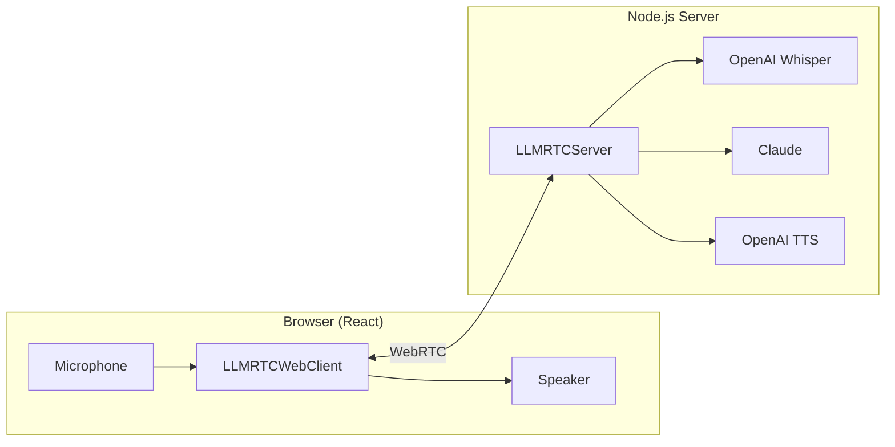

# Build Your First Voice Assistant

This tutorial walks you through building a complete voice assistant from scratch. By the end, you'll have a working application where you can speak to an AI and hear it respond.

**What you'll learn:**
- Set up a real-time voice server with LLMRTC
- Build a React frontend that captures audio and plays responses
- Handle the complete voice conversation lifecycle

**Time:** ~20 minutes

---

## What You'll Build



The flow works like this:
1. **You speak** → Microphone captures audio
2. **Server transcribes** → OpenAI Whisper converts speech to text
3. **AI thinks** → Claude generates a response
4. **Server synthesizes** → OpenAI TTS converts text to speech
5. **You hear** → Audio plays through your speakers

All of this happens in real-time with streaming, so responses feel natural and conversational.

---

## Prerequisites

Before starting, make sure you have:

### Required Software

- **Node.js 20+** - Check with `node --version`
- **FFmpeg** - Required for streaming TTS audio processing

```bash
# Install FFmpeg
# macOS
brew install ffmpeg

# Ubuntu/Debian
sudo apt-get install ffmpeg

# Windows (with chocolatey)
choco install ffmpeg
```

### API Keys

You'll need API keys from two providers:

1. **OpenAI API Key** - For speech-to-text and text-to-speech
   - Get one at [platform.openai.com](https://platform.openai.com)

2. **Anthropic API Key** - For the Claude LLM
   - Get one at [console.anthropic.com](https://console.anthropic.com)

### Browser

A modern browser with microphone support:
- Chrome (recommended)
- Firefox
- Safari
- Edge

---

## Project Setup

Let's create the project structure. Create a new directory and set up the files:

```bash
mkdir voice-assistant
cd voice-assistant
```

Your final structure will look like this:

```
voice-assistant/
├── server.ts           # Backend server
├── package.json        # Root dependencies
├── tsconfig.json       # TypeScript config
├── .env                # API keys (don't commit!)
└── client/             # React frontend
    ├── index.html
    ├── package.json
    ├── vite.config.ts
    └── src/
        ├── main.tsx
        └── App.tsx
```

---

### File 1: Root package.json

Create `package.json` in the root directory:

```json
{
  "name": "voice-assistant",
  "version": "1.0.0",
  "type": "module",
  "scripts": {
    "start": "tsx server.ts",
    "dev": "concurrently \"tsx watch server.ts\" \"npm run dev --prefix client\""
  },
  "dependencies": {
    "@metered/llmrtc-backend": "^0.1.0",
    "dotenv": "^16.4.5"
  },
  "devDependencies": {
    "tsx": "^4.19.0",
    "typescript": "^5.6.0",
    "concurrently": "^9.0.0"
  }
}
```

**What each dependency does:**
- `@metered/llmrtc-backend` - The LLMRTC server with all providers
- `dotenv` - Loads environment variables from `.env`
- `tsx` - Runs TypeScript directly without compilation
- `concurrently` - Runs server and client simultaneously

---

### File 2: tsconfig.json

Create `tsconfig.json`:

```json
{
  "compilerOptions": {
    "target": "ES2022",
    "module": "ESNext",
    "moduleResolution": "bundler",
    "strict": true,
    "esModuleInterop": true,
    "skipLibCheck": true,
    "resolveJsonModule": true
  },
  "include": ["server.ts"]
}
```

---

### File 3: .env

Create `.env` with your API keys:

```bash
# OpenAI - Used for speech-to-text (Whisper) and text-to-speech
OPENAI_API_KEY=sk-...

# Anthropic - Used for the Claude LLM
ANTHROPIC_API_KEY=sk-ant-...
```

:::warning Keep Your Keys Secret
Never commit `.env` to version control. Add it to `.gitignore`:
```bash
echo ".env" >> .gitignore
```
:::

---

### File 4: Client Setup

Create the client directory and files:

```bash
mkdir -p client/src
```

Create `client/package.json`:

```json
{
  "name": "voice-assistant-client",
  "version": "1.0.0",
  "type": "module",
  "scripts": {
    "dev": "vite",
    "build": "vite build",
    "preview": "vite preview"
  },
  "dependencies": {
    "@metered/llmrtc-web-client": "^0.1.0",
    "react": "^18.3.1",
    "react-dom": "^18.3.1"
  },
  "devDependencies": {
    "@types/react": "^18.3.12",
    "@types/react-dom": "^18.3.1",
    "@vitejs/plugin-react": "^4.3.3",
    "typescript": "^5.6.0",
    "vite": "^5.4.10"
  }
}
```

Create `client/vite.config.ts`:

```typescript
import { defineConfig } from 'vite';
import react from '@vitejs/plugin-react';

export default defineConfig({
  plugins: [react()],
  server: {
    port: 5173
  }
});
```

Create `client/index.html`:

```html
<!DOCTYPE html>
<html lang="en">
<head>
  <meta charset="UTF-8" />
  <meta name="viewport" content="width=device-width, initial-scale=1.0" />
  <title>Voice Assistant</title>
  <style>
    * {
      box-sizing: border-box;
      margin: 0;
      padding: 0;
    }
    body {
      font-family: -apple-system, BlinkMacSystemFont, 'Segoe UI', Roboto, sans-serif;
      background: linear-gradient(135deg, #1a1a2e 0%, #16213e 100%);
      color: #eee;
      min-height: 100vh;
      display: flex;
      justify-content: center;
      align-items: center;
    }
    #root {
      width: 100%;
      max-width: 600px;
      padding: 2rem;
    }
  </style>
</head>
<body>
  <div id="root"></div>
  <script type="module" src="/src/main.tsx"></script>
</body>
</html>
```

---

## Build the Backend

Now let's build the server. This is where all the AI magic happens.

Create `server.ts`:

```typescript
/**
 * Voice Assistant Server
 *
 * This server handles:
 * - WebRTC connections from the browser
 * - Speech-to-text via OpenAI Whisper
 * - AI responses via Claude
 * - Text-to-speech via OpenAI TTS
 */

// Load environment variables first
import { config } from 'dotenv';
config();

// Import the LLMRTC server and providers
import {
  LLMRTCServer,
  AnthropicLLMProvider,
  OpenAIWhisperProvider,
  OpenAITTSProvider
} from '@metered/llmrtc-backend';

// Validate required environment variables
if (!process.env.OPENAI_API_KEY) {
  console.error('Error: OPENAI_API_KEY is required in .env');
  process.exit(1);
}
if (!process.env.ANTHROPIC_API_KEY) {
  console.error('Error: ANTHROPIC_API_KEY is required in .env');
  process.exit(1);
}

// Create the server with providers
const server = new LLMRTCServer({
  // Configure the three AI providers
  providers: {
    // LLM: Claude for generating responses
    llm: new AnthropicLLMProvider({
      apiKey: process.env.ANTHROPIC_API_KEY,
      model: 'claude-sonnet-4-20250514'
    }),

    // STT: OpenAI Whisper for speech-to-text
    stt: new OpenAIWhisperProvider({
      apiKey: process.env.OPENAI_API_KEY
    }),

    // TTS: OpenAI for text-to-speech
    tts: new OpenAITTSProvider({
      apiKey: process.env.OPENAI_API_KEY,
      voice: 'nova'  // Options: alloy, echo, fable, onyx, nova, shimmer
    })
  },

  // Server configuration
  port: 8787,
  streamingTTS: true,  // Stream audio for lower latency

  // System prompt defines the assistant's personality
  systemPrompt: `You are a helpful voice assistant. Keep your responses concise
and conversational - typically 1-2 sentences. Speak naturally as if having
a real conversation. Avoid using markdown, bullet points, or other formatting
that doesn't work well when spoken aloud.`
});

// Log when server starts
server.on('listening', ({ host, port }) => {
  console.log('');
  console.log('  Voice Assistant Server');
  console.log('  ======================');
  console.log(`  Server:  http://${host}:${port}`);
  console.log(`  Client:  http://localhost:5173`);
  console.log('');
  console.log('  Ready for connections!');
  console.log('');
});

// Log client connections
server.on('connection', ({ id }) => {
  console.log(`[${new Date().toLocaleTimeString()}] Client connected: ${id}`);
});

// Log client disconnections
server.on('disconnect', ({ id }) => {
  console.log(`[${new Date().toLocaleTimeString()}] Client disconnected: ${id}`);
});

// Log errors
server.on('error', (error) => {
  console.error('[Server Error]', error.message);
});

// Start the server
await server.start();
```

**Key parts explained:**

1. **Providers** - We configure three AI services:
   - `AnthropicLLMProvider` - Claude generates intelligent responses
   - `OpenAIWhisperProvider` - Converts your speech to text
   - `OpenAITTSProvider` - Converts AI text back to speech

2. **streamingTTS** - When `true`, audio streams to the browser as it's generated, reducing latency

3. **systemPrompt** - Defines how the AI should behave and respond

---

## Build the Frontend

Now let's create the React frontend that captures your voice and displays the conversation.

Create `client/src/main.tsx`:

```tsx
import { StrictMode } from 'react';
import { createRoot } from 'react-dom/client';
import App from './App';

createRoot(document.getElementById('root')!).render(
  <StrictMode>
    <App />
  </StrictMode>
);
```

Create `client/src/App.tsx`:

```tsx
/**
 * Voice Assistant Client
 *
 * This React component handles:
 * - Connecting to the LLMRTC server
 * - Capturing microphone audio
 * - Displaying conversation transcript
 * - Playing TTS audio responses
 */

import { useState, useEffect, useRef } from 'react';
import { LLMRTCWebClient } from '@metered/llmrtc-web-client';

// Status states for the conversation
type Status = 'disconnected' | 'connecting' | 'idle' | 'listening' | 'thinking' | 'speaking';

export default function App() {
  // State for UI
  const [status, setStatus] = useState<Status>('disconnected');
  const [transcript, setTranscript] = useState('');
  const [response, setResponse] = useState('');
  const [error, setError] = useState<string | null>(null);

  // Refs for client and audio element
  const clientRef = useRef<LLMRTCWebClient | null>(null);
  const audioRef = useRef<HTMLAudioElement | null>(null);

  useEffect(() => {
    // Create the LLMRTC client
    const client = new LLMRTCWebClient({
      signallingUrl: 'ws://localhost:8787'
    });
    clientRef.current = client;

    // ==========================================
    // Connection Events
    // ==========================================

    client.on('stateChange', (state) => {
      console.log('[Client] State:', state);
      if (state === 'connected') {
        setStatus('idle');
      } else if (state === 'connecting') {
        setStatus('connecting');
      } else if (state === 'disconnected' || state === 'failed') {
        setStatus('disconnected');
      }
    });

    // ==========================================
    // Voice Activity Detection (VAD) Events
    // ==========================================

    // User started speaking
    client.on('speechStart', () => {
      console.log('[Client] Speech started');
      setStatus('listening');
      setResponse('');  // Clear previous response
    });

    // User stopped speaking
    client.on('speechEnd', () => {
      console.log('[Client] Speech ended');
      setStatus('thinking');
    });

    // ==========================================
    // Transcription Events
    // ==========================================

    // Received transcript of what user said
    client.on('transcript', (text) => {
      console.log('[Client] Transcript:', text);
      setTranscript(text);
    });

    // ==========================================
    // LLM Response Events
    // ==========================================

    // Receiving streamed LLM response
    client.on('llmChunk', (chunk) => {
      setResponse((prev) => prev + chunk);
    });

    // ==========================================
    // TTS Audio Events
    // ==========================================

    // Received audio track for playback
    client.on('ttsTrack', (stream) => {
      console.log('[Client] TTS track received');
      if (!audioRef.current) {
        audioRef.current = new Audio();
      }
      audioRef.current.srcObject = stream;
      audioRef.current.play().catch((err) => {
        // Browser may block autoplay - user needs to interact first
        console.warn('Autoplay blocked:', err.message);
        setError('Click anywhere to enable audio playback');
      });
    });

    // TTS playback started
    client.on('ttsStart', () => {
      console.log('[Client] TTS started');
      setStatus('speaking');
    });

    // TTS playback completed
    client.on('ttsComplete', () => {
      console.log('[Client] TTS complete');
      setStatus('idle');
    });

    // User interrupted (barge-in)
    client.on('ttsCancelled', () => {
      console.log('[Client] TTS cancelled (barge-in)');
      setStatus('listening');
    });

    // ==========================================
    // Error Handling
    // ==========================================

    client.on('error', (err) => {
      console.error('[Client] Error:', err);
      setError(err.message);
      // Clear error after 5 seconds
      setTimeout(() => setError(null), 5000);
    });

    // ==========================================
    // Connect and Start
    // ==========================================

    async function connect() {
      try {
        // Connect to server
        await client.start();

        // Request microphone access
        const stream = await navigator.mediaDevices.getUserMedia({
          audio: {
            echoCancellation: true,
            noiseSuppression: true,
            autoGainControl: true
          }
        });

        // Share audio with server
        await client.shareAudio(stream);

        setStatus('idle');
        console.log('[Client] Connected and ready');
      } catch (err) {
        console.error('[Client] Connection failed:', err);
        setError(err instanceof Error ? err.message : 'Connection failed');
        setStatus('disconnected');
      }
    }

    connect();

    // Cleanup on unmount
    return () => {
      client.close();
      if (audioRef.current) {
        audioRef.current.srcObject = null;
      }
    };
  }, []);

  // Status indicator colors
  const statusColors: Record<Status, string> = {
    disconnected: '#666',
    connecting: '#f39c12',
    idle: '#27ae60',
    listening: '#3498db',
    thinking: '#9b59b6',
    speaking: '#e74c3c'
  };

  // Status indicator labels
  const statusLabels: Record<Status, string> = {
    disconnected: 'Disconnected',
    connecting: 'Connecting...',
    idle: 'Ready - Start speaking',
    listening: 'Listening...',
    thinking: 'Thinking...',
    speaking: 'Speaking...'
  };

  return (
    <div style={{ textAlign: 'center' }}>
      <h1 style={{ marginBottom: '2rem', fontSize: '1.75rem', fontWeight: 600 }}>
        Voice Assistant
      </h1>

      {/* Status Indicator */}
      <div style={{
        display: 'inline-flex',
        alignItems: 'center',
        gap: '0.75rem',
        padding: '0.75rem 1.5rem',
        borderRadius: '2rem',
        background: 'rgba(255,255,255,0.1)',
        marginBottom: '2rem'
      }}>
        <div style={{
          width: '12px',
          height: '12px',
          borderRadius: '50%',
          background: statusColors[status],
          boxShadow: `0 0 10px ${statusColors[status]}`,
          animation: status !== 'disconnected' && status !== 'idle'
            ? 'pulse 1.5s infinite'
            : 'none'
        }} />
        <span style={{ fontSize: '0.95rem' }}>{statusLabels[status]}</span>
      </div>

      {/* Transcript Panel - What you said */}
      <div style={{
        background: 'rgba(255,255,255,0.05)',
        borderRadius: '1rem',
        padding: '1.5rem',
        marginBottom: '1rem',
        minHeight: '100px',
        textAlign: 'left'
      }}>
        <div style={{
          fontSize: '0.75rem',
          color: '#888',
          marginBottom: '0.75rem',
          textTransform: 'uppercase',
          letterSpacing: '0.05em'
        }}>
          You said
        </div>
        <div style={{ fontSize: '1.1rem', lineHeight: 1.5 }}>
          {transcript || (
            <span style={{ color: '#555', fontStyle: 'italic' }}>
              Start speaking to see your transcript...
            </span>
          )}
        </div>
      </div>

      {/* Response Panel - What AI said */}
      <div style={{
        background: 'rgba(255,255,255,0.05)',
        borderRadius: '1rem',
        padding: '1.5rem',
        minHeight: '150px',
        textAlign: 'left'
      }}>
        <div style={{
          fontSize: '0.75rem',
          color: '#888',
          marginBottom: '0.75rem',
          textTransform: 'uppercase',
          letterSpacing: '0.05em'
        }}>
          Assistant
        </div>
        <div style={{ fontSize: '1.1rem', lineHeight: 1.6 }}>
          {response || (
            <span style={{ color: '#555', fontStyle: 'italic' }}>
              The assistant will respond here...
            </span>
          )}
        </div>
      </div>

      {/* Error Message */}
      {error && (
        <div style={{
          marginTop: '1rem',
          padding: '0.75rem 1rem',
          background: 'rgba(231, 76, 60, 0.2)',
          border: '1px solid rgba(231, 76, 60, 0.3)',
          borderRadius: '0.5rem',
          fontSize: '0.9rem',
          color: '#e74c3c'
        }}>
          {error}
        </div>
      )}

      {/* Pulse animation for status indicator */}
      <style>{`
        @keyframes pulse {
          0%, 100% { opacity: 1; transform: scale(1); }
          50% { opacity: 0.6; transform: scale(0.95); }
        }
      `}</style>
    </div>
  );
}
```

**Key parts explained:**

1. **Connection Setup** - The `LLMRTCWebClient` connects to your server via WebSocket/WebRTC

2. **Event Handlers** - The client emits events for each stage:
   - `speechStart` / `speechEnd` - Voice activity detection
   - `transcript` - What you said
   - `llmChunk` - Streaming AI response
   - `ttsTrack` - Audio to play

3. **Audio Handling** - The `ttsTrack` event provides a MediaStream that we attach to an Audio element

4. **Status States** - The UI shows where you are in the conversation:
   - `idle` - Ready for input
   - `listening` - You're speaking
   - `thinking` - AI is generating
   - `speaking` - Playing response

---

## Install Dependencies and Run

Now let's install everything and start the application.

### Install Dependencies

```bash
# Install root dependencies
npm install

# Install client dependencies
cd client && npm install && cd ..
```

### Start the Application

```bash
# Run both server and client
npm run dev
```

You should see output like:

```
  Voice Assistant Server
  ======================
  Server:  http://127.0.0.1:8787
  Client:  http://localhost:5173

  Ready for connections!
```

### Test It

1. Open **http://localhost:5173** in your browser
2. **Allow microphone access** when prompted
3. **Start speaking** - try "Hello, what can you help me with?"
4. Watch the status indicator change: listening → thinking → speaking
5. **Hear the response** through your speakers

---

## Troubleshooting

### "NotAllowedError: Permission denied"

**Problem:** Browser blocked microphone access.

**Solution:**
1. Click the lock/camera icon in the address bar
2. Set microphone permission to "Allow"
3. Refresh the page

### "WebSocket connection failed"

**Problem:** Client can't connect to server.

**Solution:**
1. Check the server is running (`npm run dev`)
2. Verify the URL matches: `ws://localhost:8787`
3. Check no firewall is blocking the port

### No Audio Playback

**Problem:** TTS audio doesn't play.

**Solutions:**
1. Click anywhere on the page first (browser autoplay policy)
2. Check your system volume isn't muted
3. Look for errors in browser console (F12)

### "Error: OPENAI_API_KEY is required"

**Problem:** Environment variables not loaded.

**Solution:**
1. Make sure `.env` exists in the root directory
2. Check API keys are correct (no extra spaces)
3. Restart the server after changing `.env`

### High Latency / Slow Responses

**Problem:** Long delay between speaking and response.

**Solutions:**
1. Ensure `streamingTTS: true` is set in server.ts
2. Use faster models (Claude 3.5 Sonnet, GPT-4o-mini)
3. Keep system prompt concise
4. Check your internet connection

---

## Next Steps

Congratulations! You've built a complete voice assistant. Here's where to go next:

### Add Tool Calling

Give your assistant the ability to do things like check the weather, look up information, or control devices. Tool calling requires **Playbook mode** for the voice pipeline.

See these guides:
- [Tool Calling Quickstart](../getting-started/tool-calling-quickstart) - Add tools step-by-step
- [Voice Agents with Tools](../playbooks/voice-agents-with-tools) - Full voice + tools integration

### Add Multi-Stage Conversations

Use [Playbooks](../playbooks/overview) to create structured conversations with stages and transitions - perfect for customer support, booking systems, or guided workflows.

### Deploy to Production

See the [Deployment Guide](../backend/deployment) to:
- Add TURN servers for NAT traversal
- Configure for production environments
- Set up monitoring and logging

### Add Vision Capabilities

Let your assistant see! Check out [Video and Vision](../web-client/video-and-vision) to add camera or screen sharing.

### Use Different Providers

Mix and match providers for your use case:
- [ElevenLabs](../providers/elevenlabs) for better voice quality
- [OpenAI GPT-4o](../providers/openai) for the LLM
- [Local providers](../providers/local-ollama) for privacy

---

## Related Documentation

- [Backend Overview](../backend/overview) - Full backend capabilities
- [Web Client Overview](../web-client/overview) - All client features
- [Tool Calling](../concepts/tool-calling) - Advanced tool patterns
- [Playbooks](../playbooks/overview) - Multi-stage conversations
- [Troubleshooting](../operations/troubleshooting) - Common issues and fixes
