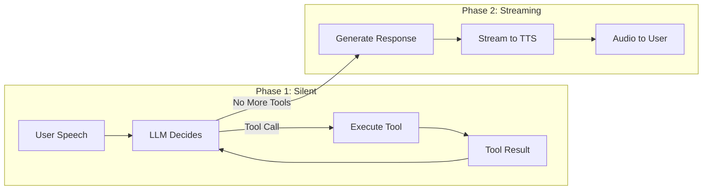

# Voice Assistant with Tools & Playbooks

**Builds on:** [Tutorial 1: Build Your First Voice Assistant](./build-voice-assistant)

This tutorial adds **tool calling** to your voice assistant. Tools let the AI take actions - like checking the weather, looking up information, or controlling devices.

**What you'll learn:**
- Why tools require Playbook mode
- How to define and register tools
- Create a simple single-stage playbook
- How two-phase execution works for voice

**Time:** ~15 minutes

---

## Starting Point

Choose your starting point:

### Option A: Continue from Tutorial 1

If you completed [Tutorial 1](./build-voice-assistant), continue with your existing code.

### Option B: Use Starter Code

<details>
<summary><strong>Click to expand starter code</strong></summary>

Create the project structure from Tutorial 1:

```
voice-assistant/
├── server.ts
├── package.json
├── tsconfig.json
├── .env
└── client/
    ├── index.html
    ├── package.json
    ├── vite.config.ts
    └── src/
        ├── main.tsx
        └── App.tsx
```

**Root `package.json`:**

```json
{
  "name": "voice-assistant",
  "version": "1.0.0",
  "type": "module",
  "scripts": {
    "start": "tsx server.ts",
    "dev": "concurrently \"tsx watch server.ts\" \"npm run dev --prefix client\""
  },
  "dependencies": {
    "@metered/llmrtc-backend": "^0.1.0",
    "dotenv": "^16.4.5"
  },
  "devDependencies": {
    "tsx": "^4.19.0",
    "typescript": "^5.6.0",
    "concurrently": "^9.0.0"
  }
}
```

**`tsconfig.json`:**

```json
{
  "compilerOptions": {
    "target": "ES2022",
    "module": "ESNext",
    "moduleResolution": "bundler",
    "strict": true,
    "esModuleInterop": true,
    "skipLibCheck": true,
    "resolveJsonModule": true
  },
  "include": ["server.ts"]
}
```

**`.env`:**

```bash
OPENAI_API_KEY=sk-...
ANTHROPIC_API_KEY=sk-ant-...
```

**`server.ts`:**

```typescript
import { config } from 'dotenv';
config();

import {
  LLMRTCServer,
  AnthropicLLMProvider,
  OpenAIWhisperProvider,
  OpenAITTSProvider
} from '@metered/llmrtc-backend';

if (!process.env.OPENAI_API_KEY) {
  console.error('Error: OPENAI_API_KEY is required');
  process.exit(1);
}
if (!process.env.ANTHROPIC_API_KEY) {
  console.error('Error: ANTHROPIC_API_KEY is required');
  process.exit(1);
}

const server = new LLMRTCServer({
  providers: {
    llm: new AnthropicLLMProvider({
      apiKey: process.env.ANTHROPIC_API_KEY,
      model: 'claude-sonnet-4-20250514'
    }),
    stt: new OpenAIWhisperProvider({
      apiKey: process.env.OPENAI_API_KEY
    }),
    tts: new OpenAITTSProvider({
      apiKey: process.env.OPENAI_API_KEY,
      voice: 'nova'
    })
  },
  port: 8787,
  streamingTTS: true,
  systemPrompt: `You are a helpful voice assistant. Keep responses concise.`
});

server.on('listening', ({ host, port }) => {
  console.log(`Server running at http://${host}:${port}`);
});

await server.start();
```

For the client files (`client/package.json`, `client/vite.config.ts`, `client/index.html`, `client/src/main.tsx`, `client/src/App.tsx`), see [Tutorial 1](./build-voice-assistant#file-4-client-setup).

</details>

---

## Why Tools Need Playbooks

In LLMRTC, **tools only work when you use a Playbook**. Here's why:

| Configuration | Orchestrator Used | Tools Work? |
|---------------|-------------------|-------------|
| Just `providers` | `ConversationOrchestrator` | No |
| `providers` + `toolRegistry` | `ConversationOrchestrator` | No |
| `providers` + `playbook` + `toolRegistry` | `VoicePlaybookOrchestrator` | **Yes** |

The `VoicePlaybookOrchestrator` implements **two-phase execution**, which is essential for voice:



**Phase 1 (Silent):** LLM calls tools in a loop. No audio yet - the user waits.

**Phase 2 (Streaming):** Once tools are done, the LLM generates its response which streams to TTS and plays immediately.

This prevents awkward partial audio while tools are executing.

---

## Define a Tool

Let's create a weather tool. In `server.ts`, add the tool definition after your imports:

```typescript
import { config } from 'dotenv';
config();

import {
  LLMRTCServer,
  AnthropicLLMProvider,
  OpenAIWhisperProvider,
  OpenAITTSProvider,
  defineTool,        // ADD
  ToolRegistry       // ADD
} from '@metered/llmrtc-backend';

// ... environment validation ...

// Define the weather tool
const getWeatherTool = defineTool(
  // First argument: Tool definition with JSON Schema parameters
  {
    name: 'get_weather',
    description: 'Get the current weather for a city. Use this when the user asks about weather.',
    parameters: {
      type: 'object',
      properties: {
        city: {
          type: 'string',
          description: 'The city name, e.g. "Tokyo", "New York"'
        },
        units: {
          type: 'string',
          enum: ['celsius', 'fahrenheit'],
          description: 'Temperature units'
        }
      },
      required: ['city']
    }
  },
  // Second argument: Handler function
  async ({ city, units = 'celsius' }) => {
    console.log(`[Tool] get_weather called for ${city}`);

    // Mock weather data - replace with real API in production
    const mockWeather: Record<string, { temp: number; condition: string }> = {
      'tokyo': { temp: 22, condition: 'Partly cloudy' },
      'new york': { temp: 18, condition: 'Sunny' },
      'london': { temp: 14, condition: 'Rainy' },
      'paris': { temp: 16, condition: 'Cloudy' }
    };

    const data = mockWeather[city.toLowerCase()] || { temp: 20, condition: 'Clear' };
    const temp = units === 'fahrenheit' ? Math.round(data.temp * 9/5 + 32) : data.temp;

    return {
      city,
      temperature: temp,
      units,
      condition: data.condition
    };
  }
);
```

**Key parts:**

`defineTool(definition, handler)` takes two arguments:

| Argument | Purpose |
|----------|---------|
| `definition.name` | Unique identifier the LLM uses to call the tool |
| `definition.description` | Helps LLM understand when to use this tool |
| `definition.parameters` | JSON Schema defining expected arguments |
| `handler` | Async function that runs when the tool is called |

---

## Create a Playbook

A **Playbook** defines stages of conversation. For this tutorial, we'll use a single stage that handles everything.

Add this after your tool definition:

```typescript
import type { Playbook, Stage } from '@metered/llmrtc-backend';

// Define a single stage
const assistantStage: Stage = {
  id: 'assistant',
  name: 'Voice Assistant',
  description: 'A helpful assistant with weather capabilities',
  systemPrompt: `You are a helpful voice assistant with access to tools.

When the user asks about weather, use the get_weather tool.
After getting weather data, respond naturally like: "It's currently 22 degrees and partly cloudy in Tokyo."

Keep all responses concise and conversational - this is a voice interface.
Avoid lists, bullet points, or formatting that doesn't work well when spoken.`,
  tools: [getWeatherTool.definition],  // List tool definitions
  toolChoice: 'auto',                   // LLM decides when to use tools
  twoPhaseExecution: true               // Essential for voice!
};

// Create the playbook
const playbook: Playbook = {
  id: 'voice-assistant',
  name: 'Voice Assistant with Tools',
  version: '1.0.0',
  stages: [assistantStage],
  transitions: [],          // No transitions for single-stage
  initialStage: 'assistant'
};
```

---

## Register Tools and Update Server

Now connect everything to the server:

```typescript
// Create tool registry and register the tool
const toolRegistry = new ToolRegistry();
toolRegistry.register(getWeatherTool);

// Update server configuration
const server = new LLMRTCServer({
  providers: {
    llm: new AnthropicLLMProvider({
      apiKey: process.env.ANTHROPIC_API_KEY,
      model: 'claude-sonnet-4-20250514'
    }),
    stt: new OpenAIWhisperProvider({
      apiKey: process.env.OPENAI_API_KEY
    }),
    tts: new OpenAITTSProvider({
      apiKey: process.env.OPENAI_API_KEY,
      voice: 'nova'
    })
  },

  // Enable playbook mode with tools
  playbook,        // ADD: The playbook definition
  toolRegistry,    // ADD: The tool implementations

  port: 8787,
  streamingTTS: true
  // Note: systemPrompt is now in the playbook stage, not here
});
```

:::warning Remove systemPrompt from server config
When using a playbook, the `systemPrompt` comes from the stage, not the server config. Remove or comment out any `systemPrompt` in the server config.
:::

---

## Complete Updated server.ts

Here's the complete `server.ts` with tools:

<details>
<summary><strong>Click to expand full server.ts</strong></summary>

```typescript
import { config } from 'dotenv';
config();

import {
  LLMRTCServer,
  AnthropicLLMProvider,
  OpenAIWhisperProvider,
  OpenAITTSProvider,
  defineTool,
  ToolRegistry
} from '@metered/llmrtc-backend';
import type { Playbook, Stage } from '@metered/llmrtc-backend';

// Validate environment
if (!process.env.OPENAI_API_KEY) {
  console.error('Error: OPENAI_API_KEY is required');
  process.exit(1);
}
if (!process.env.ANTHROPIC_API_KEY) {
  console.error('Error: ANTHROPIC_API_KEY is required');
  process.exit(1);
}

// ===========================================
// Define Tools
// ===========================================

const getWeatherTool = defineTool(
  {
    name: 'get_weather',
    description: 'Get the current weather for a city. Use when user asks about weather.',
    parameters: {
      type: 'object',
      properties: {
        city: { type: 'string', description: 'The city name' },
        units: { type: 'string', enum: ['celsius', 'fahrenheit'], description: 'Temperature units' }
      },
      required: ['city']
    }
  },
  async ({ city, units = 'celsius' }) => {
    console.log(`[Tool] get_weather called for ${city}`);

    const mockWeather: Record<string, { temp: number; condition: string }> = {
      'tokyo': { temp: 22, condition: 'Partly cloudy' },
      'new york': { temp: 18, condition: 'Sunny' },
      'london': { temp: 14, condition: 'Rainy' },
      'paris': { temp: 16, condition: 'Cloudy' },
      'sydney': { temp: 25, condition: 'Sunny' }
    };

    const data = mockWeather[city.toLowerCase()] || { temp: 20, condition: 'Clear' };
    const temp = units === 'fahrenheit' ? Math.round(data.temp * 9/5 + 32) : data.temp;

    return { city, temperature: temp, units, condition: data.condition };
  }
);

const getTimeTool = defineTool(
  {
    name: 'get_time',
    description: 'Get the current time. Use when user asks what time it is.',
    parameters: {
      type: 'object',
      properties: {},
      required: []
    }
  },
  async () => {
    console.log('[Tool] get_time called');
    const now = new Date();
    return {
      time: now.toLocaleTimeString('en-US', { hour: 'numeric', minute: '2-digit' }),
      date: now.toLocaleDateString('en-US', { weekday: 'long', month: 'long', day: 'numeric' })
    };
  }
);

// ===========================================
// Define Playbook
// ===========================================

const assistantStage: Stage = {
  id: 'assistant',
  name: 'Voice Assistant',
  description: 'A helpful assistant with tools',
  systemPrompt: `You are a helpful voice assistant with access to tools.

Available tools:
- get_weather: Use when asked about weather in any city
- get_time: Use when asked about current time or date

After using a tool, incorporate the result naturally into your response.
Keep all responses concise and conversational - this is a voice interface.`,
  tools: [getWeatherTool.definition, getTimeTool.definition],
  toolChoice: 'auto',
  twoPhaseExecution: true
};

const playbook: Playbook = {
  id: 'voice-assistant',
  name: 'Voice Assistant with Tools',
  version: '1.0.0',
  stages: [assistantStage],
  transitions: [],
  initialStage: 'assistant'
};

// ===========================================
// Create Tool Registry
// ===========================================

const toolRegistry = new ToolRegistry();
toolRegistry.register(getWeatherTool);
toolRegistry.register(getTimeTool);

// ===========================================
// Create Server
// ===========================================

const server = new LLMRTCServer({
  providers: {
    llm: new AnthropicLLMProvider({
      apiKey: process.env.ANTHROPIC_API_KEY,
      model: 'claude-sonnet-4-20250514'
    }),
    stt: new OpenAIWhisperProvider({
      apiKey: process.env.OPENAI_API_KEY
    }),
    tts: new OpenAITTSProvider({
      apiKey: process.env.OPENAI_API_KEY,
      voice: 'nova'
    })
  },
  playbook,
  toolRegistry,
  port: 8787,
  streamingTTS: true
});

// ===========================================
// Server Events
// ===========================================

server.on('listening', ({ host, port }) => {
  console.log('');
  console.log('  Voice Assistant with Tools');
  console.log('  ==========================');
  console.log(`  Server:  http://${host}:${port}`);
  console.log(`  Client:  http://localhost:5173`);
  console.log('');
  console.log('  Try saying:');
  console.log('  - "What\'s the weather in Tokyo?"');
  console.log('  - "What time is it?"');
  console.log('');
});

server.on('connection', ({ id }) => {
  console.log(`[${new Date().toLocaleTimeString()}] Client connected: ${id}`);
});

server.on('disconnect', ({ id }) => {
  console.log(`[${new Date().toLocaleTimeString()}] Client disconnected: ${id}`);
});

await server.start();
```

</details>

---

## Frontend: Handle Tool Events (Optional)

The frontend doesn't require changes for tools to work. However, you can listen for tool events to show UI feedback.

In `client/src/App.tsx`, add these event handlers inside your `useEffect`:

```typescript
    // Tool call events (optional - for UI feedback)
    client.on('toolCallStart', ({ name, arguments: args }) => {
      console.log(`[Tool] Starting: ${name}`, args);
      // Optional: Show "Checking weather..." in UI
    });

    client.on('toolCallEnd', ({ name, result, error }) => {
      if (error) {
        console.error(`[Tool] ${name} failed:`, error);
      } else {
        console.log(`[Tool] ${name} completed:`, result);
      }
    });
```

You could extend this to show a "Checking weather..." indicator while the tool runs.

---

## Test It

1. **Start the app:**
   ```bash
   npm run dev
   ```

2. **Open** http://localhost:5173

3. **Try these commands:**
   - "What's the weather in Tokyo?"
   - "How about the weather in London?"
   - "What time is it?"
   - "What's the weather like in New York in Fahrenheit?"

4. **Watch the server logs** - you'll see:
   ```
   [Tool] get_weather called for Tokyo
   ```

5. **Hear the response** - the AI will speak naturally about the weather.

---

## How Two-Phase Execution Works

When you say "What's the weather in Tokyo?", here's what happens:

```mermaid
sequenceDiagram
    participant User
    participant Server
    participant LLM
    participant Tool
    participant TTS

    User->>Server: "What's the weather in Tokyo?"
    Server->>LLM: Transcript + tool definitions

    rect rgb(50, 50, 80)
        Note over LLM,Tool: Phase 1: Silent (no audio yet)
        LLM->>Server: Tool call: get_weather({city: "Tokyo"})
        Server->>Tool: Execute get_weather
        Tool-->>Server: {temperature: 22, condition: "Partly cloudy"}
        Server->>LLM: Tool result
    end

    rect rgb(50, 80, 50)
        Note over LLM,TTS: Phase 2: Streaming
        LLM->>Server: "It's 22 degrees and partly cloudy in Tokyo"
        Server->>TTS: Stream text
        TTS-->>User: Audio plays immediately
    end
```



**Why this matters for voice:**

- **Without two-phase:** Audio would start playing "Let me check..." then pause awkwardly while the tool runs
- **With two-phase:** The user hears one smooth response after tools complete

---

## Add More Tools

Tools are easy to add. Here's another example - a dice roller:

```typescript
const rollDiceTool = defineTool(
  {
    name: 'roll_dice',
    description: 'Roll dice. Use when user wants to roll dice for games.',
    parameters: {
      type: 'object',
      properties: {
        sides: { type: 'integer', description: 'Number of sides (default: 6)', minimum: 2, maximum: 100 },
        count: { type: 'integer', description: 'Number of dice (default: 1)', minimum: 1, maximum: 10 }
      },
      required: []
    }
  },
  async ({ sides = 6, count = 1 }) => {
    console.log(`[Tool] roll_dice: ${count}d${sides}`);
    const rolls = Array.from({ length: count }, () => Math.floor(Math.random() * sides) + 1);
    return {
      rolls,
      total: rolls.reduce((a, b) => a + b, 0),
      description: `${count}d${sides}`
    };
  }
);

// Add to registry
toolRegistry.register(rollDiceTool);

// Add to stage tools array
const assistantStage: Stage = {
  // ...
  tools: [
    getWeatherTool.definition,
    getTimeTool.definition,
    rollDiceTool.definition  // ADD
  ],
  // ...
};
```

Now try: "Roll two six-sided dice" or "Roll a d20".

---

## Error Handling in Tools

Tools should handle errors gracefully:

```typescript
const searchTool = defineTool(
  {
    name: 'search',
    description: 'Search for information',
    parameters: {
      type: 'object',
      properties: {
        query: { type: 'string', description: 'Search query' }
      },
      required: ['query']
    }
  },
  async ({ query }) => {
    try {
      const results = await someSearchAPI(query);
      return { results };
    } catch (error) {
      // Return error info instead of throwing
      // The LLM will incorporate this into its response
      return {
        error: 'Search unavailable',
        message: 'I was unable to search right now. Please try again later.'
      };
    }
  }
);
```

When a tool returns an error object, the LLM will typically respond with something like "I'm sorry, I wasn't able to search for that right now."

---

## Troubleshooting

### Tool Never Called

**Problem:** The AI responds without using the tool.

**Solutions:**
1. Check the tool `description` clearly explains when to use it
2. Verify the tool is in the stage's `tools` array
3. Ensure `toolChoice: 'auto'` is set
4. Try being more explicit: "Use the weather tool to check Tokyo"

### Tool Error in Logs

**Problem:** Server shows `TOOL_ERROR`.

**Solutions:**
1. Check handler function doesn't throw uncaught errors
2. Verify parameters match the JSON Schema definition
3. Return error objects instead of throwing:
   ```typescript
   return { error: 'Something went wrong' };
   ```

### No Audio After Tool

**Problem:** Tool executes but no voice response.

**Solutions:**
1. Verify `twoPhaseExecution: true` in the stage
2. Check TTS provider is working
3. Look for errors in browser console

### Tools Not Working At All

**Problem:** Tools seem to be ignored completely.

**Solution:** Verify you have BOTH `playbook` AND `toolRegistry` in server config:
```typescript
const server = new LLMRTCServer({
  providers: { ... },
  playbook,       // Required for tools!
  toolRegistry,   // Required for tools!
});
```

---

## Next Steps

You've built a voice assistant with tool calling! Here's where to go next:

### Multi-Stage Playbooks

Create complex flows with multiple stages and transitions:
- [Playbooks Overview](../playbooks/overview)
- [Defining Playbooks](../playbooks/defining-playbooks)
- [Support Bot Example](../recipes/support-bot)

### More Tool Patterns

- [Tool Calling Concepts](../concepts/tool-calling)
- [Core SDK Tools Reference](../core-sdk/tools)

### Production Deployment

- [Deployment Guide](../backend/deployment)
- [Observability & Hooks](../backend/observability-and-hooks)

---

## Related Documentation

- [Playbooks Overview](../playbooks/overview) - Full playbook concepts
- [Voice Agents with Tools](../playbooks/voice-agents-with-tools) - Advanced patterns
- [Tool Calling](../concepts/tool-calling) - Deep dive on tools
- [Troubleshooting](../operations/troubleshooting) - Common issues
