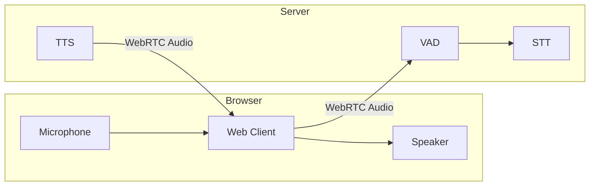
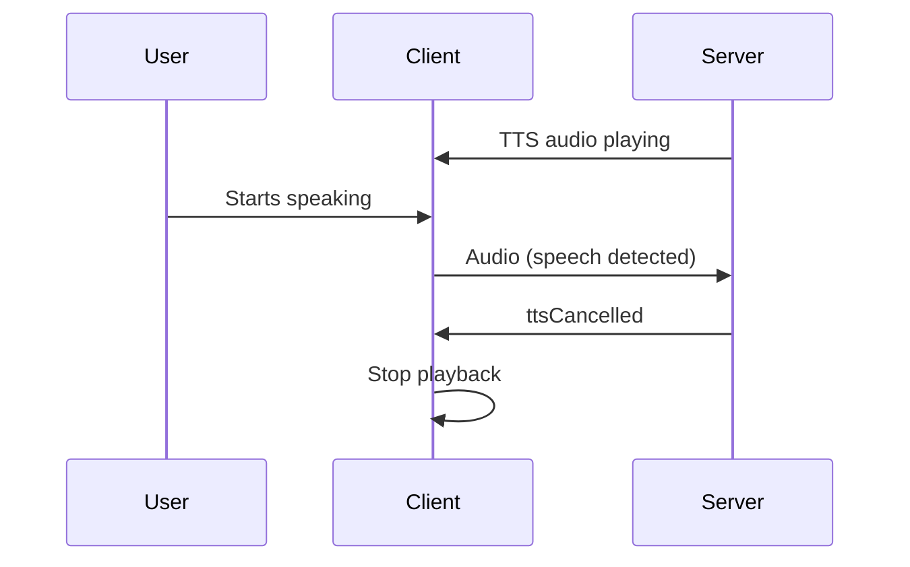

Guide for handling microphone capture and TTS playback in the web client.

---

## Audio Flow

Audio flows bidirectionally between browser and server:



---

## Microphone Capture

### Request Permission

Request microphone access with a user gesture (click/tap):

```typescript
async function startMicrophone() {
  try {
    const stream = await navigator.mediaDevices.getUserMedia({
      audio: {
        echoCancellation: true,
        noiseSuppression: true,
        autoGainControl: true
      }
    });
    return stream;
  } catch (error) {
    if (error.name === 'NotAllowedError') {
      console.error('Microphone permission denied');
    } else if (error.name === 'NotFoundError') {
      console.error('No microphone found');
    }
    throw error;
  }
}
```

### Share Audio

Pass the stream to the client:

```typescript
const stream = await startMicrophone();
const controller = client.shareAudio(stream);

// Later, stop sharing
controller.stop();
```

The returned controller provides:
- `stop()` - Stop audio capture and release microphone

### Audio Constraints

Recommended audio constraints for voice:

```typescript
const stream = await navigator.mediaDevices.getUserMedia({
  audio: {
    echoCancellation: true,    // Prevent feedback
    noiseSuppression: true,    // Reduce background noise
    autoGainControl: true,     // Normalize volume
    sampleRate: 48000,         // High quality
    channelCount: 1            // Mono for voice
  }
});
```

---

## TTS Playback

The client emits TTS events but **does not auto-play audio**. You must handle playback yourself by listening to the `ttsTrack` event:

```typescript
const client = new LLMRTCWebClient({
  signallingUrl: 'wss://server.com'
});

// Handle TTS audio playback
client.on('ttsTrack', (stream) => {
  const audio = new Audio();
  audio.srcObject = stream;
  audio.play();
});
```

### Alternative: Raw Audio Data

For non-WebRTC scenarios, use the `tts` event which provides raw audio:

```typescript
client.on('tts', (audioBuffer, format) => {
  // audioBuffer is an ArrayBuffer
  // format is typically 'audio/wav' or 'audio/mp3'
  const blob = new Blob([audioBuffer], { type: format });
  const url = URL.createObjectURL(blob);
  const audio = new Audio(url);
  audio.play();
});
```

### TTS Events

Monitor TTS lifecycle:

```typescript
client.on('ttsStart', () => {
  console.log('Assistant started speaking');
  showSpeakingIndicator();
});

client.on('ttsComplete', () => {
  console.log('Assistant finished speaking');
  hideSpeakingIndicator();
});

client.on('ttsCancelled', () => {
  console.log('TTS interrupted (barge-in)');
  hideSpeakingIndicator();
});
```

---

## Speech Events

Track when the user is speaking:

```typescript
client.on('speechStart', () => {
  console.log('User started speaking');
  showListeningIndicator();
});

client.on('speechEnd', () => {
  console.log('User stopped speaking');
  showProcessingIndicator();
});

client.on('transcript', (text) => {
  console.log('User said:', text);
  displayTranscript(text);
});
```

---

## Barge-in

Barge-in allows users to interrupt the assistant:



Handle barge-in in your UI:

```typescript
client.on('ttsCancelled', () => {
  // Stop any currently playing audio
  if (audioElement) {
    audioElement.pause();
    audioElement.currentTime = 0;
  }

  // Update UI state
  setAssistantSpeaking(false);
  setUserSpeaking(true);
});
```

---

## Audio Visualization

### Level Meter

Display microphone input levels:

```typescript
function createLevelMeter(stream: MediaStream) {
  const audioContext = new AudioContext();
  const source = audioContext.createMediaStreamSource(stream);
  const analyser = audioContext.createAnalyser();

  analyser.fftSize = 256;
  source.connect(analyser);

  const dataArray = new Uint8Array(analyser.frequencyBinCount);

  function getLevel() {
    analyser.getByteFrequencyData(dataArray);
    const average = dataArray.reduce((a, b) => a + b) / dataArray.length;
    return average / 255;  // 0 to 1
  }

  return { getLevel, audioContext };
}

// Usage
const stream = await startMicrophone();
const meter = createLevelMeter(stream);

function updateMeter() {
  const level = meter.getLevel();
  meterElement.style.width = `${level * 100}%`;
  requestAnimationFrame(updateMeter);
}
updateMeter();
```

### Waveform

Display real-time waveform:

```typescript
function drawWaveform(analyser: AnalyserNode, canvas: HTMLCanvasElement) {
  const ctx = canvas.getContext('2d')!;
  const bufferLength = analyser.frequencyBinCount;
  const dataArray = new Uint8Array(bufferLength);

  function draw() {
    analyser.getByteTimeDomainData(dataArray);

    ctx.fillStyle = '#1a1a1a';
    ctx.fillRect(0, 0, canvas.width, canvas.height);

    ctx.lineWidth = 2;
    ctx.strokeStyle = '#00ff00';
    ctx.beginPath();

    const sliceWidth = canvas.width / bufferLength;
    let x = 0;

    for (let i = 0; i < bufferLength; i++) {
      const v = dataArray[i] / 128.0;
      const y = (v * canvas.height) / 2;

      if (i === 0) {
        ctx.moveTo(x, y);
      } else {
        ctx.lineTo(x, y);
      }
      x += sliceWidth;
    }

    ctx.lineTo(canvas.width, canvas.height / 2);
    ctx.stroke();

    requestAnimationFrame(draw);
  }

  draw();
}
```

---

## Error Handling

Handle common audio errors:

```typescript
async function setupAudio() {
  try {
    const stream = await navigator.mediaDevices.getUserMedia({ audio: true });
    client.shareAudio(stream);
  } catch (error) {
    switch (error.name) {
      case 'NotAllowedError':
        showError('Please allow microphone access');
        break;
      case 'NotFoundError':
        showError('No microphone detected');
        break;
      case 'NotReadableError':
        showError('Microphone is in use by another application');
        break;
      default:
        showError('Failed to access microphone');
    }
  }
}
```

---

## Device Selection

Let users choose their microphone:

```typescript
async function getMicrophones() {
  const devices = await navigator.mediaDevices.enumerateDevices();
  return devices.filter(d => d.kind === 'audioinput');
}

async function selectMicrophone(deviceId: string) {
  const stream = await navigator.mediaDevices.getUserMedia({
    audio: { deviceId: { exact: deviceId } }
  });
  client.shareAudio(stream);
}

// UI
const mics = await getMicrophones();
mics.forEach(mic => {
  console.log(`${mic.label} (${mic.deviceId})`);
});
```

---

---

## Related Documentation

- [Overview](overview) - Client architecture
- [Events](events) - Complete event reference
- [Video & Vision](video-and-vision) - Camera and screen capture
- [UI Patterns](ui-patterns) - Audio UI implementations
- [Concepts: Audio & VAD](../concepts/audio-and-vad) - Server-side audio processing
