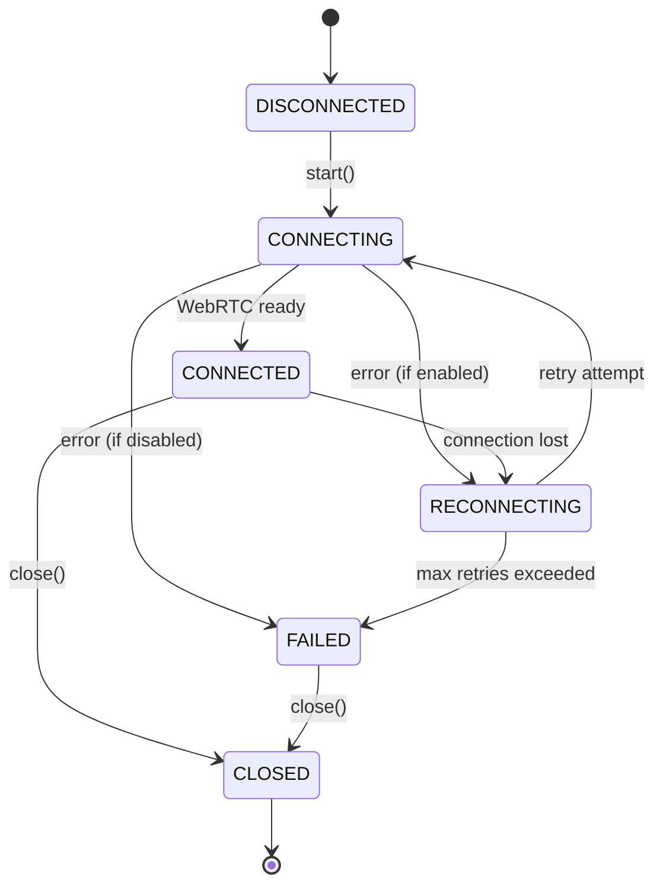
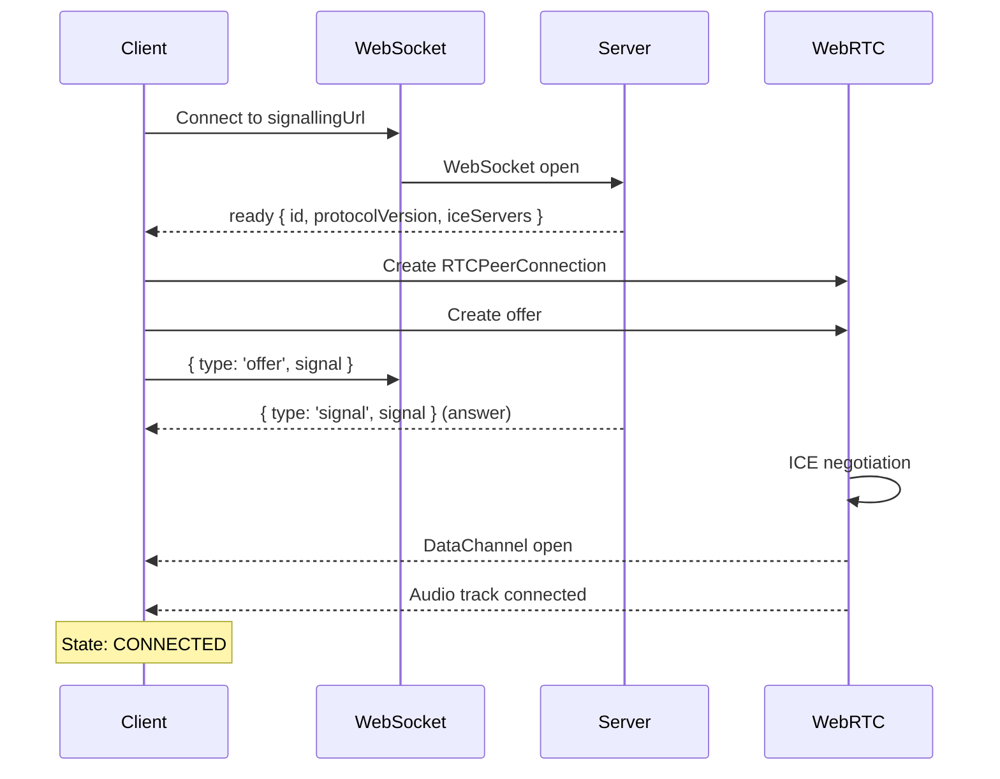
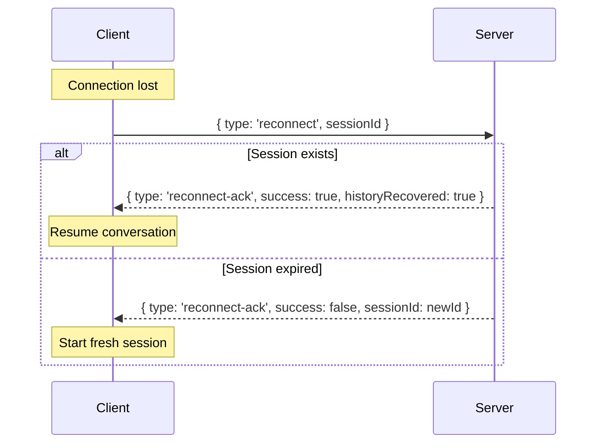

Understanding the connection state machine and how to handle state transitions.

---

## Connection States



| State | Description |
|-------|-------------|
| `disconnected` | Initial state, not connected |
| `connecting` | WebSocket/WebRTC handshake in progress |
| `connected` | Fully connected, ready for conversation |
| `reconnecting` | Connection lost, attempting recovery |
| `failed` | Connection failed after max retries |
| `closed` | Explicitly closed by user |

---

## Connection Flow



---

## Reconnection

Automatic reconnection is enabled by default with exponential backoff.

### Configuration

```typescript
const client = new LLMRTCWebClient({
  signallingUrl: 'ws://localhost:8787',
  reconnection: {
    enabled: true,         // Enable auto-reconnect (default: true)
    maxRetries: 5,         // Max retry attempts (default: 5)
    baseDelayMs: 1000,     // Initial delay (default: 1000)
    maxDelayMs: 30000,     // Max delay (default: 30000)
    jitterFactor: 0.3      // Randomization factor (default: 0.3)
  }
});
```

### Backoff Formula

```
delay = min(baseDelayMs * 2^attempt, maxDelayMs) * (1 ± jitterFactor)
```

Example with defaults:
- Attempt 1: ~1s
- Attempt 2: ~2s
- Attempt 3: ~4s
- Attempt 4: ~8s
- Attempt 5: ~16s

### Session Recovery

During reconnection, the client attempts to recover the previous session:



---

## Client Methods

### `start()`

Initiate connection:

```typescript
const client = new LLMRTCWebClient({ signallingUrl: 'ws://localhost:8787' });
await client.start();
// State: connecting → connected
```

### `close()`

Clean shutdown:

```typescript
client.close();
// State: → closed
```

### `state`

Get current state:

```typescript
if (client.state === 'connected') {
  // Ready for conversation
}
```

### `currentSessionId`

Get session ID (for manual persistence):

```typescript
const sessionId = client.currentSessionId;
localStorage.setItem('sessionId', sessionId);
```

---

## Handling State Changes

```typescript
const client = new LLMRTCWebClient({ signallingUrl: 'ws://localhost:8787' });

client.on('stateChange', (state) => {
  console.log('State:', state);

  switch (state) {
    case 'connecting':
      showStatus('Connecting...');
      break;

    case 'connected':
      showStatus('Connected');
      enableMicrophone();
      break;

    case 'reconnecting':
      showStatus('Reconnecting...');
      disableMicrophone();
      break;

    case 'failed':
      showStatus('Connection failed');
      showRetryButton();
      break;

    case 'closed':
      showStatus('Disconnected');
      break;
  }
});

client.on('reconnecting', (attempt, maxAttempts) => {
  showStatus(`Reconnecting (${attempt}/${maxAttempts})...`);
});
```

---

## Best Practices

### Show Connection Status

Always display connection state to users:

```typescript
function ConnectionBadge({ state }: { state: ConnectionState }) {
  const colors = {
    disconnected: 'gray',
    connecting: 'yellow',
    connected: 'green',
    reconnecting: 'orange',
    failed: 'red',
    closed: 'gray'
  };

  return <Badge color={colors[state]}>{state}</Badge>;
}
```

### Queue Input During Reconnection

Don't drop user input during reconnection:

```typescript
const pendingMessages: string[] = [];

client.on('stateChange', (state) => {
  if (state === 'connected' && pendingMessages.length > 0) {
    // Send queued messages
    pendingMessages.forEach(msg => client.sendText(msg));
    pendingMessages.length = 0;
  }
});

function sendMessage(text: string) {
  if (client.state === 'connected') {
    client.sendText(text);
  } else {
    pendingMessages.push(text);
  }
}
```

### Persist Session for Page Refresh

```typescript
// On connect
client.on('stateChange', (state) => {
  if (state === 'connected') {
    localStorage.setItem('sessionId', client.currentSessionId);
  }
});

// On page load
const savedSessionId = localStorage.getItem('sessionId');
if (savedSessionId) {
  // Server will attempt to restore session
  client.start({ sessionId: savedSessionId });
}
```

---

## Related

- [Client Events](events) - All client events
- [Networking & TURN](../backend/networking-and-turn) - ICE configuration
