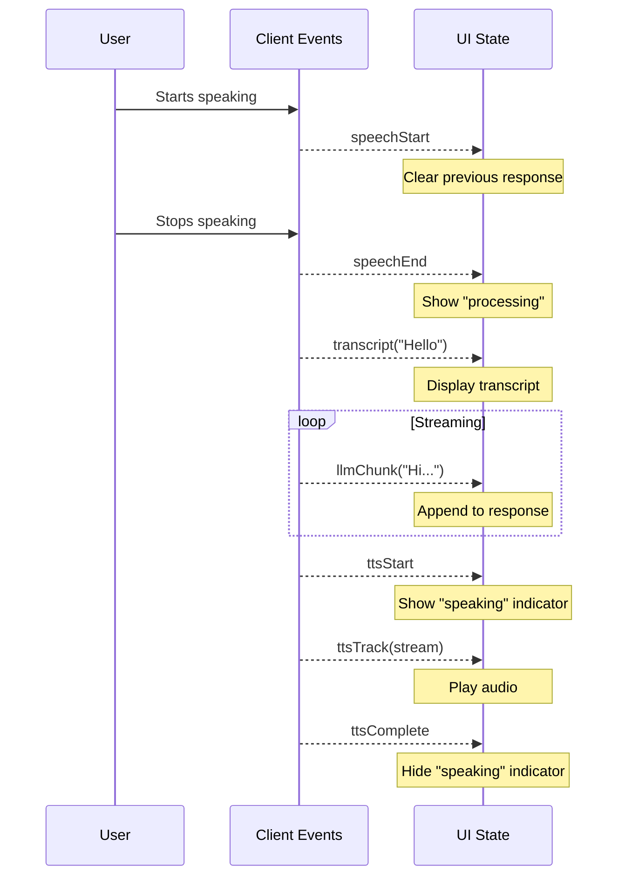

Complete reference for all events emitted by `LLMRTCWebClient`.

---

## Event Reference

### Conversation Events

| Event | Payload | Description |
|-------|---------|-------------|
| `transcript` | `(text: string)` | Speech transcription (final or interim) |
| `llm` | `(text: string)` | Complete LLM response (non-streaming) |
| `llmChunk` | `(text: string)` | Streaming LLM response chunk |
| `tts` | `(audio: ArrayBuffer, format: string)` | Complete TTS audio (non-streaming) |
| `ttsTrack` | `(stream: MediaStream)` | WebRTC audio track for TTS playback |
| `ttsStart` | `()` | TTS synthesis starting |
| `ttsComplete` | `()` | TTS playback finished |
| `ttsCancelled` | `()` | TTS interrupted (user barge-in) |

### Speech Detection Events

| Event | Payload | Description |
|-------|---------|-------------|
| `speechStart` | `()` | User started speaking |
| `speechEnd` | `()` | User stopped speaking, processing begins |

### Connection Events

| Event | Payload | Description |
|-------|---------|-------------|
| `stateChange` | `(state: ConnectionState)` | Connection state changed |
| `reconnecting` | `(attempt: number, maxAttempts: number)` | Reconnection in progress |
| `error` | `(error: ClientError)` | Error occurred |

### Playbook Events

| Event | Payload | Description |
|-------|---------|-------------|
| `toolCallStart` | `ToolCallStartPayload` | Tool execution starting |
| `toolCallEnd` | `ToolCallEndPayload` | Tool execution completed |
| `stageChange` | `StageChangePayload` | Playbook stage transition |

---

## Payload Types

```typescript
interface ToolCallStartPayload {
  name: string;                        // Tool name
  callId: string;                      // Unique call ID
  arguments: Record<string, unknown>;  // Tool arguments
}

interface ToolCallEndPayload {
  callId: string;       // Matches toolCallStart
  result?: unknown;     // Tool result (on success)
  error?: string;       // Error message (on failure)
  durationMs: number;   // Execution time in milliseconds
}

interface StageChangePayload {
  from: string;         // Previous stage ID
  to: string;           // New stage ID
  reason: string;       // Why the transition occurred
}

interface ClientError {
  code: string;         // Error code (e.g., 'CONNECTION_FAILED')
  message: string;      // Human-readable description
  recoverable: boolean; // Whether client can recover
}
```

---

## Usage Examples

### Basic Conversation UI

```typescript
const client = new LLMRTCWebClient({ signallingUrl: 'ws://localhost:8787' });

// Display transcription
client.on('transcript', (text) => {
  setTranscript(text);
});

// Stream LLM response
client.on('llmChunk', (chunk) => {
  setResponse((prev) => prev + chunk);
});

// Handle TTS audio
client.on('ttsTrack', (stream) => {
  const audio = document.getElementById('audio') as HTMLAudioElement;
  audio.srcObject = stream;
  audio.play();
});

// Clear response on new speech
client.on('speechStart', () => {
  setResponse('');
});
```

### Playbook Tool Tracking

```typescript
const [tools, setTools] = useState<ToolCall[]>([]);

client.on('toolCallStart', ({ name, callId, arguments: args }) => {
  setTools((prev) => [
    ...prev,
    { callId, name, args, status: 'running', startTime: Date.now() }
  ]);
});

client.on('toolCallEnd', ({ callId, result, error, durationMs }) => {
  setTools((prev) =>
    prev.map((t) =>
      t.callId === callId
        ? { ...t, result, error, status: 'done', durationMs }
        : t
    )
  );
});

client.on('stageChange', ({ from, to, reason }) => {
  console.log(`Stage: ${from} → ${to} (${reason})`);
  setCurrentStage(to);
});
```

### Connection State Handling

```typescript
client.on('stateChange', (state) => {
  switch (state) {
    case 'disconnected':
      setStatus('Disconnected');
      break;
    case 'connecting':
      setStatus('Connecting...');
      break;
    case 'connected':
      setStatus('Connected');
      break;
    case 'reconnecting':
      setStatus('Reconnecting...');
      break;
    case 'failed':
      setStatus('Connection failed');
      break;
  }
});

client.on('reconnecting', (attempt, maxAttempts) => {
  setStatus(`Reconnecting (${attempt}/${maxAttempts})...`);
});
```

### Error Handling

```typescript
client.on('error', (error) => {
  console.error(`[${error.code}] ${error.message}`);

  if (!error.recoverable) {
    // Fatal error - prompt user to reload
    showFatalError(error.message);
  } else {
    // Transient error - show toast
    showToast(`Error: ${error.message}`);
  }
});
```

### Barge-in Handling

```typescript
// User interrupted AI speech
client.on('ttsCancelled', () => {
  console.log('TTS cancelled - user barged in');
  setIsSpeaking(false);
});

// Track TTS state
client.on('ttsStart', () => setIsSpeaking(true));
client.on('ttsComplete', () => setIsSpeaking(false));
```

---

## Event Flow Diagram



---

## Related

- [Connection Lifecycle](connection-lifecycle) - Connection states
- [UI Patterns](ui-patterns) - Complete UI examples
