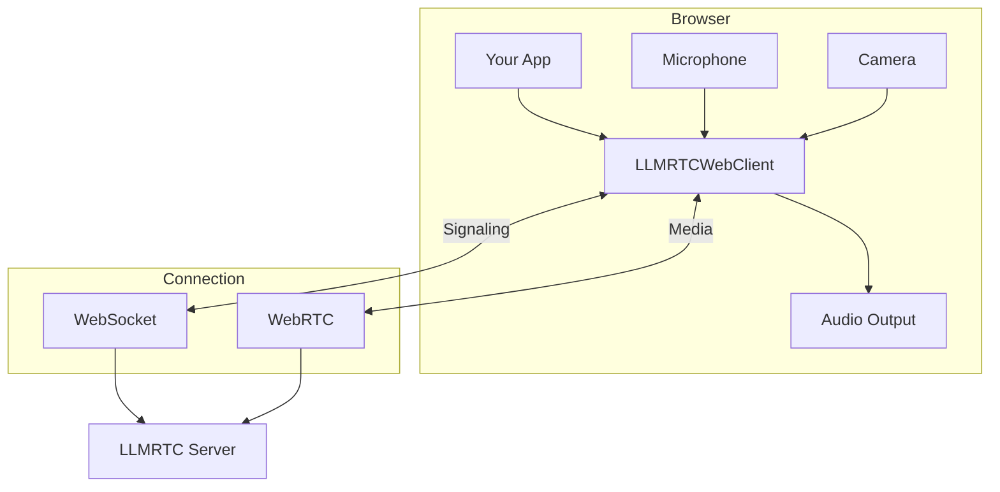
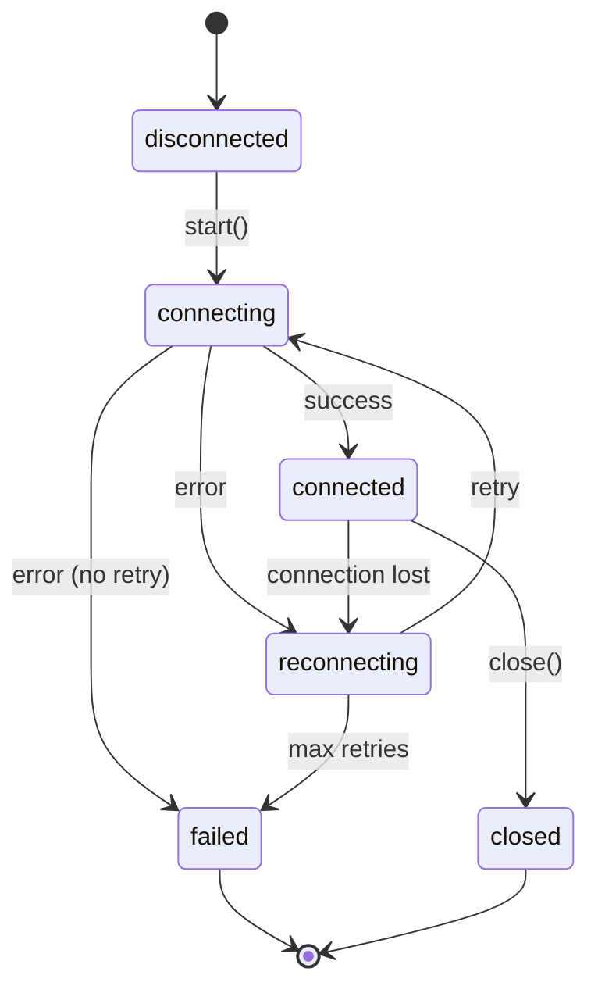

The **web client** (`@llmrtc/llmrtc-web-client`) is a browser library that handles WebRTC signaling, audio/video capture, and event emission for voice AI applications.

---

## Architecture

The web client manages the browser-side connection:



---

## Core Features

### Connection Management
- WebSocket signaling with automatic reconnection
- WebRTC peer connection setup
- ICE candidate handling
- Session persistence across reconnects

### Audio Handling
- Microphone capture via getUserMedia
- TTS playback through WebRTC tracks
- Speech state events (start/end)
- Barge-in support

### Video & Vision
- Camera capture with frame extraction
- Screen sharing support
- Automatic attachment queuing
- FPS control for bandwidth management

### Event System
- Rich event API for UI integration
- Transcript and LLM response events
- Tool call notifications
- Connection state changes

---

## Basic Usage

```typescript
import { LLMRTCWebClient } from '@llmrtc/llmrtc-web-client';

// Create client
const client = new LLMRTCWebClient({
  signallingUrl: 'wss://your-server.com'
});

// Set up event handlers
client.on('stateChange', (state) => {
  console.log('Connection state:', state);
});

client.on('transcript', (text) => {
  console.log('User said:', text);
});

client.on('llmChunk', (chunk) => {
  process.stdout.write(chunk);
});

client.on('ttsStart', () => {
  console.log('Assistant speaking...');
});

client.on('ttsComplete', () => {
  console.log('Assistant finished.');
});

// Start connection
await client.start();

// Share microphone
const stream = await navigator.mediaDevices.getUserMedia({ audio: true });
const controller = client.shareAudio(stream);

// Later: cleanup
controller.stop();
await client.close();
```

---

## Connection States

The client moves through defined states:



| State | Description |
|-------|-------------|
| `disconnected` | Initial state, not connected |
| `connecting` | Establishing WebSocket and WebRTC |
| `connected` | Fully connected and operational |
| `reconnecting` | Connection lost, attempting recovery |
| `failed` | Connection failed, no more retries |
| `closed` | Explicitly closed by application |

---

## Events

The client emits events for UI integration:

### Connection Events

| Event | Payload | Description |
|-------|---------|-------------|
| `stateChange` | `ConnectionState` | Connection state changed |
| `reconnecting` | `{ attempt, maxAttempts }` | Reconnection attempt |
| `error` | `ClientError` | Error occurred |

### Speech Events

| Event | Payload | Description |
|-------|---------|-------------|
| `speechStart` | - | User started speaking |
| `speechEnd` | - | User stopped speaking |
| `transcript` | `string` | Final transcription |

### Response Events

| Event | Payload | Description |
|-------|---------|-------------|
| `llm` | `string` | Complete LLM response |
| `llmChunk` | `string` | Streaming LLM chunk |
| `ttsStart` | - | TTS audio started |
| `ttsComplete` | - | TTS audio finished |
| `ttsCancelled` | - | TTS interrupted (barge-in) |
| `ttsTrack` | `MediaStream` | WebRTC audio track |

### Playbook Events

| Event | Payload | Description |
|-------|---------|-------------|
| `stageChange` | `{ from, to, reason }` | Stage transition |
| `toolCallStart` | `{ name, callId, arguments }` | Tool execution started |
| `toolCallEnd` | `{ callId, result, error, durationMs }` | Tool execution completed |

---

## Constructor Options

```typescript
interface LLMRTCWebClientConfig {
  // Required
  signallingUrl: string;           // WebSocket server URL

  // WebRTC
  iceServers?: RTCIceServer[];     // Custom ICE servers (optional)
  useWebRTC?: boolean;             // Force WebRTC transport

  // Reconnection
  reconnection?: {
    enabled?: boolean;             // Enable auto-reconnect (default: true)
    maxRetries?: number;           // Max retry attempts (default: 5)
    baseDelayMs?: number;          // Initial delay (default: 1000)
    maxDelayMs?: number;           // Max delay (default: 30000)
    jitterFactor?: number;         // Jitter (0-1) (default: 0.3)
  };
}
```

:::note Audio Playback
The client **does not auto-play TTS audio**. You must handle the `ttsTrack` or `tts` event and connect the audio to an `<audio>` element yourself. See [Audio Handling](audio) for details.
:::

---

## Methods

### Connection

| Method | Description |
|--------|-------------|
| `start()` | Establish connection to server |
| `close()` | Close connection and cleanup |

### Audio

| Method | Description |
|--------|-------------|
| `shareAudio(stream)` | Share microphone audio, returns controller |

### Video & Vision

| Method | Description |
|--------|-------------|
| `shareVideo(stream, intervalMs?)` | Share camera with frame capture (intervalMs between frames) |
| `shareScreen(stream, intervalMs?)` | Share screen with frame capture (intervalMs between frames) |
| `sendAttachments()` | Send queued attachments to server |

---

## Framework Integration

### React

```typescript
import { useEffect, useState, useRef } from 'react';
import { LLMRTCWebClient } from '@llmrtc/llmrtc-web-client';

function useVoiceClient(url: string) {
  const clientRef = useRef<LLMRTCWebClient | null>(null);
  const [state, setState] = useState('disconnected');
  const [transcript, setTranscript] = useState('');

  useEffect(() => {
    const client = new LLMRTCWebClient({ signallingUrl: url });
    clientRef.current = client;

    client.on('stateChange', setState);
    client.on('transcript', setTranscript);

    return () => {
      client.close();
    };
  }, [url]);

  return { client: clientRef.current, state, transcript };
}
```

### Vue

```typescript
import { ref, onMounted, onUnmounted } from 'vue';
import { LLMRTCWebClient } from '@llmrtc/llmrtc-web-client';

export function useVoiceClient(url: string) {
  const client = ref<LLMRTCWebClient | null>(null);
  const state = ref('disconnected');

  onMounted(() => {
    client.value = new LLMRTCWebClient({ signallingUrl: url });
    client.value.on('stateChange', (s) => state.value = s);
  });

  onUnmounted(() => {
    client.value?.close();
  });

  return { client, state };
}
```

---

## Browser Requirements

| Browser | Minimum Version |
|---------|-----------------|
| Chrome | 74+ |
| Firefox | 78+ |
| Safari | 14.1+ |
| Edge | 79+ |

Required APIs:
- WebSocket
- WebRTC (RTCPeerConnection)
- getUserMedia
- MediaStream

---

## Related Documentation

- [Installation](installation) - Package setup
- [Connection Lifecycle](connection-lifecycle) - State management
- [Audio](audio) - Microphone and playback
- [Video & Vision](video-and-vision) - Camera and screen sharing
- [Events](events) - Complete event reference
- [UI Patterns](ui-patterns) - Common UI implementations
