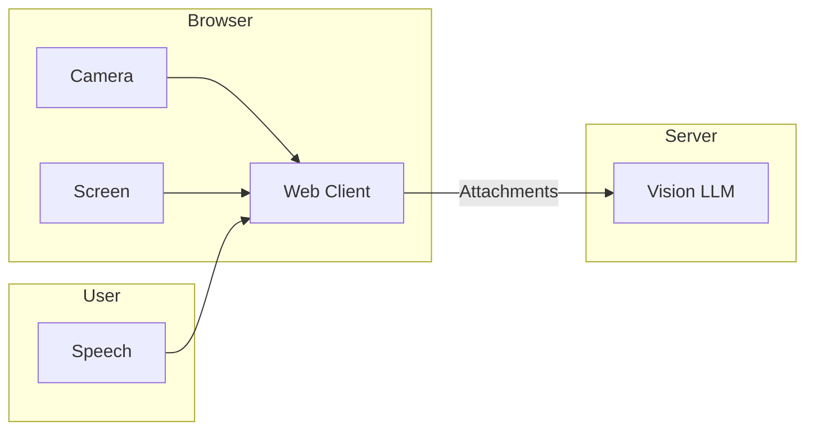
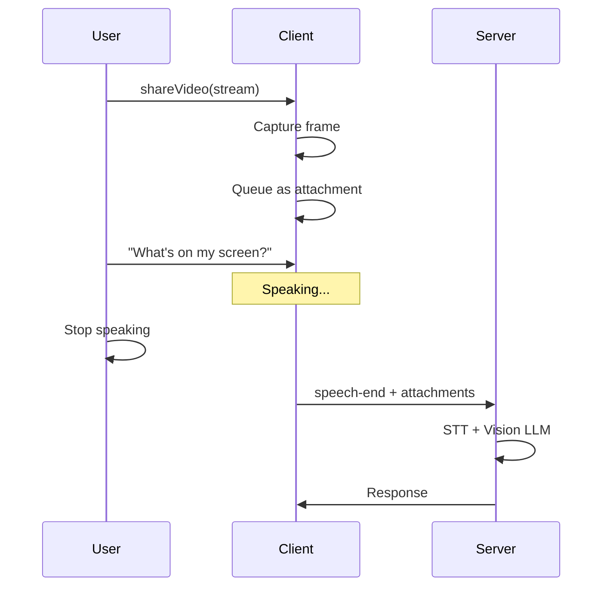

Guide for camera capture, screen sharing, and sending visual attachments to vision-capable models.

---

## Vision Flow

Images flow from browser to server alongside audio:



Images are queued as attachments and sent when speech ends, allowing the model to see what you're talking about.

---

## Camera Capture

### Basic Setup

```typescript
async function startCamera() {
  const stream = await navigator.mediaDevices.getUserMedia({
    video: {
      width: { ideal: 1280 },
      height: { ideal: 720 },
      facingMode: 'user'
    }
  });

  // Share with 1 FPS (default)
  const controller = client.shareVideo(stream);

  return controller;
}
```

### Frame Rate Control

Adjust FPS to balance quality and bandwidth:

```typescript
// Low FPS for bandwidth savings
const controller = client.shareVideo(stream, 0.5);  // 1 frame per 2 seconds

// Higher FPS for real-time applications
const controller = client.shareVideo(stream, 2);   // 2 frames per second
```

Recommended FPS:
- 0.5 - Basic context (what's on screen)
- 1 - General use (default)
- 2 - Active demonstrations

### Preview

Display camera preview:

```typescript
const stream = await navigator.mediaDevices.getUserMedia({ video: true });

// Show preview
const video = document.getElementById('preview') as HTMLVideoElement;
video.srcObject = stream;
video.play();

// Share with LLMRTC
client.shareVideo(stream);
```

---

## Screen Sharing

### Basic Setup

```typescript
async function startScreenShare() {
  const stream = await navigator.mediaDevices.getDisplayMedia({
    video: {
      cursor: 'always'  // Show cursor in capture
    }
  });

  const controller = client.shareScreen(stream);

  // Handle user stopping share via browser UI
  stream.getVideoTracks()[0].onended = () => {
    controller.stop();
    updateUI('Screen share ended');
  };

  return controller;
}
```

### Capture Options

```typescript
const stream = await navigator.mediaDevices.getDisplayMedia({
  video: {
    displaySurface: 'monitor',  // 'monitor', 'window', or 'browser'
    cursor: 'always',            // 'always', 'motion', or 'never'
    width: { ideal: 1920 },
    height: { ideal: 1080 },
    frameRate: { max: 5 }
  },
  audio: false  // Don't capture system audio
});
```

---

## Manual Attachments

Send images programmatically:

```typescript
// From data URI
client.sendAttachments([
  {
    type: 'image',
    data: 'data:image/jpeg;base64,/9j/4AAQ...',
    alt: 'Screenshot of dashboard'
  }
]);

// From URL
client.sendAttachments([
  {
    type: 'image',
    data: 'https://example.com/image.jpg',
    alt: 'Product image'
  }
]);
```

### From Canvas

```typescript
function captureCanvas(canvas: HTMLCanvasElement) {
  const dataUri = canvas.toDataURL('image/jpeg', 0.8);

  client.sendAttachments([
    {
      type: 'image',
      data: dataUri,
      alt: 'Canvas capture'
    }
  ]);
}
```

### From File Upload

```typescript
async function handleFileUpload(file: File) {
  const dataUri = await fileToDataUri(file);

  client.sendAttachments([
    {
      type: 'image',
      data: dataUri,
      alt: file.name
    }
  ]);
}

function fileToDataUri(file: File): Promise<string> {
  return new Promise((resolve, reject) => {
    const reader = new FileReader();
    reader.onload = () => resolve(reader.result as string);
    reader.onerror = reject;
    reader.readAsDataURL(file);
  });
}
```

---

## Frame Capture Controller

Both `shareVideo()` and `shareScreen()` return a controller:

```typescript
interface FrameCaptureController {
  stop(): void;                    // Stop capturing
  getLastFrame(): string | null;   // Get last captured frame as data URI
}
```

### Accessing Captured Frames

```typescript
const controller = client.shareVideo(stream);

// Get the last captured frame
const lastFrame = controller.getLastFrame();
if (lastFrame) {
  const img = document.createElement('img');
  img.src = lastFrame;
  document.body.appendChild(img);
}

// Stop when done
controller.stop();
```

---

## Attachment Timing

Attachments are queued and sent when speech ends:



This ensures the image context matches what the user is asking about.

---

## Multiple Cameras

Work with multiple cameras:

```typescript
async function listCameras() {
  const devices = await navigator.mediaDevices.enumerateDevices();
  return devices.filter(d => d.kind === 'videoinput');
}

async function selectCamera(deviceId: string) {
  const stream = await navigator.mediaDevices.getUserMedia({
    video: { deviceId: { exact: deviceId } }
  });
  return client.shareVideo(stream);
}

// List available cameras
const cameras = await listCameras();
cameras.forEach(cam => {
  console.log(`${cam.label} (${cam.deviceId})`);
});
```

---

## Error Handling

```typescript
async function setupVideo() {
  try {
    const stream = await navigator.mediaDevices.getUserMedia({ video: true });
    client.shareVideo(stream);
  } catch (error) {
    switch (error.name) {
      case 'NotAllowedError':
        showError('Camera access denied');
        break;
      case 'NotFoundError':
        showError('No camera found');
        break;
      case 'NotReadableError':
        showError('Camera is in use');
        break;
      case 'OverconstrainedError':
        showError('Camera doesn\'t support requested settings');
        break;
      default:
        showError('Failed to access camera');
    }
  }
}

async function setupScreenShare() {
  try {
    const stream = await navigator.mediaDevices.getDisplayMedia({ video: true });
    client.shareScreen(stream);
  } catch (error) {
    if (error.name === 'NotAllowedError') {
      showError('Screen share cancelled');
    } else {
      showError('Failed to share screen');
    }
  }
}
```

---

## Stopping Capture

Clean up when done:

```typescript
let videoController: FrameCaptureController | null = null;
let screenController: FrameCaptureController | null = null;

function stopAllCapture() {
  videoController?.stop();
  videoController = null;

  screenController?.stop();
  screenController = null;
}

// Stop on disconnect
client.on('stateChange', (state) => {
  if (state === 'disconnected' || state === 'closed') {
    stopAllCapture();
  }
});
```

---

## Image Optimization

Optimize images before sending:

```typescript
async function optimizeImage(
  dataUri: string,
  maxWidth = 1024,
  quality = 0.8
): Promise<string> {
  return new Promise((resolve) => {
    const img = new Image();
    img.onload = () => {
      const canvas = document.createElement('canvas');

      // Calculate new dimensions
      let width = img.width;
      let height = img.height;
      if (width > maxWidth) {
        height = (height * maxWidth) / width;
        width = maxWidth;
      }

      canvas.width = width;
      canvas.height = height;

      const ctx = canvas.getContext('2d')!;
      ctx.drawImage(img, 0, 0, width, height);

      resolve(canvas.toDataURL('image/jpeg', quality));
    };
    img.src = dataUri;
  });
}
```

---

## Related Documentation

- [Overview](overview) - Client architecture
- [Audio](audio) - Microphone capture
- [Events](events) - Vision-related events
- [Concepts: Vision & Attachments](../concepts/vision-and-attachments) - Vision concepts
- [Providers](../providers/overview) - Vision-capable providers
